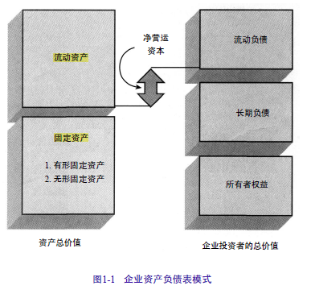
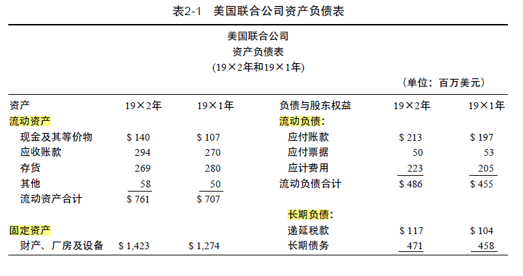
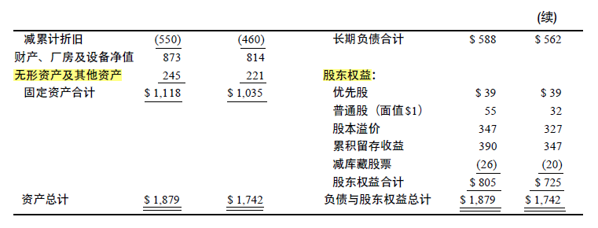
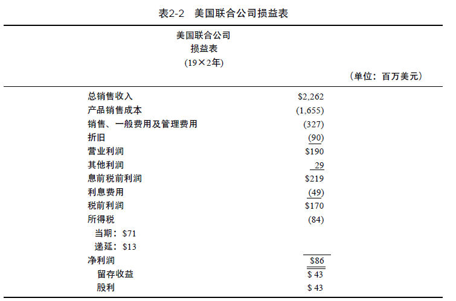
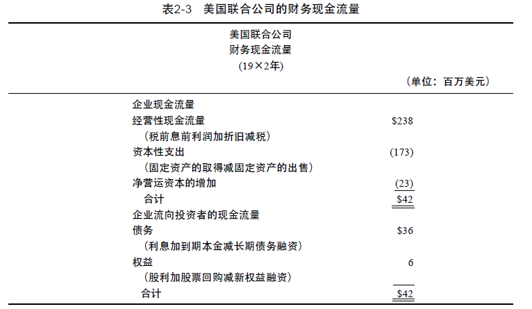
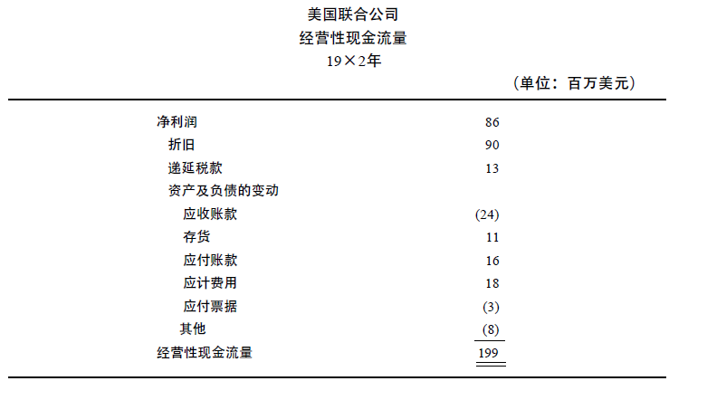
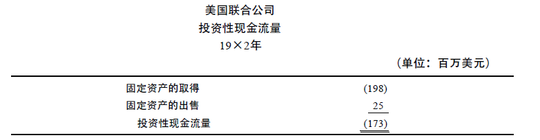
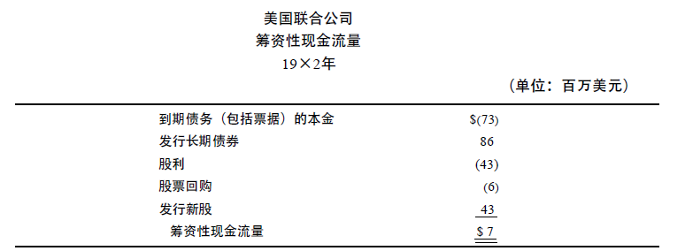

[toc]

# 第一篇 综述

## 第一章 公司理财导论

* 基本问题：资本预算；融资决策；短期融资和净运营资本决策
* 公司筹集资金进行投资的一个重要方式是**发行证券**。**证券**，称作“金融工具”或“索取权”，<u>划分为“权益”或“负债”，简称“股票”或“债券”</u>  
* 两类金融市场：**货币市场和资本市场**

### 公司理财

#### 资产负债平衡表

资产：**“固定资产”和“流动资产”**
固定资产：“有形固定资产”和“无形固定资产”。“有形固定资产”诸如机器和设备；“无形固定资产”诸如专利、商标、管理者素质。

融资方式：发行证券、借贷或发行股票；分为负债和股东权益，<u>股东权益等于公司的资产价值与其负债之间的差</u>。—> 股东权益是企业的资产剩余索取权

基本问题：

* 公司应该投资什么样的长期资产？涉及资产负债表的左边。公司的资产和类型一般视业务性质而定。“资本预算”和“资本性支出”描述长期固定资产的投资和管理过程

* 公司如何筹集资本性支出所需的资金？–> 融资决策，这一问题涉及资产负债表的右边。用“资本结构”表示公司短期及长期负债与股东权益的比例。

* 公司应该如何管理经营中的现金流量？涉及资产负债表的上方。

  * 经营中的现金流入量和现金流出量在时间上不对等。
  * 经营中现金流量的数额和时间具有不确定性。

  —> 财务经理必须致力于管理现金流量的缺口。
  从资产负债表角度：现金流量的短期管理与净运营资本有关

  * 净运营资本：短期资本与短期负债之差。

  从财务管理角度：短期流量问题是由于现金流量和现金流量之间的不对等导致的，属于短期理财问题

#### 资本结构

购买公司债务的人或机构统称为“债权人”；持有公司权益股份者称为“股东”。—> 发行债权和股权的决策影响到公司的资本结构

公司在金融市场的价值：
$$
V = B + S
$$

> V: 公司价值；B：债权或负债的价值；S：股权或所有者权益的价值。
> 财务经理的目标之一就是选择使得公司的价值V尽可能大的负债与所有者权益的比例。

#### 财务经理

现金流量确认：不同于会计角度，公司理财关注经营是否给公司创造了现金流量，价值创造取决于现金流量，即是否以及何时产生现金流。

现金流量的时效性：公司投资的价值取决于现金流量的时效性。

> 假设任何人都偏好早一点收到现金流量，即时间偏好假设。
> 债券和股票的价值反映了对较早现金流量的偏好。

现金流量的风险：大多数投资者是风险厌恶者。

### 公司证券对公司价值的或有索取权

负债的基本特征：借债的公司承诺在某一确定的时间支付给债权人一笔固定的金额
股东在年末对公司价值的索取权等于支付给债权人之后的剩余部分。
债权人的索取权与股东的索取权之和总是等于公司期末的价值。
—> 公司发行的债权和股权的证券从公司的总价值上获得价值，即债权和股权的证券是伴随或依附于公司总价值的或有索取权。

### 公司制企业

#### 个体业主制

#### 合伙制

#### 公司制

### 公司制企业的目标

*系统合同理论*：公司制企业力图通过采取行动<u>提高现有公司股票的价值，以使股东财富价值最大化</u>

#### 代理成本和系列合同理论的观点

企业合同理论：企业可以被视为许多合同的集合

> 合同条款之一是：所有者权益对企业资产的剩余索取权
> 所有者权益合同可定义为：委托——代理关系
> 管理小组的成员是代理人，股东是委托人

股东通过设计合适的激励机制和监督管理者的行为，减少管理者背离股东的利益 –> “剩余损失”：由于管理者背离股东利益而使其蒙受财富损失。
解决管理者和股东之间的利益冲突的费用是一种“代理成本”：股东的监督成本；实施控制方法的成本。

#### 管理者的目标

“费用偏好”

管理者收到两种基本激励的影响：

1. 生存。组织的生存意味着管理者总是要控制足够的资源来防止企业被淘汰。

2. 独立性和自我满足。指不受外界干扰和不依赖于外部的资本市场而进行决策的独立性。

   > 管理者不喜欢发行新股，他们喜欢依赖于内部产生的现金流量。

–> 管理者的基本财富目标：公司财富最大化。

* 公司财富是管理者所能进行有效控制的财富，与公司的成长性和公司规模密切相关。公司财富并非必然就是股东财富。
* 通过提供成长所需资金和在一定程度上限制筹集新的权益资本，公司财富具有导致成长性提高的趋向。而提高公司成长性及规模与提高股东财富并非必然相同。

#### 所有权和控制权分离

股权分散化导致大型公司的所有权和控制权分离。

### 金融市场

基本证券：
债务证券：偿还公司借款的债务合同
权益债券：表示对公司剩余现金流量的非合同式索取权。
–> 公司公开发售股票和债权，在金融市场交易

金融市场由货币市场(money markets) 和 资本市场(capital markets) 构成

* 货币市场指短期的债务证券市场，需要在一年内偿还
  * 货币市场适用于一系列联系松散的市场，是经纪人市场。
  * 经纪人是一些根据其库存的货币市场工具和风险随时准备购买或销售而进行连续报价的公司。因此，在大多数交易中，经纪人是委托人。
    * 货币经纪人集中为借贷双方寻找短期资金
    * 股票经纪人：在股票交易所中充当代理人，为顾客买卖股票；股票代理人本身实际上不购买证券。
  * 货币市场的核心：货币市场银行
* 资本市场指长期债务证券和权益股份市场，长期债务证券的期限为一年以上。
* 金融市场划分为一级市场和二级市场。

#### 一级市场：首次发行

一级市场用于政府或公司首次发售证券 –> **公开发行**和**私下募集(私募)**

#### 二级市场

在债券和股票首次发售后，就可以在二级市场交易 –> **拍卖市场**和**经纪人市场**

#### 上市公司股票的交易

#### 挂牌交易

## 第二章 会计报表与现金流量

### 资产负债表 Balance Sheet

**资产 = 负债 + 股东权益**

> 资产按持续经营的企业资产正常变现所需的时间长短排列，取决于企业的行业性质和管理行为。
> 负债和股东权益按偿付期的先后顺序排列，反映了企业筹集资金的类型和比例，取决于管理当局对资本结构的选择–> 在负债与权益之间的选择和在流动负债与长期负债之间的选择。

分析资产负债表需要关注：**会计流动性、债务与权益、市价与成本**

#### 会计流动性

会计流动性：指资产变现的方便与快捷程度。

> “流动资产”流动性最强；“固定资产”流动性最差

<u>资产的流动性越大，对短期债务的清偿能力就越强。</u> –> 企业避免财务困境的可能性与其资产的流动性相关。
<u>流动资产的收益率通常低于固定资产的收益率</u>
–> 企业投资于流动性强的资产是以牺牲更有利的投资机会为代价的。

#### 负债与权益

一般情况下，当企业借款时，债权人享有对企业现金流量的第一要求权。

$$
资产 - 负债 = 股东权益
$$

#### 市价与成本

### 损益表

损益表(income statement) 用来衡量企业在一个特定时期内的业绩。
利润的会计定义式：
$$
收入 - 费用 = 利润
$$

#### 公认会计准则

当货物已经交换或服务已经提供，盈利过程已经在实质上完成时，损益表确认收入。
但当企业财产的价值增值，但尚未实现时，则不能确认收入。
–> 企业有可能在需要的时候售出已增值的资产，以调节利润
–> 一旦收入实现，即使没有实际的现金流入，也要在损益表上报告。
	例如：以商业信用售出产品，应报告销售收入和利润

#### 非现金项目

#### 时间和成本

### 净营运资本

<u>净营运资本= 流动资产 - 流动负债</u>

企业除了投资于固定资产（即资本性支出），还要投资于净营运资本，这称为“净营运资本变动额”(change in net working capital)
净营运资本变动额 是 净营运资本的差额
一个成长性企业的净营运资本变动额通常是正数。

### 财务现金流量 cash flow

现金流量 不同于 净营运资本
例如：增加存货需要支出现金，但由于存货和现金都是流动资产，因此不影响净营运资本，而现金流量减少。

企业资产的价值等于负债的价值加上权益的价值，则相对应：
资产的现金流量（由企业资产所产生的现金流量，即从企业的营业活动中得到的现金流量）$CF(A)$，等于负债的现金流量（流向企业债权人的现金流量）$CF(B)$加上所有者权益的现金流量（流向权益投资者的现金流量）$CF(S)$：
$$
CF(A) = CF(B) + CF(S)
$$

> 折旧指是对固定资产进行折旧，并不涉及现金流动，而在income state 中被作为费用扣除了，因此在cash flow 中还原回来。
>
> 经营性现金流量通常为正，当企业的经营性现金流量长期为负时，就表明该企业已陷入困境，因为其经营活动的现金入不敷出。
> “企业的总现金流量”(total cash flow of the firm) 是经资本性支出和净营运资本支出调整后的现金流量，它有时为负。当企业以较高的增长率成长时，用于存货和固定资产的支出就可能大于来自销售的现金流量。
>
> 净利润不同于现金流量，现金流量和净利润通常不等。在判断企业的经济和财务状况时，现金流量通常更有用。

### 财务报表分析

对财务报表信息进行重新组织，使之以**财务比率**的形式从五个方面放映企业的财务业绩

1. **短期偿债能力**——企业偿付短期债务的能力

   *短期偿债能力比率*衡量企业承担经常性财务负担（即偿还流动负债）的能力。

   企业若有足够的现金流量，就不会造成债务违约，可避免陷入财务困境。

   会计流动性反映了企业的短期偿债能力，通常与净营运资本相联系。衡量会计流动性最常用的指标是流动比率和速动比率：

   * *流动比率*：$流动比率 = \frac{流动资产}{流动负债}$

     如果企业出现财务上的困难，可能无法按时支付贷款（应付账款），或需要向银行申请贷款（应付票据）展期，结果造成流动负债比流动资产增加得快，流动比率下降。

   * *速动比率*：$速动比率 = \frac{速动资产}{流动负债}$ 

     速动资产为扣除存货之后的流动资产，是能够快速变现的流动资产。

     存货是流动性最差的流动资产。企业应能够不依靠变卖存货来清偿债务。

2. **营运能力**——企业运营资产的能力

   *营运能力比率*用来衡量企业对资产的管理是否有效。

   将资产与全年的销售收入相比得出周转率，以了解企业运用资产创造销售收入的有效程度。
   *总投资周转率*：$总资产周转率 = \frac{销售收入总额}{平均的资产总额}$
   衡量企业对总资产的运用是否有效。<u>若资产周转率高，说明企业能有效地运用资产创造收入；若资产周转率低，则说明企业没有充分利用资产的效能，因而必须提高销售额，或削减部分资产。</u>
   运用这一比率说明资产的使用效果时存在一个问题：旧资产的会计价值低于新资产，总资产周转率可能因为旧资产的使用而偏大；固定资产投资较少的企业（如零售或批发企业），较之固定资产投资较多的企业（如制造企业），其总资产周转率会更高。

   *应收账款周转率*： $应收账款周转率 = \frac{销售收入总额}{平均的应收账款净额}$
   *平均收账期*： $平均收账期 = \frac{会议期的天数}{应收账款周转率}$
   应收账款周转率和平均收账期提供了有关企业应收账款管理方面的信息。
   这些比率的实际意义在于它们反映了企业的信用政策。<u>如果企业的信用政策较宽松，其应收账款就会较高。在判断企业应收账款的账龄是否过长时，财务分析人员常用的经验是：应收账款的平均收账期应不超过企业信用条件所允许的付款期10天</u>

   *存货周转率*： $存货周转率 = \frac{产品销售成本}{平均存货}$
   *存货周转天数*：$存货周转天数 = \frac{会议期的天数}{存货周转率}$

   因为存货是按历史成本记录的，所以必须根据产品的销售成本而不是销售收入（销售收入中含有销售毛利，与存货不相匹配）来计算。
   一年的天数除以存货周转率可得到*存货周转天数*，存货周转天数是指从存货的购买到销售所用的天数，在零售与批发商业企业，它被称作“库存周期”。
   <u>存货周转率衡量了存货生产及销售的速度</u>，它主要受产品制造技术影响。存货周转天数的大幅度增加，可能表明企业存在大量未销的产成品，或企业的产品组合中生产周期较长的产品变得更多。

3. **财务杠杆**——企业对债务融资的依赖程度

   财务杠杆与企业债务融资和权益融资多少有关。<u>财务杠杆可作为一种工具来衡量企业在债务合同上违约的可能性。企业的债务越多，其不能履行债务责任的可能性越大。即过多的债务将可能导致企业丧失清偿能力，陷入财务困境</u>

   *负债比率*：$负债比率 = \frac{总负债}{总资产},负债权益比 = \frac{总负债}{总权益},权益乘数 = \frac{总资产}{总权益}$
   负债比率反映了债权人权益的受保护程度，以及企业为将来有利的投资机会取得新资金的能力。
   *利息保障倍数*：$利息保障倍数 = \frac{息前税前利润}{利息费用}$
   这一比率着重反映企业所赚取的利润对利息费用的偿付能力。利息保障倍数直接反映了企业支付利息的能力。

4. **获利能力**——企业的盈利水平

   一般来说，会计利润反映了收入与成本之差。
   财务分析人员至多能衡量当前或既往的会计利润，但许多商业机会都是以牺牲当前利润为代价来换取未来利润。
   以会计为基础衡量企业盈利能力，忽略了风险。

   *销售利润率*：$销售净利润率 = \frac{净利润}{总销售收入},销售总利润率 = \frac{息前税前利润}{总销售收入}$
   <u>一般来说，销售利润率反映了企业以较低的成本或较高的价格提供产品和劳务的能力。</u>但由于销售利润率是基于总销售收入而不是基于企业或权益投资者所投资的资产而计算的利润率，因此不能直接衡量企业的盈利能力。

   *资产收益率(ROA)*：$资产净收益率 = \frac{净利润}{平均总资产},资产总收益率 = \frac{息前税前利润}{平均总资产}$

   > $ROA = 销售利润率 \times 资产周转率$
   > $ROA(净) = \frac{净利润}{总销售收入} \times \frac{总销售收入}{平均总资产}$
   > $ROA(总) = \frac{息前税前利润}{总销售收入}\times \frac{总销售收入}{平均总资产}$

   企业可以通过提高销售利润率或资产周转率来增大$ROA$。

   *净资产收益率(ROE)*：$ROE = \frac{净利润}{平均的普通股股东权益}$

   > $ROA$与$ROE$的区别：
   > $ROE = 销售利润率 \times 资产周转率\times 权益倍数 = \frac{净利润}{总销售收入}\times\frac{总销售收入}{平均的总资产}\times\frac{平均的总资产}{平均的股东权益}$
   > 当$ROA(总)$大于债务利润时，财务杠杆能够扩大$ROE$

   *股利支付率*：$\frac{现金股利}{净利润}$
   *留存比率*：$留存比率 = \frac{留存收益}{净利润}$
   *留存收益*：$留存收益 = 净利润 - 股利$

   *可持续增长率*：$可持续增长率 = ROE \times 留存比率$
   <u>可持续增长率是企业在不提高财务杠杆的情况下，仅使用内部权益所能达到的最高增长率</u>

5. **价值**——企业的价值

   *市场价值比率*
   *市场价格*：普通股股票的每股市场价格是买卖双方在股票交易时确定的。企业普通股权益的市场价值等于普通股每股市场价格乘以发行在外的股数。
   *公平市场价值*：在有意愿买者和有意愿卖者都掌握相关信息的情况下，双方的交易金额。是对企业资产真实价值的估计值。

   > 在一个有效的市场上，市场价格反映了企业的全部相关信息，揭示了企业资产的真实价值。

   *市盈率(P/E)*：当前市价除以上年普通股每股盈余
   *股利收益率*：$股利收益率 = \frac{每股股利}{每股市价}$

   > 股利收益率与市场对企业未来前景的与其有关，有好的增长前景的企业，一般股利收益率较低。

   *市值与账面价值(M/B)比*：每股市场价格除以每股账面价值
   *托宾$Q$比率*：用企业负债的市场价值和权益的市场价值之和代替$M/B$比率计算公式中的企业资产的市场价值

   > Q比率大于1的企业比Q比率小于1的企业更具投资吸引力。Q比率高的企业一般有着诱人的投资机会或显著的竞争优势。
   >
   > > 当$Q>1$，企业市场价值高于企业的重置成本，企业发行较少的股票而购买到较多的投资品。

### 现金流量表

* 经营性现金流量

  

* 投资性现金流量

  

* 筹资性现金流量

  

  > 现金流量表中的筹资性现金流量与企业总现金流量之间的差异在于利息费用。

----

