[toc]

# 第三篇

## 第九章 资本市场理论综述

*资本资产定价模型(CAPM)*：
<u>$某种证券的期望收益率 = 无风险利率 + \beta (市场组合的期望收益率 - 无风险利率)$</u>

### 收益

<u>$总收益 = 股利收入 + 资本利得(资本损失)$</u>

若在年末出售股票，则现金总收入：
<u>$现金总收入 = 初始投资 + 总收益 = 出售股票收入 + 股利收入$</u>

### 收益率

$$
\begin{align}
收益率&= 股利收益率 + 资本利得收益率 \\
&=\frac{至期末支付的股利 + 期初和期末的价格变化}{期初价格}\\
\end{align}\\
1 + 收益率 = \frac{至期末支付的股利 + 期末的价格}{期初价格}\\
$$

*资本利得收益率(capital gain)*: 股票价格的变动幅度除以初始价格
$$
capital\ gain = \frac{P_{t+1}-P_{t}}{P_t}
$$

> $P_{t}$: 年初股票价格
> $P_{t+1}$：年末股票价格

#### 持有期间收益率

*持有期间收益率(holding-period return)*：如果投资1美元于股票市场，且将每年所得到的前一年的股利再投资于股票市场，最终所得到的总收益。

设$R_t$为第$t$年的收益率，则从第1年至第$T$年的总收入是每年$(1+R_t)$的连乘积：
$$
(1 + R_1)\times (1 + R_2) \times \cdots \times(1+R_t) \times \cdots \times (1 + R_T)
$$

### 收益统计

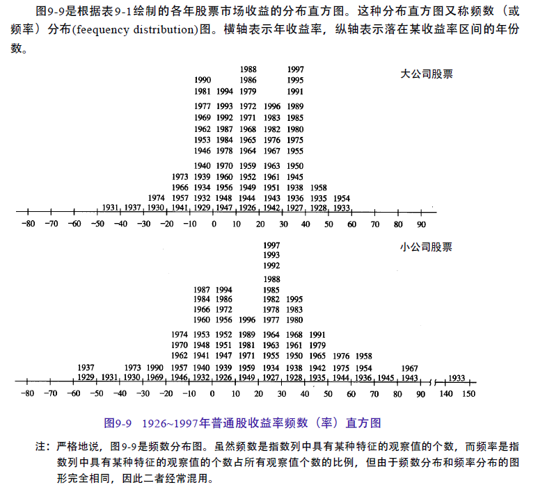
$$
\bar{R} = \frac{\sum_{t = 1}^T{R_t}}{T}
$$

#### 股票的平均收益和无风险收益

* 政府债券的收益在短期内，是“无风险收益”

* 风险收益与无风险收益之差通常被称为“风险资产的超额收益”，解释为“*风险溢价(risk premium)*”。

  > 源于股票的风险性而增加的收益

#### 风险统计

*方差(variance)* 和 *标准差(standard deviation)*是度量变动程度或离散程度的指标。
$$
Var = \frac{(R_1 - \bar{R})^2 + (R_2 - \bar{R})^2  + \cdots + (R_T - \bar{R})^2}{T-1}\\
SD = \sqrt{Var}
$$

## 第十章 收益和风险：资本资产定价模型

### 投资组合的收益和风险

#### 组合的期望收益

* 组合的期望收益是构成组合的各个证券的期望收益的简单加权平均数
  $$
  组合的期望收益 = \bar{R}_p = X_A \times \bar{R}_A + X_B \times \bar{R}_B 
  $$

  > $X_A,X_B$: 对应股票在投资组合中所占比例
  > $\bar{R}_A,\bar{R}_B$: 对应股票的期望收益
  >
  > $\bar{R}_p$: p —> *投资组合(portfolio)*

#### 组合的方差和标准差

由$A,B$两种证券构成的投资组合的方差：
$$
Var = X_A^2\sigma_A^2 + 2X_AX_B\sigma_{AB} + X_B^2\sigma_{B}^2
$$

> 证券A的方差$\sigma_A^2$，证券B的方差$\sigma_B^2$，证券A和B的协方差$\sigma_{AB}$
>
> 投资组合的方差取决于组合中各种证券的方差和每两种证券之间的协方差。
>
> * 每种证券的方差度量每种证券收益的变动程度
>
> * 协方差度量两种证券收益之间的相互关系
>
>   在证券方差给定的情况下：
>
>   * 如果两种证券收益之间的相互关系或协方差为正，组合的方差就上升；
>   * 如果两种证券收益之间的相互关系或协方差为负，组合的方差就下降。
>
>   如果持有的两种证券，当一种证券的收益上升时，另一种证券的收益下降，则这两种证券的收益之间相互抵消，即“对冲交易”或“套头交易”，投资组合的整体风险就低。

矩阵方法：

投资组合的标准差：
$$
\sigma_p = SD = \sqrt{Var}
$$

#### 投资组合的多元化效应

$$
Cov(R_A,R_B) = \sigma_{AB} = \rho_{AB} \times \sigma_A \times \sigma_B\\
\Rightarrow Var = X_A^2\sigma_A^2 + 2X_AX_B\rho_{AB}\sigma_A\sigma_B + X_B^2\sigma_{B}^2 \le X_A^2\sigma_A^2 + 2X_AX_B\sigma_{A}\sigma_B + X_B^2\sigma_{B}^2\\
\Rightarrow SD \le X_A\sigma_A + X_B\sigma_B
$$

从而：当$\rho_{AB} = 1$时，投资组合收益的标准差正好等于组合中各个证券的收益的标准差的加权平均；当相关系数$\rho_{AB}$下降至低于1时，组合的方差和标准差都会随之下降：
<u>当由两种证券构成投资组合时，只要$\rho_{AB}\le 1$，组合的标准差就小于这两种证券各自标准差的加权平均数</u> $\Rightarrow$ <u>在由多种证券构成的组合中，只要组合中两两证券的收益之间的相关系数小于1，组合的标准差一定小于组合中各种证券的标准差的加权平均数</u>

### 两种资产组合的有效集

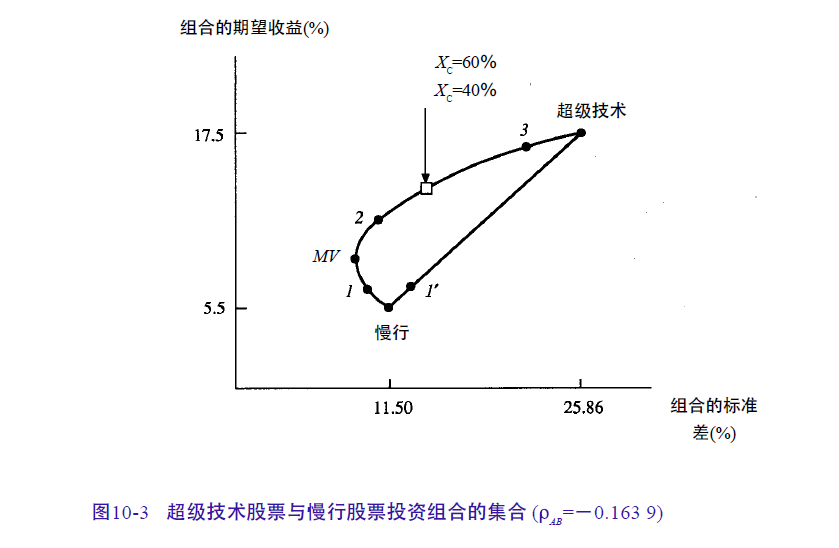

* 组合多元化效应

  直线代表在两种证券的相关系数$\rho_{AB}$等于1的情况下的各种投资组合；
  曲线代表无限多个投资组合所形成的集合，相关系数$\rho_{AB} = -0.1639$。

  * 相关系数决定了两种投资品的关系，相关系数越小，越有可能分散风险。$\rho = 1$就不可能分散风险

    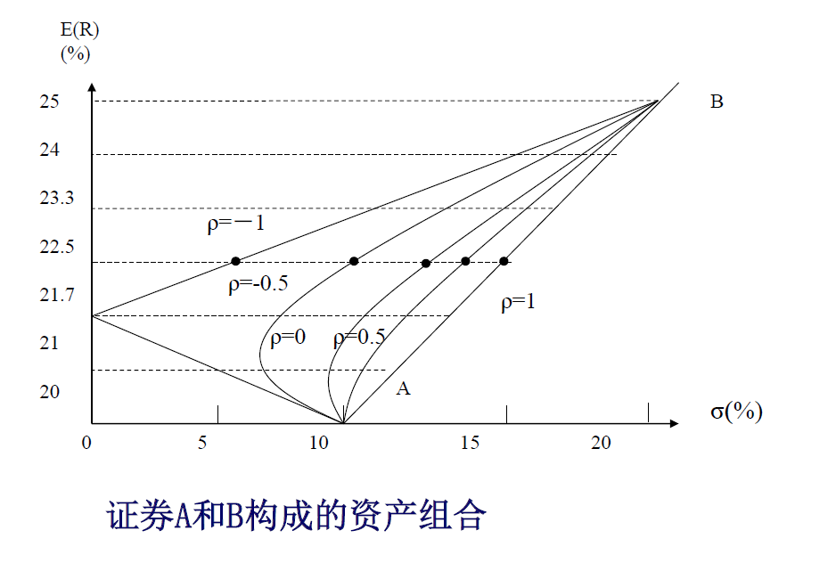

* 点MV代表具有*最小方差组合*，该组合也具有最小标准差。

* 曲线代表一个投资者考虑投资于两种证券所构成的各种可能的组合，即面临着投资的“*机会集(opportunity set)*”或“*可行集(feasible set)*”

* 没有投资者要持有一个组合，其期望收益低于最小方差组合的期望收益。

  故，没有投资者愿意选择组合1，该投资组合的期望收益较低，而标准差较高，称组合1受到最小方差组合的支配，地位低于最小方差组合。

  因此，虽然从慢行至超级技术的整段曲线被称为“可行集”，但投资者实际上只考虑从最小方差组合至超级技术这段曲线，称为“*有效集(efficient set)*”或“*有效边界(efficient frontier)*”

### 多种资产组合的有效集

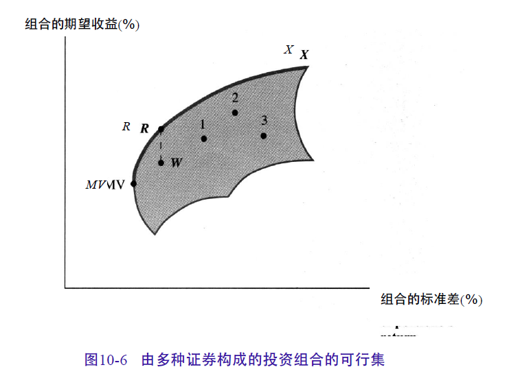

当多种证券构成投资组合时，所有的各种组合都位于一个区域之中。

<u>投资者无论如何都要选择该区域上方从MV到X这一边界</u>。这一边界，称为“有效集”。
任何一个位于从MV到X的曲线下方的点，其期望收益都小于对应在有效集上的点，而标准差却相等。

#### 多种资产组合的方差和标准差

* 在一个投资组合中，两种证券之间的协方差对组合收益的方差的影响大于每种证券的方差对组合收益的方差的影响

* 投资组合不能分散和化解全部风险，而只能分散和化解部分风险。

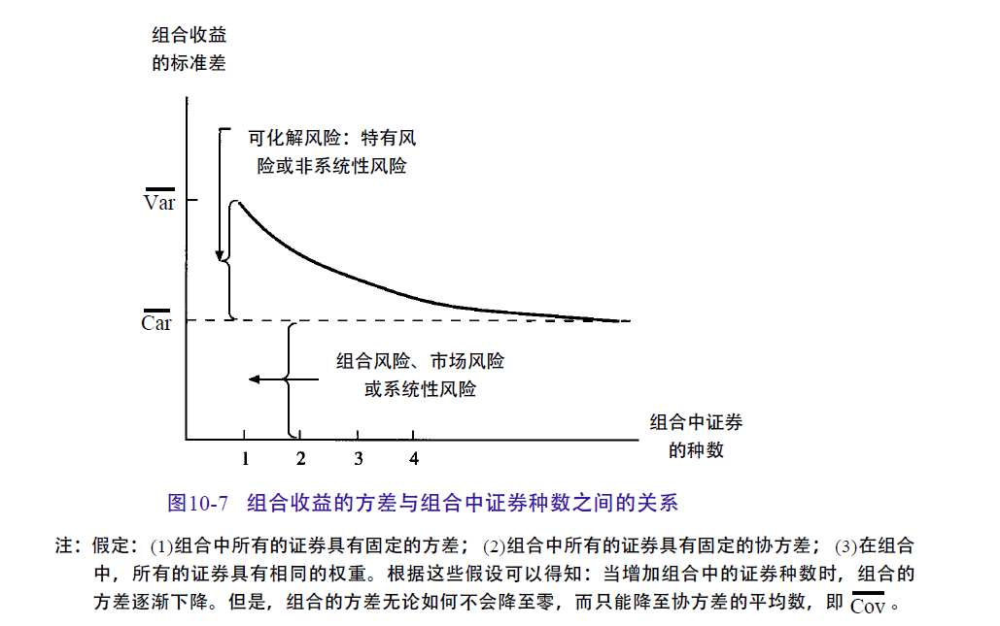

* 某债券的总风险$\overline{Var}$ = 组合的风险$\overline{Cov}$ + 非系统性或可化解的风险$\overline{Var} - \overline{Cov}$

  * 总风险是持有一种证券的投资者所承受的风险
  * 组合风险，又称系统风险(Systematic risk)、市场风险(market risk)或不可化解的风险，是投资者在持有一个完整充分的投资组合之后仍需承受的风险
  * 可化解风险(diversifiable risk)，又称非系统性风险(unsystematic risk)或持有风险(unique risk)，是通过投资组合可以化解的风险。等于总风险和组合风险之差

  对于选择投资组合的投资者来说，某一种证券的总风险并不重要。当增加一种证券于组合之中，投资者关心的是这种证券的不可化解风险，这部分风险是该种证券对整个投资组合风险的贡献。

#### 风险和敏感性投资者

规避或厌恶风险(risk averse)的投资者：一个公平的赌博是一个期望收益为0的赌博，而厌恶风险的投资者偏向于避免这种公平的赌博

### 无风险借贷

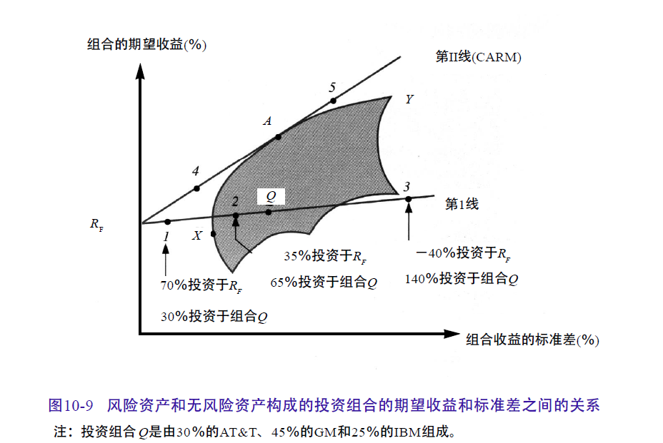

直线Ⅰ是任意风险资产与无风险资产构成的资产组合，称为*资本配置线(CAL)*
$$
E(R_P) = wR_f + (1-w)E(R_A)\\
\sigma_P = (1-w)\sigma_A\\
CAL: E(R_P) = R_f + \frac{E(R_A) - R_f}{\sigma_A}\sigma_P
$$
直线Ⅱ是风险资产有效集的切线，称为“*资本市场线(Capital Market Line*)”，提供给投资者最优的投资机会。
$$
E(R_P) = wR_f + (1-w)E(R_M)\\
\sigma_P = (1-w)\sigma_M\\
CAL: E(R_P) = R_f + \frac{E(R_M) - R_f}{\sigma_M}\sigma_P
$$
<u>通过按照无利率风险进行借贷，任何投资者持有的风险资产的投资组合都将是点A。</u>不考虑投资者忍受风险的程度，他绝不会选择风险资产有效集（曲线XAY）中的其他点，也绝不会选择可行集内部的任何点

*风险溢价*或*风险报酬*是一个资产或资产组合的期望收益率与无风险资产收益率之差，即$E(R_P) - R_f$
CML斜率为正，代表风险溢价为正；风险愈大，预期收益愈高。<u>CML的斜率反映有效组合的单位风险溢价，表示一个资产组合的风险每增加一个百分点，需要增加的风险报酬</u>
$$
\frac{E(R_M) - R_f}{\sigma_M}
$$

> CML上任何有效的资产组合P的预期收益 = 无风险收益 + 市场组合单位风险的风险溢价 × 资产组合P的标准差

*分离定理(separation principle)*：投资者进行两个分离的决策，即投资决策独立于融资决策。

1. 投资决策：在估计组合中各种证券或资产的期望收益和方差，以及各种证券或资产收益之间的协方差之后，计算风险资产的有效集。选择最优风险资产组合或市场组合
2. 融资决策：构造风险资产组合(A点)与无风险资产之间的组合，即将可投资资金在无风险资产和最优风险资产组合之间分配。

### 市场均衡

#### 市场均衡组合

*共同期望假设(homogeneous expectations)*：所有的投资者对收益、方差和协方差都具有“相同的确信”

在一个具有共同期望的世界中，所有的投资者都会持有以A点所代表的风险资产组合。 —> 这个组合就是由所有现存证券按照市场价值加权计算所得到的组合，称为“*市场组合(market portfolio)*"

#### 风险的定义：当投资者持有市场组合

一个证券最佳的风险度量是这个证券的贝塔系数($\beta$)：贝塔系数是度量一种证券对于市场组合变动的反应程度的指标。衡量资产或资产组合所含的系统风险的大小。

> 每种证券对市场组合的收益的方差的贡献或作用，经过合理地标准化，就是证券的贝塔系数

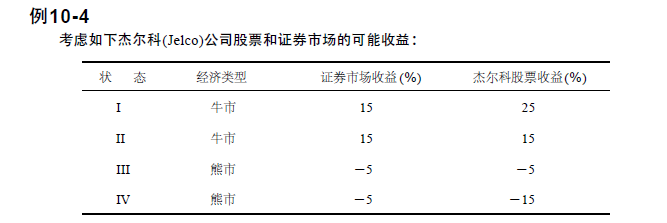

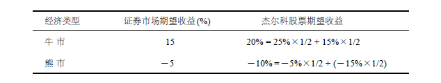

在牛市的时候，杰尔科公司股票的期望收益大于其在熊市的时候，称杰尔科公司对于市场变动发生反应

在牛市情况下的市场收益超过熊市情况下的市场收益$20\% = 15\% - (-5\%)$，
在牛市情况下杰尔科股票的收益超过在熊市情况下杰尔科股票收益的$30\% = 20\% - (-10\%)$。
则杰尔科公司股票收益变动对市场收益变动的反应系数为$1.5 = 30\% / 20\%$

*证券特征线(characteristic line, Characteristic Line of the Security)*: 

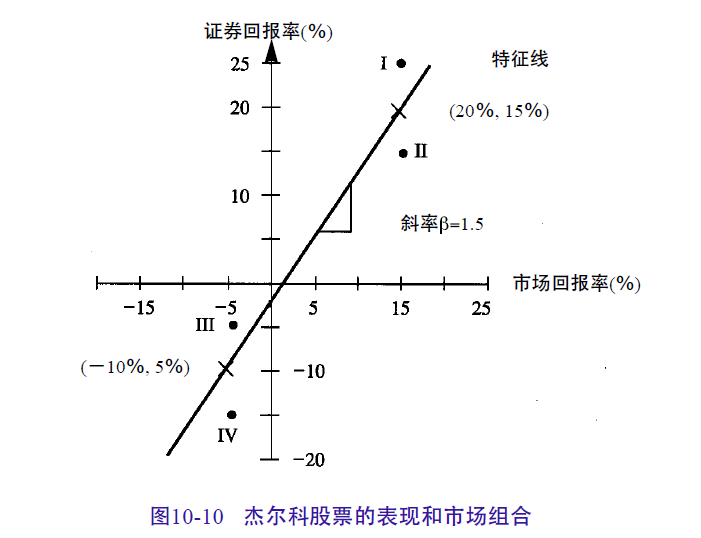

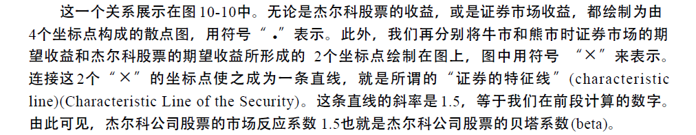

> 证券市场平均贝塔系数视为1
>
> 杰尔科股票的“放大因子”为1.5，可视为增加投资组合风险的股票；
> 对一个大型、多元化的投资组合所贡献的风险，超过一种一般或平均的股票

对一种贝塔系数为负的证券，将其视同**套利交易工具**或**保险策略**。
当市场走势较差时，这类证券预期走势较好；当市场走势较好时，这类证券预期走势较差。
将贝塔系数为负值的股票纳入一个大型、多元化的投资组合，实际上降低了组合的风险。

> 实证结果表明：实际上没有贝塔系数为负值的股票

##### 贝塔系数的计算公式

$$
\beta_i = \frac{Cov(R_i, R_M)}{\sigma^2{(R_M)}}
$$

> $Cov(R_i, R_M)$: 第$i$种证券的收益与市场组合收益之间的协方差
>
> $\sigma^2{(R_M)}$: 市场组合收益的方差

<u>当以各种股票的市场价值占市场组合总的市场价值的比重为权重时，所有证券的贝塔系数的平均数为1</u>，即：
$$
\sum_{i = 1}^N X_i \beta_i = 1
$$

> $X_i$为各种股票的市场价值占市场组合总的市场价值的比重
>
> > 如果将所有证券按照其市场价值进行加权，组合的结果就是市场组合

### 期望收益与风险之间的关系：资本资产定价模型

#### 市场的期望收益

$$
\bar{R}_M = R_F + 风险溢价
$$

> 即市场的期望收益是无风险资产的收益率加上因市场组合的内在风险所需的补偿

#### 单个证券的期望收益

*资本资产定价模型(capital-asset-pricing model, CAPM)*:
$$
\bar{R}_i = R_F + \beta_i \times (\bar{R}_M - R_F)
$$

> 某种证券的期望收益 = 无风险资产收益率 + 证券的贝塔系数 $\times$ 风险溢价

*证券市场线(security market line, SML)*: 

## 第十一章 套利定价理论

*套利定价理论(Arbitrage Pricing Theory)*

### 因素模型

#### 公告、意外和期望收益

任何在金融市场上交易的股票的收益都是由两个部分组成的：

1. 来自股票的正常收益或期望收益，这部分收益是市场上的股东对其投资收益的预测或期望。它取决于股东所拥有的关于其所持有的股票的信息，以及如何认识和使用在未来一个月有关影响股票价格变动的因素的信息
2. 股票的不确定性收益或风险收益。这部分收益源于在本月份内将要披露的信息。

$$
R = \bar{R} + U
$$

> $R$: 下个月的实际总收益
> $\bar{R}$: 实际总收益中的期望收益部分
> $U$: 实际总收益中的非期望收益部分

$$
公布信息 = 期望部分 + 异动部分
$$

> 期望部分：市场为获得某一种股票或期望收益$\bar{R}$而使用的部分信息：
> 异动部分：影响该种股票的“没有预期到的收益”$U$的那部分信息

#### 风险：系统性和非系统性

没有预测到的部分收益，其实是任何投资的真实风险

* *系统性风险*：指对大多数资产产生影响的风险，每种资产受影响的程度不同
* *非系统性风险*：指对某一种资产或某一类资产发生影响的风险。在一个大规模的投资组合中，非系统性风险会因资产多元化而化解或削减

$$
\begin{align}
R &= \bar{R} + U\\
&= \bar{R} + m + \varepsilon
\end{align}
$$

> $m$: 收益的系统性风险，也称为“市场风险”，在某种程度上，m影响着市场上所有资产的价格
>
> $\varepsilon$: 收益的非系统性风险，因为非系统性风险由某一公司持有，故又称为“持有风险”，与大多数公司的持有风险无关，即$Corr(\varepsilon_A, \varepsilon_B) = 0$

#### 系统性风险和贝塔系数

*贝塔系数(beta coefficient, $\beta$)*：表明股票收益对系统性风险的反应程度。

> 对前一章贝塔系数进行了一般化

以出人意料的通货膨胀为例，
如果公司股票的收益与通货膨胀的风险正相关，则该种股票所具有的通货膨胀的贝塔系数为正
如果公司股票的收益与通货膨胀的风险负相关，则该种股票所具有的通货膨胀的贝塔系数为负
如果公司股票的收益与通货膨胀的风险无关，则该种股票所具有的通货膨胀的贝塔系数为零

**因素模型(factor model)**: 系统性风险记作F，称作“系统性风险源”，简称“因素”。如果有$K$个系统性风险因素那么因素模型的完整公式如下：
$$
R = \bar{R} + \beta_1F_1 + \beta_2F_2 + \cdots + \beta_KF_K + \varepsilon
$$

> 其中，$\varepsilon$为某种股票持有的非系统性风险的收益，与其他公司股票的$\varepsilon$不相关

**三因素模型**：

三种重要的系统性风险：通货膨胀、GNP和利率
假设这三种系统性风险因素是足以描述影响股票收益的三种系统性风险因素：
$$
\begin{align}
R &= \bar{R} + U\\
&= \bar{R} +m + e\\
&= \bar{R} + \beta_I F_I + \beta_{GNP} F_{GNP}+ \beta_r F_r + e
\end{align}
$$

> $\beta_I$: 通货膨胀贝塔系数
> $\beta_{GNP}$: 国民生产总值贝塔系数
> $\beta_r$: 利率贝塔系数
> $F_I$: 通货膨胀异动
> $F_{GNP}$: 国民生产总值异动
> $F_r$: 利率异动

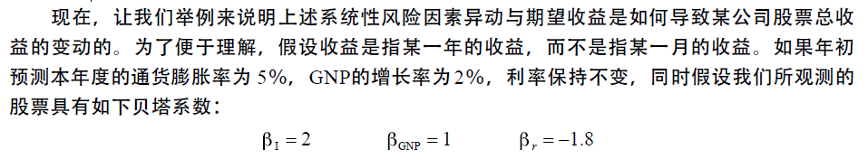

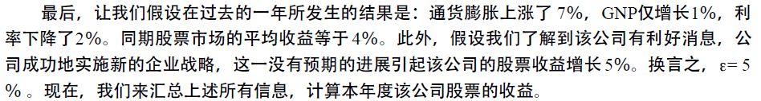

1. 确定各种系统性风险因素的异动，即没有预测到的变动，$F_{I},F_{GNP},F_{r}$；从而确定系统性风险因素异动对公司股票的影响即系统性风险收益$m$

   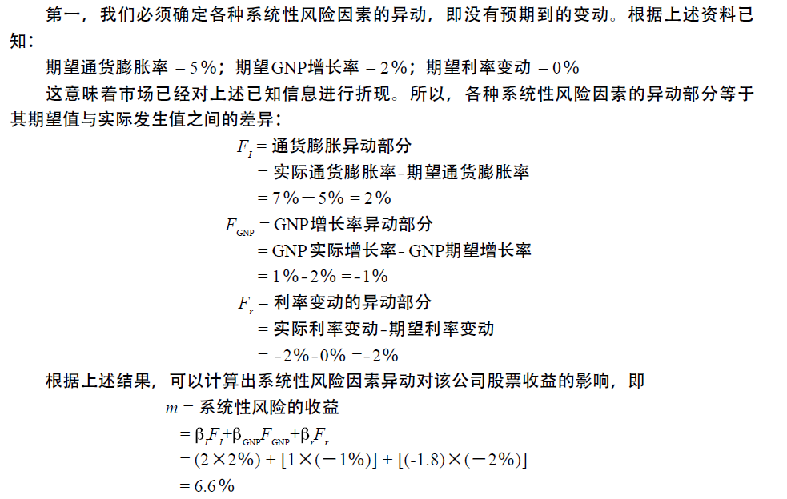

2. 计算公司股票的非期望收益，其等于将系统性风险的收益加上非系统性风险的收益：$m + \varepsilon$

   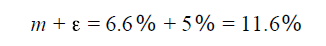

3. 计算该公司股票的总收益：

   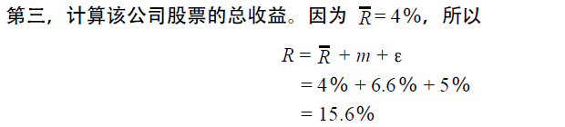

**单因素收益模型**：使用股票市场的收益指数作为唯一的因素，例如标准普尔500指数，或者是具有更广泛基础的、包含更多种股票的收益指数。
$$
R = \bar{R} + \beta(R_{标准普尔500} - \bar{R}_{标准普尔500}) + \varepsilon
$$
**市场模型(market model)**：
$$
R = \bar{R} + \beta(R_M - \bar{R}_M) + \varepsilon\\
another\ form: R = \alpha + \beta R_M + \varepsilon\\
\alpha = \bar{R} - \beta \bar{R}_M
$$

> $R_M$: 市场组合的实际收益
> $\bar{R}_M$: 市场组合的期望收益
> $\beta$: 贝塔系数

#### 投资组合与因素模型

将每种股票都表示为单因素模型，以这些股票构成投资组合：
$$
R_i = \bar{R}_i + \beta_i F + \varepsilon_i
$$
则投资组合：
$$
X_1 + X_2 + \cdots + X_N = 1\\
R_F = X_1 R_1 + X_2 R_2 + \cdots + X_NR_N\\
\Rightarrow R_F = X_1(\bar{R}_1 + \beta_1F + \varepsilon_1) + X_2(\bar{R}_2 + \beta_2F + \varepsilon_2) \\+\cdots + X_N(\bar{R}_N + \beta_NF + \varepsilon_N)\\
\Rightarrow R_F = (X_1\bar{R}_1 + X_2 \bar{R}_2 + \cdots + X_N \bar{R}_N) \\
+ (X_1\beta_1 + X_2 \beta_2 + \cdots + X_N\beta_N) \times F\\
+ (X_1\varepsilon_1 + X_2\varepsilon_2 + \cdots + X_N\varepsilon_N)
$$

> $$
> \begin{align}
> R_F &= 组合中各种证券期望收益的加权平均数 \\
> &+ 组合中各种证券的加权平均数 \times F\\
> &+ 组合中各种证券非系统性风险的加权平均数
> \end{align}
> $$

#### 投资组合与多元化

从技术上说，所谓的“大型组合”是指投资者不断增加投资组合中证券的种数。
在实践中，当投资组合中的证券种数达到一定数量时，投资组合为“有效组合”；此时，继续增加投资组合中的证券种数，不会再继续降低组合的风险。
<u>由于组合多元化效应，通过配置少量的投资于一个大型投资组合中的各种证券，组合中各种证券的非系统性风险将基本消失；而系统性风险仍然存在</u>
$$
\begin{align}
R_F &= (X_1\bar{R}_1 + X_2 \bar{R}_2 + \cdots + X_N \bar{R}_N) \\
&+ (X_1\beta_1 + X_2 \beta_2 + \cdots + X_N\beta_N) \times F
\end{align}
$$

> $$
> \begin{align}
> R_F &= 组合中各种证券期望收益的加权平均数 \\
> &+ 组合中各种证券的加权平均数 \times F
> \end{align}
> $$

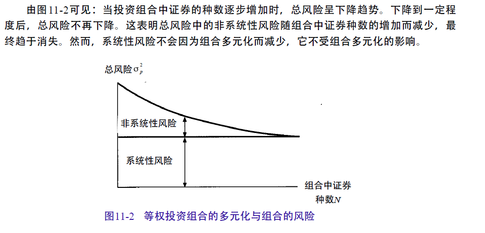

### 资本资产定价模型与套利定价模型

* 在*资本资产定价模型(CAPM)*中，贝塔系数是度量一种证券收益对证券市场收益变动的反应程度
* 在*套利定价模型(APT)*中，贝塔系数是度量一种证券收益对某种因素变动的反应程度

## 第十二章 风险、收益与资本预算

### 权益资本成本

 当企业有多余现金时，可以有两种做法：立即派发现金股利；投资一个项目，用项目所产生的未来现金流量派发股利
如果股东自己能以与企业投资项目相同的风险将分得的股利再投资于一项金融资产，那么股东就会在自己投资和企业投资中选择预期收益率较高的一个

<u>只有当项目的预期收益率大于风险水平相当的金融资产的预期收益率时，项目才可行</u>
即：项目的折现率等于同样风险水平的金融资产的预期收益率

从企业的角度来看，预期收益率就是权益资本成本，若用CAPM模型，股票的预期收益率为：
$$
\bar{R} = R_F + \beta \times (\bar{R}_M - R_F)
$$

> $R_F$: 无风险利率；
> $\bar{R}_M - R_F$：市场组合的预期收益率与无风险利率之差，称为*预期超额市场收益率*

则估算企业权益资本成本，需要：

1. 无风险利率$R_F$
2. 市场风险溢价$\bar{R}_M - R_F$
3. 公司贝塔系数$\beta$

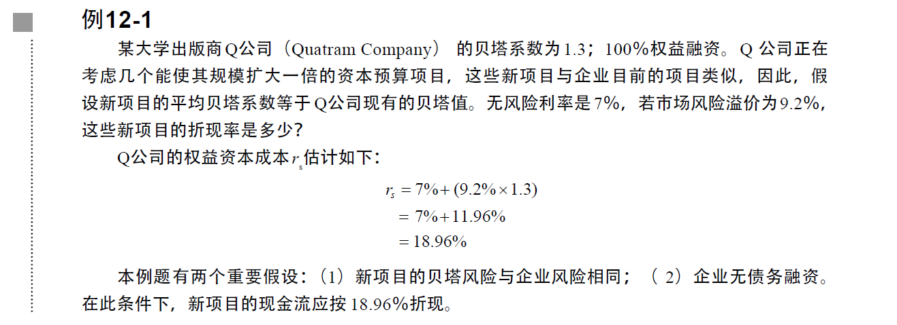

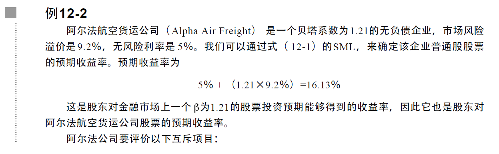

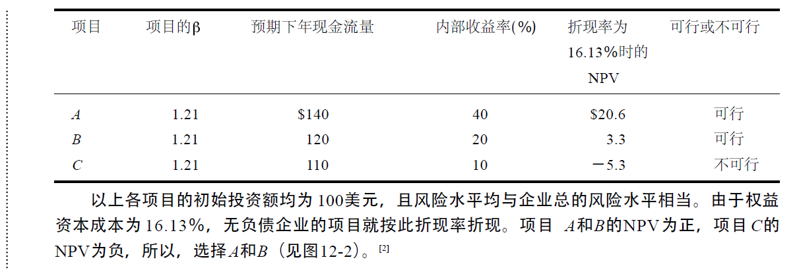

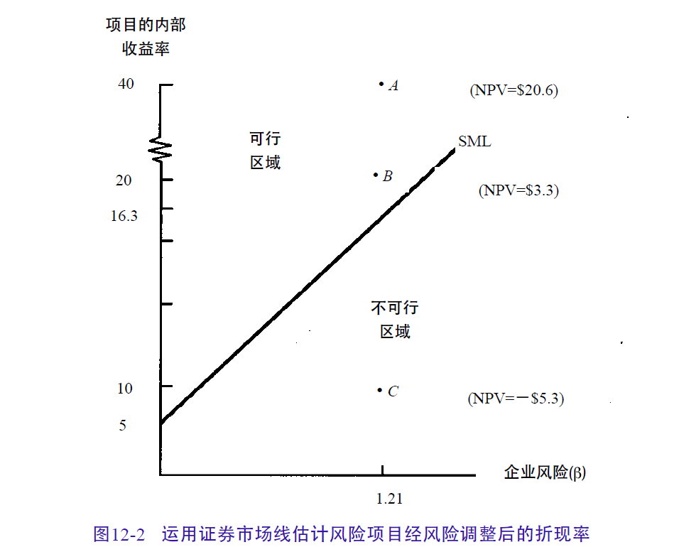

### 贝塔的估计

 证券的贝塔是证券收益率与市场组合收益率的标准协方差：
$$
证券i的贝塔 = \frac{Cov(R_i, R_M)}{Var(R_M)} = \frac{\sigma_{i,M}}{\sigma_{M}^2}
$$
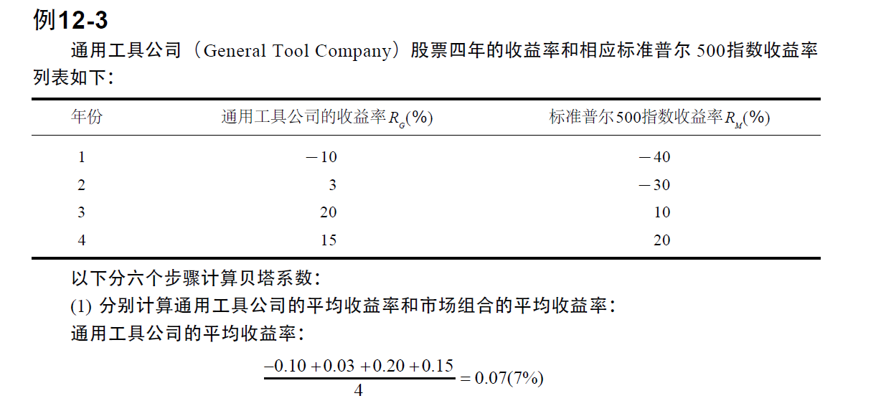

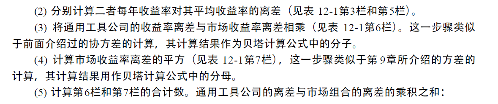
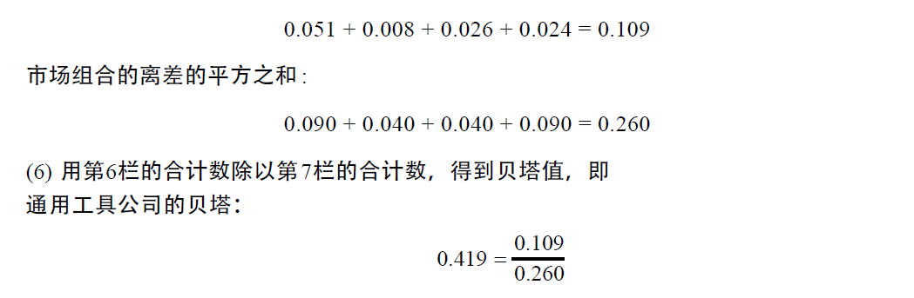

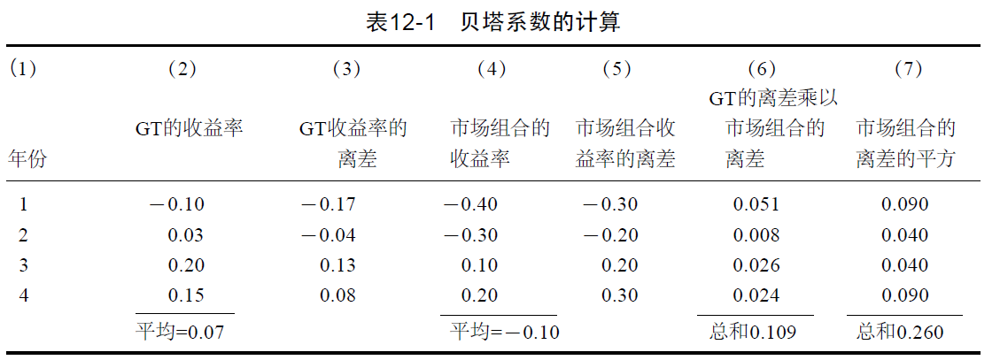

#### 实际工作中的贝塔系数

每个企业都有其特征线，证券特征线的斜率就是贝塔系数 —> *回归*

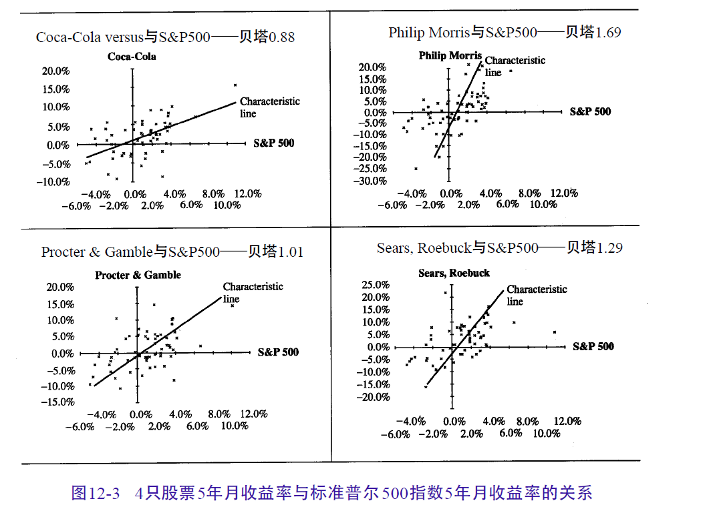

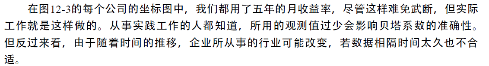

#### 行业贝塔系数的运用

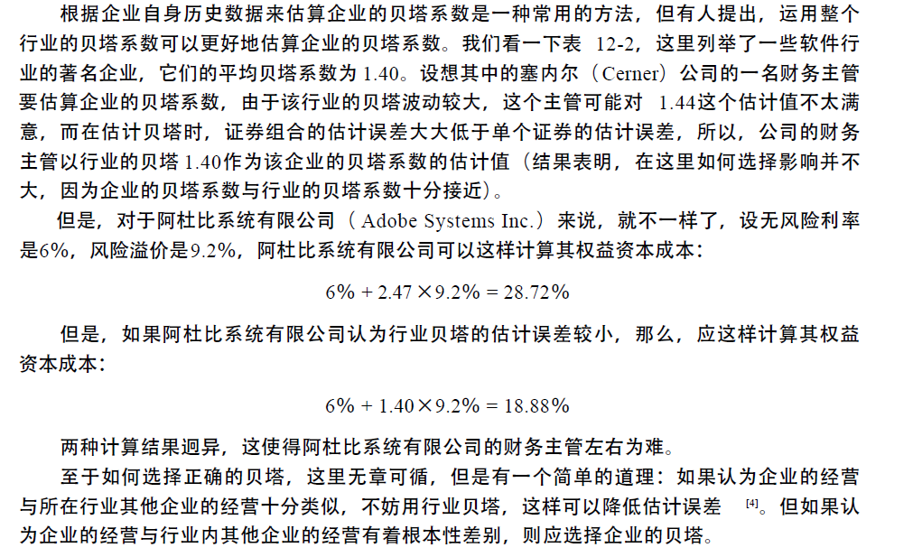

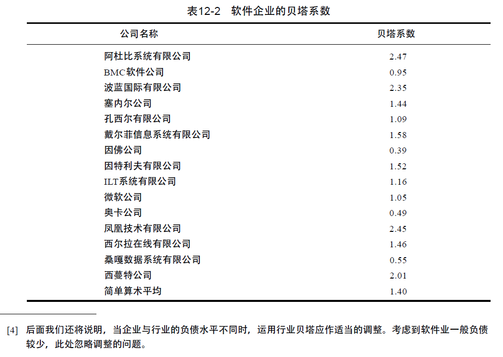

### 贝塔的确定

一只股票的贝塔由其企业的特性决定：<u>收入的周期性、经营杠杆和财务杠杆</u>

#### 收入的周期性

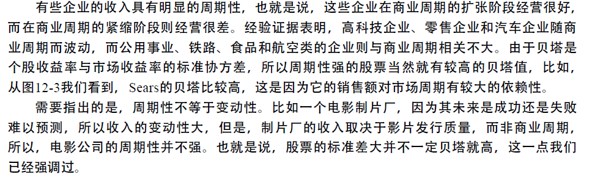

#### 经营杠杆

*经营杠杆(operating leverage)*: 
$$
DOL = \frac{EBIT的变动}{EBIT} \times \frac{销售收入}{销售收入的变动}\\
DOL =(S - SC) / (S - SC - F)
$$

> $EBIT$： 税前息前利润
> $S$: 销售额
> $Q$: 销售量
> $V$: 变动成本
> $C$: 变动成本率
> $F$: 固定成本
>
> 经营杠杆反映了：销售收入变动百分比给定EBIT变动百分比下，当固定成本增加，变动成本下降时，经营杠杆提高
>
> > 根据成本性态，在一定产销量范围内，产销量的增加一般不会影响固定成本总额，但会是单位产品固定成本降低，从而提高单位产品利润，并使利润增长率大于产销量增长率；反之，产销量减少，会使单位产品固定成本升高，从而降低单位产品利润，并使利润下降率大于产销量的下降率。
> >
> > 产品只有在没有固定成本的条件下，才能使贡献毛益等于经营利润，使利润变动率与产销量变动率同步增减。

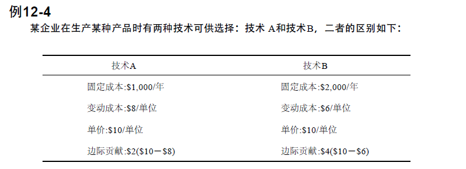

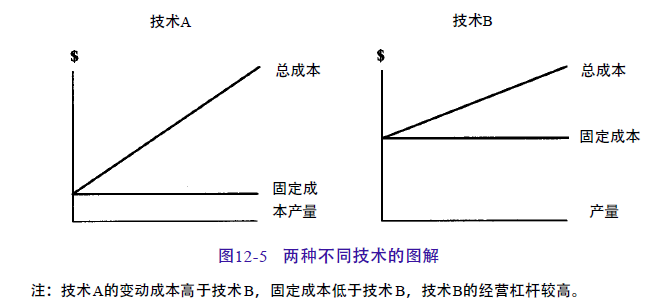

边际贡献等于价格与变动成本之差，用于衡量每增加一个单位的产品所增加的利润。
<u>技术B的边际贡献较大，所以这种技术风险较大，即销售量的变动所引起的税前息前利润的变动更大。</u>

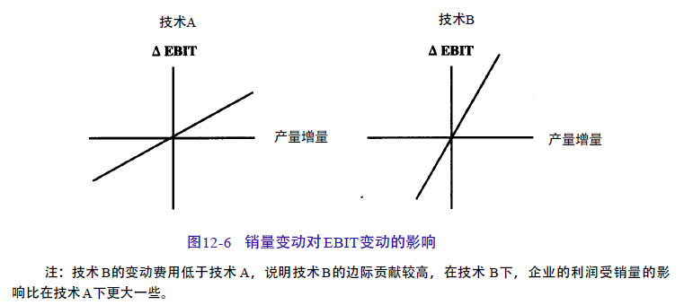

* 企业收入的周期对贝塔起决定性作用，经营杠杆则将这种作用放大。
  * 如果收入的周期性强且经营杠杆高，则贝塔值也高
  * 如果收入的周期性不明显且经营杠杆低，则贝塔值也低
  
* 经营风险一般指无财务杠杆的情况下的企业风险，取决于企业收入对商业周期的敏感程度和企业的经营杠杆

  在固定成本不变的情况下，销售额越大，经营杠杆系数越小，经营风险就越小；销售额越小，经营杠杆系数越大，经营风险越大

#### 财务杠杆

* 经营杠杆指企业的固定成本，而财务杠杆反映企业对债务融资的依赖程度
* 杠杆企业是指资本结构中有负债的企业，杠杆企业无论其销售情况如何都要支付利息，所以财务杠杆是指企业的固定财务费用

$$
DFL = (\Delta EPS / EPS) / (\Delta EBIT / EBIT)\\
DFL = EBIT / (EBIT - I)
$$

> $I$: 利息费用

*资产贝塔(asset beta)* v.s. *权益贝塔(equity beta)* 
—> 资产贝塔是企业总资产的贝塔系数，除非完全依靠权益融资，否则不能把资产贝塔看作普通股的贝塔系数(权益贝塔)
$$
\beta_{资产} = \frac{负债}{负债+ 权益}\times\beta_{负债} + \frac{权益}{负债 + 权益}\times \beta_{权益}
$$

> 在实际中，负债的贝塔很低，一般假设为0，则:
> $$
> \beta_{资产} = \frac{权益}{负债 + 权益}\times \beta_{权益}
> $$
> 对于杠杆企业，$ \frac{权益}{负债 + 权益}$一定小于1，所以$\beta_{资产}< \beta_{权益}$，即在财务杠杆的情况下，权益贝塔一定大于资产贝塔
> $$
> \beta_{权益} = \beta_{资产}(1 + \frac{负债}{权益})
> $$
>
> > 在课税的情况下，企业的资产贝塔和权益贝塔的关系为：
> > $$
> > \beta_{权益} = \beta_{资产}[1 + (1 - T_C)\frac{负债}{权益}]
> > $$

### 基本模型的扩展

企业贝塔 v.s. 项目贝塔 —> 公司贴现率 v.s. 项目贴现率

* 如果公司对所有项目都按照同一个贴现率贴现，就会出现偏差，从而接受过多的高风险项目，拒绝过多的低风险项目

行业贝塔 v.s. 项目贝塔

* 一般可假定项目风险与行业风险相同，可用行业的贝塔系数作为项目的贝塔系数
* 新的项目往往受经济环境变化的影响比较大，所以一个新项目的贝塔可能会大于同行业中现有的企业的贝塔
  * 在经济衰退期，新项目可能会失败，而成熟项目可以正常运营
  * 在经济扩张期，新项目会比成熟项目增长更快
* 为了体现额外的风险，新项目应在行业贝塔系数的基础上调高一些
* 有时候一个新的项目可能不属于任何现有的行业，可通过了解项目收入的周期性和经营杠杆来估计贝塔，这是一种定性的方法

#### 有负债情况下的资本成本

假定某企业运用债务和权益融资来进行投资，按$r_B$借入债务资本，按$r_S$取得权益资本：
$$
\frac{S}{S + B}\times r_S + \frac{B}{S + B}\times r_B
$$

> 若企业无负债，即一个全权益企业，其平均资本成本就等于权益成本$r_S$
> 若企业负债特别多而权益几乎没有，即一个全负债企业，其平均资本成本就等于负债成本$r_B$

由于利息是可以抵税的，税后的债务资本成本为：
$$
税后债务资本成本 = r_B \times (1-T_C)
$$

> $T_C$: 公司的所得税税率

从而，企业税后平均资本成本：
$$
平均资本成本 =\frac{S}{S + B}\times r_S + \frac{B}{S + B}\times r_B \times(1-T_C)
$$
平均资本成本是权益资本成本和债务资本成本的加权平均，故通常称之为：*加权平均资本成本(weighted average cost of capital, WACC)*
如果企业有负债，则折现率应按$r_{WACC}$

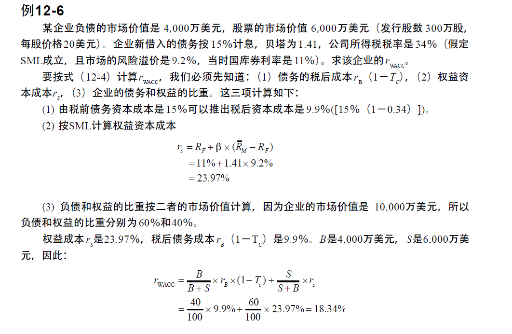

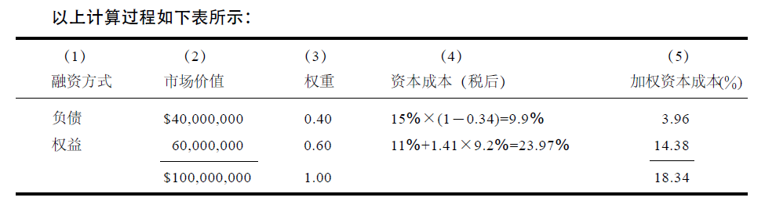

----

