[toc]

# 第二篇 价值和资本预算

* 真实资产 v.s. 金融资产
* 投资的目的是使投资的价值最大化 —> 价值理论

## 第三章 金融市场和净现值：高级理财的第一原则

### 金融市场经济

* 授权给任何人都有权获得支付的金融工具叫做“*无记名金融工具*”。

#### 匿名的市场

执行使借款人和贷款人或交易者匹配的市场职能的机构叫做“*金融中介机构(financial intermediaries)*”

> 借款人和贷款人无需见面，不必寻找交易对象，可以各自跟纪录保存者直接交易。

#### 市场出清

贷款人愿意贷出的数量 等于 借款人愿意借入的数量 —> 市场出清。
这一利率水平被称之为：*均衡利率*

### 一定时期内的消费选择决策

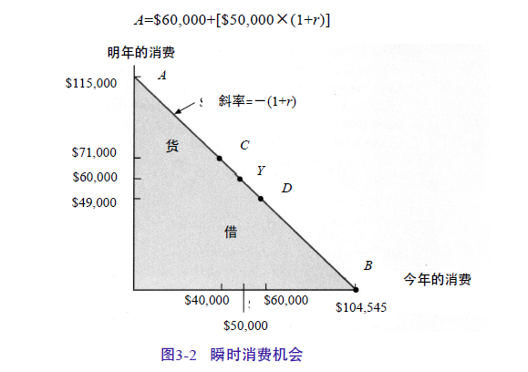

> $r$ 代表利率，市场上的均衡利率。假设不存在信用风险，故为无风险利率。

通过借贷，可以实现线段$AB$上任何一点的消费组合 —> 个人通常能利用金融市场上的借贷行为来调整储蓄和消费模式。

### 竞争性市场

只能被动地对利率和价格作出反应而不能对之产生任何影响的人，在经济学上叫做“*价格追随者*”。

“*价格追随假设*”是构成完全竞争金融市场(perfectly competitive financial markets)的条件之一。

* 无交易成本，能够自由进入或退出金融市场
* 有关借贷机会的信息是可获得的
* 存在大量的交易者，没有交易者对市场价格具有举足轻重的影响

#### 在竞争市场上存在多少种利率

在一个市场上签订合同而同时在另一个市场作反向交易的过程，以及其他更受人喜爱的形式统称为“*套利*”，操作的过程就叫进行*套利*。

<u>一旦本质上相同的无风险贷款存在不同的利率，套利者将通过以较低利率借入再以较高利率贷出的办法，从这种情形中获利。</u> —> 利率差异将会消失，市场上只能存在一种利率。

### 基本原则

假设：<u>如果个人能增加选择机会，对他而言无论如何不是坏事。</u>

*投资决策第一性原则*：只有当一个投资项目能够增加在金融市场上的选择范围时，它才是可行的。实施这个投资项目至少要带来与金融市场上可获得的机会相等的效用。
如果它不能带来金融市场所能提供的效用，人们不会从事这项投资而是径直利用金融市场上的机会。

### 原则的利用

*分离定理* :<u>对个人而言，一项投资的价值与消费偏好无关</u>

### 投资决策阐释

*净现值(NPV)* v.s. *终值(FV)* —> *净现值法则(net present value rule)*

> NPV 回答了作为投资的替代，一个投资者现在需要多少现金的问题。
> 如果净现值为正，则这项投资值得实施，其本质上相当于获得等于净现值数量的现金收入。
> 如果净现值为负，进行这项投资相当于现在放弃一些现金，因此放弃这项投资。

### 公司投资决策过程

公司并无*消费禀赋*

NPV法则 —> 使管理者最大化公司的价值

## 第四章 净现值

**货币的时间价值**

### 单期 v.s. 多期

#### 单期

*终值(future value)* / *复利值(compound value)* v.s. *现值(present value)*
$$
PV = \frac{C_1}{1+ r}
$$

> $C_1$: 一期后的现金流
> $r$: 适用的利率 —> 贴现率

$$
NPV = -成本 + PV
$$

#### 多期

##### 终值和复利计算

*单利(simple interest)* v.s. *复利计算(compounding)*
$$
FV = C_0 \times (1+r)^T
$$

> $C_0$: 期初投资的金额
> $r$: 利息率
> $T$: 资金投资所持续时期数

##### 现值和贴现

*贴现(discounting)*：计算未来现金流现值的过程
$$
PV = \frac{C_T}{(1+r)^T}
$$

> $C_T$: 在$T$期的现金流
> $r$: 利息率

$$
NPV = -C_0 + \frac{C_1}{1+r} + \frac{C_2}{(1+r)^2} + \cdots + \frac{C_T}{(1+r)^T} = -C_0 + \sum_{i = 1}^T \frac{C_i}{(1+r)^i}
$$

#### 复利计息期数

一年之中一项投资复利计息$m$次的年末终值为：
$$
C_0(1+\frac{r}{m})^m
$$

> $C_0$: 投资者的初始投资
> $r$: 名义年利率（年百分比率）
>
> 名义年利率(SAIR) —> 实际年利率(EAIR)
> 由于复利计息，实际年利率要高于名义利率：
> 实际年利率：$(1+\frac{r}{m})^m - 1$

##### 多年期复利计息

$$
FV = C_0 \times (1 + \frac{r}{m})^{mT}
$$

##### 连续复利计息

*连续复利计息(continuous compounding)*
$$
FV = C_0 \times e^{rT}
$$

> $C_0$: 初始投资
> $r$: 名义利率
> $T$: 投资所持续年限
> $e$: 常数

### 四类现金流

*永续年金(perpetuity)​*: 
$$
PV = \frac{C}{1+r} + \frac{C}{(1+r)^2} + \frac{C}{(1+r)^3} + \cdots = \frac{C}{r}
$$

> 永续年金的现值会随着利率的下调而增加，随着利率的升高而下降

*永续增长年金(growing perpetuity)*:
$$
PV = \frac{C}{1+r} + \frac{C\times (1+g)}{(1+r)^2} + \frac{C\times (1+g)^2}{(1+r)^3} + \cdots + \frac{C\times (1+g)^{N-1}}{(1+r)^N}+ \cdots = \frac{C}{r-g}
$$

> $C$: 现在开始一期后收到的现金流
> $g$: 每期的增长率
> $r$: 贴现率

*年金(annuity)*: 一系列稳定有规律的、持续一段固定时期的现金收付活动。
$$
PV = \frac{C}{r} - \frac{C}{r(1+r)^T} = C(\frac{1}{r} - \frac{1}{r(1+r)^T})
$$

> $\frac{1}{r} - \frac{1}{r(1+r)^T}$ —> *年金系数(annuity factor)*，记作$A_r^T$，在利率$r$下，$T$年内每年获得1美元的年金的现值
>
> *先付年金* v.s. *后付年金*

*增长年金(growing annuity)*
$$
PV = C(\frac{1}{r-g} - \frac{1}{r-g}\times(\frac{1+g}{1+r})^T)
$$

### 评估公司价值

<u>公司目前的价值取决于它未来的现金流</u>

## 第五章 债券和股票的定价

### 债券

#### 债券种类及其定价

*纯贴现债券(pure discount bond)* / *零息债券*：承诺在未来某一确定的日期作某一单笔支付，<u>债券持有人到期前不能得到任何现金支付</u>。
$$
PV = \frac{F}{(1+r)^T}
$$
*平息债券*：不仅在*到期日(maturity date)*支付现金，在发行日和到期日之间也进行有规律的现金支付。这些支付被称为债券的*票面利息(coupons)*。

平息债券的价格，为其利息支付流的现值和其本金支付的现值之和。
$$
PV = \frac{C}{1+r} + \frac{C}{(1+r)^2} + \cdots +  \frac{C}{(1+r)^T} + \frac{F}{(1+r)^T} = C\times A_r^T + \frac{F}{(1+r)^T}
$$

> $C$: 债券的票面利息
> $F$: *面值(face value)*

实际年利率：$(1+\frac{r}{m})^m - 1$

> $r$: 名义票面利率
> $m$: 间隔期数

*永久公债*：长期公债从不停止支付票面利息，从没有最后支付日，因此也从没有到期日。

> *优先股*：由公司发行的、给予持有者永久固定红利的股票。如果公司对优先股的股利支付没有任何问题，这样的优先股实际上就是永久公债。
>
> 永久公债的定价参见 永续年金
> $$
> PV = \frac{C}{r}
> $$

#### 利率和债券价格

债券*折价(discount)*销售 v.s. 债券*溢价(premium)*销售

<u>债券价格随市场利率上升而下降，随市场利率下降而上升</u>
普遍来说，平息债券用以下方式销售：

* 如果票面利率等于市场利率，债券以面值平价销售
* 如果票面利率低于市场利率，则债券折价销售
* 如果票面利率高于市场利率，则债券溢价销售

#### 到期收益率

*到期收益率(yield to maturity)*：使得<u>债券的价格等于本金和利息的现值</u>的折扣率，即到期收益率。

### 普通股的股价

#### 股利和资本利得

<u>股票价格等于下一期的股利和下一期股票价格的现值的总和，也是以后所有各期股利的现值</u>
$$
P_0 = \frac{Div_1}{1+r} + \frac{P_1}{1+r}\\
P_1 = \frac{Div_2}{1+r} + \frac{P_2}{1+r}\\
\Rightarrow P_0 = \sum_{t=1}^\infty \frac{Div_t}{(1+r)^t}
$$

> $Div$: 年底支付的分红
> $P_1$: 年底价格
> $P_0$: 普通股投资的现值
> $r$: 股票的折现率。在没有风险的时候，它将等于市场利率；当有风险的时候，它高于市场利率。

#### 公司股利基本模式与定价模型

**股利增长模型**：

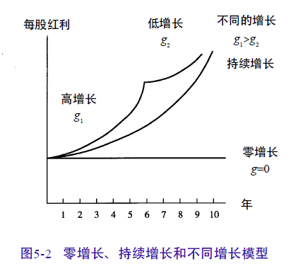

*零增长*：股利零增长的股票价格 
$$
Div_1 = Div_2 = \cdots = Div\\
P_0 = \frac{Div_1}{1+r} + \frac{Div_2}{(1+r)^2} + \cdots = \frac{Div}{r}
$$
*持续增长*：股利以 $g$ 的比例增长

| 年底 | 1     | 2          | 3            | 4            | $\cdots$ |
| ---- | ----- | ---------- | ------------ | ------------ | -------- |
| 股利 | $Div$ | $Div(1+g)$ | $Div(1+g)^2$ | $Div(1+g)^3$ | $\cdots$ |

$$
P_0 = \frac{Div}{1+r} + \frac{Div(1+g)}{(1+r)^2} +\frac{Div(1+g)^2}{(1+r)^3} +  \cdots = \frac{Div}{r-g}
$$

> $g$: 增长率
> $Div$: 第一期结束时的股利
>
> 参见永续增长年金 

*不同增长*
$$
P_0 = \sum_{t = 1}^T\frac{Div(1+g_1)^{t-1}}{(1+r)^t} + \frac{\frac{Div_{T+1}}{r-g_2}}{(1+r)^T}
$$

### 股利折现模型的参数估计

#### 股利增长率g

除非有净投资进行，一个公司下年度的赢利一般被视为与今年的赢利相同。
一项净投资等于总投资减折旧，当总投资等于折旧时，净投资将是零增长，公司的物质形态会维持，但赢利并没有持续增长。
只有当一些盈余没有被当作股利支付给投资者时，净投资才会为正：
—> $下一年的赢利 = 今年的赢利 + 今年留存收益 \times 今年留存收益的回报率$ 
—> $\frac{下一年的赢利}{今年赢利} = \frac{今年的赢利}{今年的赢利} + \frac{今年留存收益}{今年的赢利} \times 今年留存收益的回报率$
—> $1+g = 1+留存比率 \times 留存收益回报率$
$$
g = 留存比率 \times 留存收益回报率
$$

> $g$: 盈利增长率
>
> > $g$也指红利的增长率。因为红利和赢利的比例经常保持不变，本文中赢利增长率等于红利增长率。
>
> 留存收益和赢利的比例被称为*留存比率(retention ratio)*
>
> 由于即将出现的项目的细节并非公开信息，决定最近的留存收益的预期回报率是困难的，通常假设近年选择的项目与其他年度投资项目具有相同的回报率。 —> 历史*权益回报率(return on equity, ROE)* 来估计现有的留存收益的预期回报率
>
> > $ROE$是公司全部资本的回报率，是公司以往所有项目回报的累积

#### 股票现金流贴现率r

$$
P_0 = \frac{Div}{r - g}\\
\Rightarrow r = \frac{Div}{P_0} + g
$$

> 从而折现率被分为两个部分，一部分是比率$Div/P_0$，即股利收益率，另一部分$g$则是股利增长比率。
>
> > $Div$指以后一年得到的股利
>
> 由于股利和股票价格信息公开，$Div/P_0$易得，而$g$可由$g = 留存比率 \times 留存收益回报率$计算得到，$r$可计算得出。
>
> > 股利又可借助留存比率计算：
> > 支付比率是股利与盈利的比率：
> > $支付比率 = 1 - 留存比率$
> >
> > 下一年盈利由当年度盈利与增长率得出，由下一年度盈利与支付比率可得股利。

#### 怀疑主义

* 对股利折现模型的$g$参数估计是建立在一系列假设上的，而参数$r$的估计又高度依赖于$g$。
  故一些财务经济学家普遍认为，对单个证券的$r$的估计由于误差太大而缺乏可操作性，建议计算整个行业的平均$r$值，以此作为这一行业领域某一特定股票股利的折现。

* 估计单个股票$r$值时，需要主义两种极端情况

  1. 最近公司不支付股利：

     这种股票价格高于0是因为投资者相信公司在某一特定日期会发放股利，或者在将来某个时候可以从公司得到一些什么。

     当公司从无股利转为发放某一数额股利时，增长率是无穷

  2. 当$g = r$时，公司价格是无穷

     股票价格不可能是无穷，所以对某一特定公司的$g$等于或高于$r$的估计都是错误的。

     在大多数情况下，分析家对$g$的高估在未来几年是正确的，但是公司不可能永远维持一种非正常的高增长状态。

     分析者的错误是用对$g$的短期估计来衡量公司永久的增长率

### 增长机会

假设公司为了对某一特定的项目进行投资，在第一期保留了所有的股利。项目折现到0期的每股净现值是*NPVGO*，他代表了增长机会的每股净现值。

如果公司决定在第1期开发项目，因为项目的每股价值是附加在公司原先的股票价格之上，因此公司承担新项目后的股票价格为：
$$
\frac{EPS}{r} + NPVGO
$$

> $EPS$: 每股盈利
> $r$: 公司股票的折现率
> $NPVGO$: 增长机会的每股净现值
>
> 则股票价格可看作两部分的组合：
> 第一部分：$EPS/r$是公司对现有成绩心满意足而简单地把所有的盈利都分配给投资者时股票的价格
> 第二部分：公司为了给新项目筹资保留盈余时的新增价值

  为了提高价值，两种情况必会出现：

1. 必须保留盈余以为项目筹资
2. 项目必须要有正的净现值

#### 股利和盈利的增长和增长机会

当公司投资在有正的NPVGO的增长机会时，公司的价值增加；而当公司选择了有负的NPVGO的机会时，公司的价值降低。
但是，<u>不管项目是否有正的或负的NPV，股利都是增长的</u>。

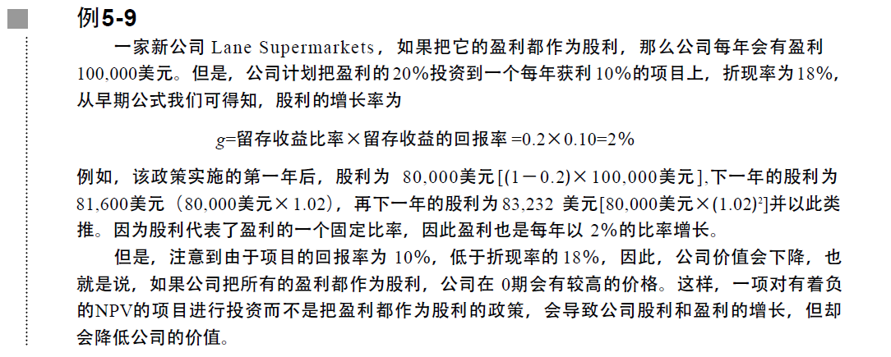

##### 股利和盈利

* 我们对股利而非盈利进行折现。
  投资者只能从股票的两处获利：股利和最终的销售价，而这些是由未来希望从股利中获益的投资者决定的。
* 如果用盈利而非股利折现，股票价格会太高。
  实际上，只有盈利的一部分作为股利被持有人拥有，其余部分被保留用于产生新的股利。
  模型中，留存收益等于公司投资。折现盈利而非股利会忽略一个公司为了产生未来的收益而必须进行的新的投资

### 股利增长模型和NPVGO模型

用增长年金模型对股利稳定增长的股票进行定价时，该模型又被称为*股利增长模型*。

股利的稳定增长是由对增长型机会的持续投资引起的，而不是由对单一机会的投资引起的。因此，当由于持续的投资产生增长时，有必要对*股利增长模型*和*NPVGO模型*进行比较。

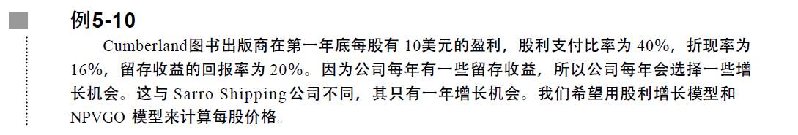

**股利增长模型**：

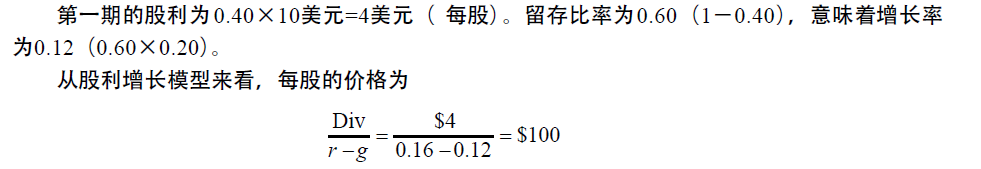

**NPVGO模型**：

1. 单一增长机会的净现值

   第一期时公司每股盈利10美元，其中6美元($0.6 \times 10)$ 用于投资，公司以后每年可以得到1.2美元($6 \times 0.20$)的盈利。
   投资的净现值：
   第一期投资产生的每股净现值：
   $-\$6 + \frac{\$ 1.20}{0.16} = \$1.50$ 

2. 所有增长机会的净现值

   盈利和股利的增长率为$12\%$，因为留存收益是全部盈利的一部分，因此，留存收益以每年$12\%$的比率增长。又所有项目每年产生相同的回报，故NPVGO以每年$12\%$的比率增长。
   $$
   NPVGO = \frac{\$ 1.50}{1.16} + \frac{\$ 1.50 \times 1.12}{1.16} + \frac{\$ 1.50 \times (1.12)^2}{1.16} + \cdots\\
   \Rightarrow NPVGO = \frac{\$ 1.50}{0.16 - 0.12} = \$37.50
   $$
   
3. 公司作为“现金牛”的每股价格，即公司没有任何增长机会时的价格。

   假设公司把所有盈利作为分红支付，在这种情况下，每年的股利为10美元。
   $\frac{Div}{r} = \frac{\$ 10}{0.16} = \$62.50$
> 公司股票的价格为(2)和(3)总和

<u>无论采用股利增长模型还是NPVGO模型，股票定价一致。因为尽管方法不一样，但是现值概念方法的运用是一样的</u>

### 市盈率

$$
每股价格 = \frac{EPS}{r} + NPVGO\\
\Rightarrow \frac{每股价格}{EPS} = \frac{1}{r} + \frac{NPVGO}{EPS}
$$

> $\frac{每股价格}{EPS}$：*市盈率(P/E)*
>
> 每股盈利相同的公司，具有较多发展机会的公司的股票可以在较高的价位出售，因为投资者既购买现有的1美元，也购买了发展机会。
>
> > 电子和其他高科技股票价格经常可以以较高的$P/E$比率出售，因为它们让人感到会有较高的增长率。事实上，一些科技股票类别的公司虽然尚未赢利，但却以较高的价位出售，$P/E$比率为无穷
> >
> > 而公共事业和一些传统行业经常以较低的$P/E$比率出售，人们对它们增长的预期较低

* 折现率：

  $P/E$与折现率负相关，又折现率与股票的风险和变动正相关，则$P/E$比率与股票的风险负相关。

  则$EPS$相同时，盈利比较稳定的公司风险较小，股票售价更高，拥有更高的$P/E$比率

* 会计方法选择

  不同会计方法影响盈余的计量，以存货的会计方法为例：

  * *先进先出(FIFO)*: 在通货膨胀情况下，FIFO少报了存货的实际成本，相应地高估了盈余
  * *后进先出(LIFO)*: 用最近的成本对存货定价的做法意味着盈利会比在FIFO的情况下低。这样LIFO比FIFO更为保守。

  从而，在每股价格相同时，相对保守的公司就拥有较高的$P/E$比率

在以下情况下，公司的市盈率可能比较高：
* 公司有许多发展机会（比较重要）
* 低风险
* 采用比较保守的会计方法

### 利率的期限结构、即期利率和到期收益率

<u>因为不同时间里的通货膨胀率不同，利率随着时间的变化而变化</u>

*即期利率* v.s. *到期收益率*

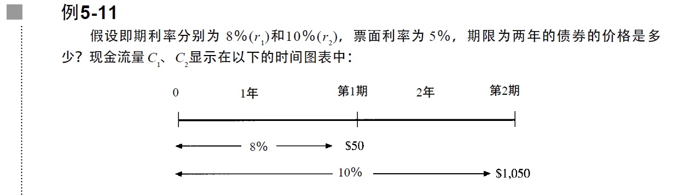

即期利率：债券可被看作一个零息债券与一年和两年的到期债权的组合。
$PV = \frac{\$50}{1 + 0.08} + \frac{\$1,050}{(1+1.10)^2} = \$914.06$

到期收益率：
$PV = \frac{\$50}{1 + y} + \frac{\$1,050}{(1+y)^2} = \$914.06 \Rightarrow y = 9.95\%$
$y$为到期收益率

> 通过市场即期利率来决定债券价格，通过债券价格来计算到期收益率
> —> 到期收益率可看作即期利率的某种平均值（金融经济学家认为它是以时间为权重的平均值）
>
> > 具有相同到期日的债券，如票面收益率不同，债券的到期收益率将会不同

#### 利率的期限结构

*远期利率*：给定即期利率$r_1$$、$$r_2$，可决定远期利率$f_2$
$$
(1+r_2)^2 = (1+r_1)\times(1+f_2)\\
f_2 = \frac{(1+r_2)^2}{1+r_1} - 1
$$

> 把两年期的即期利率分解为一个一年期的即期利率与第二年的远期利率

$$
f_n = \frac{(1+r_n)^n}{(1+r_{n-1})^{n-1}} - 1
$$

> $f_n$: n年后的远期利率
> $r_n$: n年的即期利率
> $r_{n-1}$: $n-1$年的即期利率

#### 预期假说

如果第二年的远期利率等于第二年预期的即期利率，投资者在第一年将获得相同的收益，而不管是：

1. 投资一年期的债券$P_0 \times (1+r_1)$
2. 投资两年期的债券，但在一年后出售$\frac{P_0\times(1+r_2)^2}{1 + 第2年预计的即期利率} =\frac{P_0\times(1+r_1)\times(1+f_2)}{1 + 第2年预计的即期利率}$

**预期假说**：$f_2 = 第2年预期的即期利率$
投资者会将利率设在使得<u>远期利率等于由市场决定的从现在开始的一年期的即期利率</u>的水平上。
如果远期利率$f_2$低于第2年的即期利率
($\frac{P_0\times(1+r_1)\times(1+f_2)}{1 + 第2年预计的即期利率} = P_0\times(1+r_1)\times\frac{(1+f_2)}{1 + 第2年预计的即期利率}<P_0\times(1+r_1)$)，
则想要投资于一年的个体通常会购买一年期债券

#### 流动性偏好假说

策略Ⅰ无风险，投资回报率必为$r_1$，而策略Ⅱ存在风险，其最后的投资回报率依赖于利率的变化。

因此，若两个策略收益一样，则对风险有偏好的投资者将会选择策略Ⅱ。而对反对风险的投资者，只有当策略Ⅱ比策略Ⅰ有更高的回报时，才会选择策略Ⅱ。
也即，
**流动偏好性假说**：$f_2 > 第2年预期的即期利率$

因此，为了吸引投资者持有风险性相对较高的2年期债券，市场通常会把第2年的远期利率设得比第2年的预计即期利率高。

> 1年期的投资者占主导地位的市场：$f_2 > 第2年预期的即期利率$
>
> 典型投资者的时间水平通常比市场上典型债券的到期期限短，因此，这一不等式可看作时由风险反对者组成的债券市场均衡

3. 购买2年期债券$P_0 \times (1+r_2)^2 = P_0 \times (1+r_1) \times (1 + f_2)$
4. 购买1年期债券，当债券到期时，立即购买另一种1年期债券$P_0 \times (1+r_1) \times 第2年预期的即期利率$

> 以2年期为起点的投资者占主导地位的市场中：$f_2 < 第2年预计的即期利率$

## 第六章 资本预算的其他方法

### 回收期法

*payback period rule*:

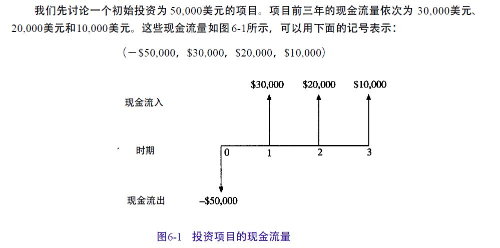

公司在项目运营的前两年将收到$30,000$美元 和 $20,000$美元，加起来相当于初始投资$50,000$美元。这意味着公司在两年内就可以收回投资。两年就是项目的”*回收期*“

> 选择一个具体的回收期，比如两年，则所有回收期等于或小于两年的项目都可行，而回收期在两年以上的项目便不可行

#### 回收期法存在的问题

1. 回收期内现金流量的时间序列
2. 关于回收期以后的现金流量
3. 回收期法决策依据的主观臆断

> 由于回收期法决策过程的简便性，回收期法常常被用来筛选大量的小型投资项目

#### 折现回收期法

*discounted payback period rule*: 先对现金流量进行折现，然后求出达到初始投资所需要的折现现金流量的时限长短

则根据回收期法，该投资的回收期为2年

初始投资的折现回收期就是折现后现金流量的回收期。则可得折现现金流量的回收期略小于3年。

> 在各期现金流量均为正数的情况下，由于贴现会使现金流量变小，折现回收期一定会大于至少是等于相应的回收期

### 平均会计收益率法

平均会计收益率(*average accounting return*)为扣除所得税和折旧之后的项目平均收益除以整个项目期限内的平均账面投资额

1. 确定平均净收益
   年净收益为扣除折旧和所得税之后的净现金流量。
   折旧不是现金流出，而是一项提成，反映了商店的投资余额逐年递减

2. 确定平均投资额

3. 确定平均会计收益率
   **$ARR = \frac{平均净收益}{平均投资额}$**

   > 若公司的*目标会计收益率*大于ARR，项目将被放弃；否则，项目可以接受

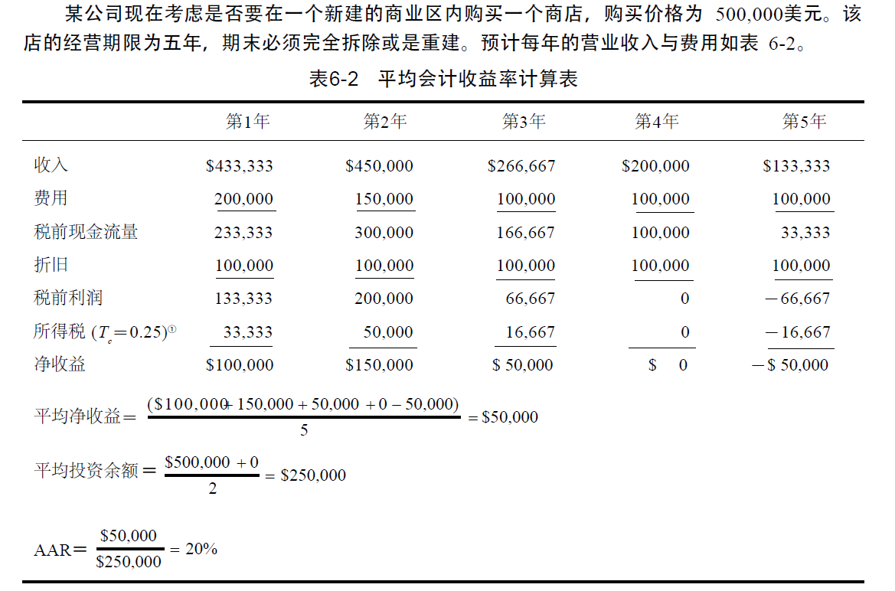

### 内部收益率

内部收益率(*internal rate of return*, *IRR*)本身不受资本市场利息率的影响，完全取决于项目的现金流量，反映了项目的内在。—> 一个数字就能够概括出项目的特性并进行比较

内部收益率就是使得项目净现值为 0 的贴现率

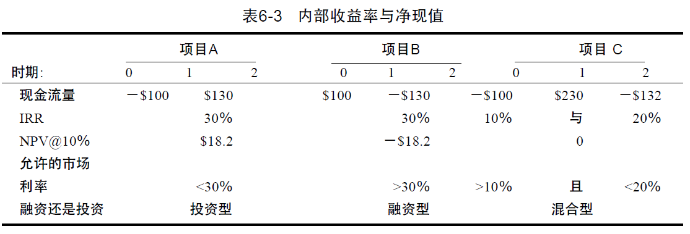

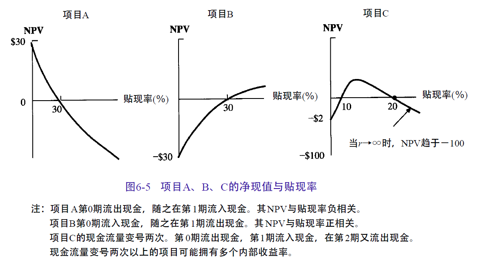

* 项目A在首期付出现金，称为投资型项目，投资型项目是内部收益率应用的一般模型：

  项目A的现金流量为：$(-\$100,\$130)$​

  

  贴现率小于内部收益率时，净现值为正；贴现率大于内部收益率时，净现值为负 
  —> 内部收益率的基本法则：<u>若内部收益率大于贴现率，项目可以接受；若内部收益率小于贴现率，项目不能接受</u>

  * 逐步测算法：
    凭经验估计一个折现率，计算净现值。如计算结果大于0，则IRR高于估计的折现率，应当提高折现率；如计算结果小于0，则应当降低折现率。

  $$
  IRR = r_1 + (r_2 - r_1) \cdot \frac{NPV_1}{NPV_1 - NPV_2}
  $$

* 项目B在首期收到现金，称为融资型项目：

  项目B的现金流量为：$(\$100, -\$130)$

  比较特殊的一类投资项目，诸如学术研究机构主办专家研讨会，通常与会者就得预支会费，大部分开支则发生在研讨会召开期间

  融资型项目内部收益率的基本法则出现悖反：
  <u>内部收益率小于贴现率时，项目可以接受；若内部收益率大于贴现率，项目不能接受</u>

* 混合型：多重收益率

  项目C的现金流量为$(-\$100, \$230, -\$132)$

  该项目每期现金流量依次为负的现金流量、正的现金流量、负的现金流量，即项目的现金流量改号两次 —> “非常规现金流量”；很多项目都要求在获得现金流入后必须再次诸如一些现金

  项目C存在两个内部收益率，IRR法则无效，采用NPV法则

#### 内部收益率存在的问题

##### 独立项目与互斥项目

*独立项目(independent project)*：对其作出接受或者放弃的投资决策都不会受其他项目投资决策的影响

*互斥项目(mutually exclusive investment)*：不能同时采纳的项目

* 规模问题：

  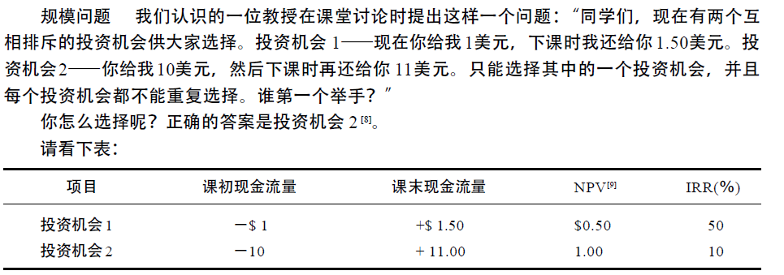

  > 假设贴现率为0

  <u>内部收益率忽略了项目的规模</u>，从而使得投资机会1的高收益率掩盖了收益绝对值偏低的不足 —> *增量内部收益率(incremental IRR)*
  
* 时间序列问题
  
* 关于互斥项目的三种解决方案：
    1. 比较净现值
    2. 计算增量净现值
    3. 比较增量内部收益率与贴现率

### 盈利指数

$盈利指数(PI) = \frac{初始投资所带来的后续现金流量的现值}{初始投资}$

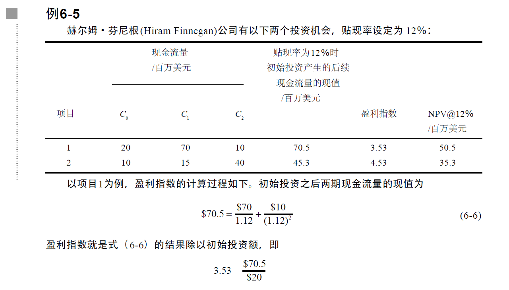

* 独立项目：

  如果两个项目都是独立项目，则根据净现值法则的基本投资法则，只要净现值为正就可以采纳 —> 净现值为正，即盈利指数(PI)大于1。

  <u>对于独立项目，若$PI > 1$，可以接受；若$PI<1$，必须放弃</u>

* 互斥项目：若两个项目只能选择一个，则根据净现值法则，应选择净现值大的项目

  然而，和内部收益率一样，由于盈利指数是一个比值，忽略了互斥项目之间规模上的差异 —> 增量分析法

  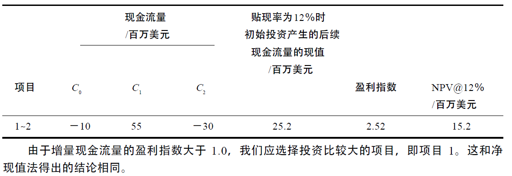

* *资本配置(capital rationing)*：独立项目和互斥项目均假设公司有充足的资金用于投资，而当资金不足以支付所有可盈利项目时，需要进行“资本配置”

  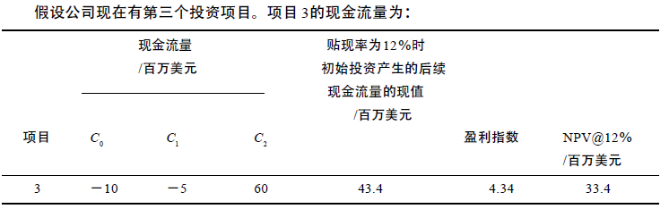

  假设公司各项目之间相互独立，且公司只有$2,000$万美元可供投资。

  则由于项目1初始投资额$2,000$万美元，一旦选择项目1，就无法选择其他项目；而项目2和项目3均只需要$1,000$万美元的初始投资，因此可以同时采纳这两个项目 —> 有限的资金使得公司选择项目1或者选择项目2和3

## 第7章 净现值和资本预算

**贴现现金流量(DCF)分析** & **净现值法**

### 增量现金流量

*沉没成本(sunk cost)*: 指已经发生的成本。由于沉没成本是在过去发生的，并不因接受或摒弃某个项目的决策而改变。 —> 应该忽略沉没成本，沉没成本不属于净增现金流量，即一旦公司的某项费用发生了，这项成本就与将来的任意决策无关

*机会成本(opportunity costs)*: 一旦将某一资产用于某个新项目，则丧失了其他使用方式所能带来的潜在的收入。

*关联效应*：决定净增现金流量的一个困难之处在于项目对公司其他部分的关联效应。最重要的关联效应是“*侵蚀(erosion)*” —> “侵蚀”是指来自于顾客和公司其他产品销售的现金流量转移到一个新项目上

#### 净营运资本投资

净营运资本的投资来自：

1. 在产品销售之前购买的原材料和其他存货；
2. 为不可预测的支出而在项目中保留的作为缓冲的现金；
3. 当发生了信用销售，产生的不是现金而是应收账款

### 通货膨胀与资本预算

#### 利率与通货膨胀

*名义利率(nominal interest rate)* (也简称为“利率”) v.s. *实际利率(real interest rate)*
$$
1 + 名义利率 = (1 + 实际利率)\times (1 + 通货膨胀利率)\\
\Rightarrow 实际利率 = \frac{1 + 名义利率}{1 + 通货膨胀利率} - 1\\
in\ fact,\ 实际利率 \approx 名义利率 - 通货膨胀利率
$$

> 近似公式对较低的利率和通货膨胀利率而言是比较准确的，但当利率较高时，近似度变得很差

#### 现金流量与通货膨胀

*名义现金流量(nominal cash flow)* v.s. *实际现金流量(real cash flow)*

#### 贴现

**现金流量和贴现率之间需保持一致性**

“名义”现金流量应以“名义”利率贴现；
“实际”现金流量应以“实际”利率贴现

> 用不同的方法计算出的净现值是一致的，因此一般采用更简单的贴现方式。

### 不同生命周期的投资：约当年均成本法

#### 重置链

*循环匹配* v.s. *约当年均成本法*

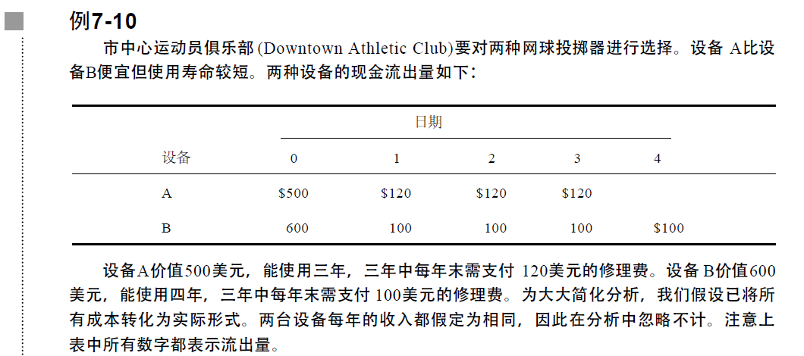

* 循环匹配：

  假定上例持续了12年，即设备A有四个完整循环，设备B有三个完整循环。 —> 计算12年期的成本的现值

  

  

* 约当年均成本法：

  使得一次性支付额等价于同期限的年金，则：
  设备A：$\$798.42 = C \times A_{0.10}^3 \Rightarrow C = 321.05$，
  则对于重复循环，等价于未来无限期的年支付额321.05美元

  设备B：$\$916.99 = C \times A_{0.01}^4 \Rightarrow C = 289.28$
  则对于重复循环，等价于未来无限期的年支付额289.28

  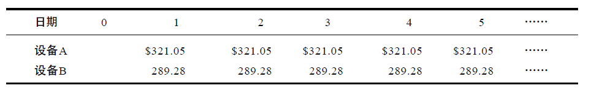

  > 以上$C$即为“*约当年均成本(EAC)*”

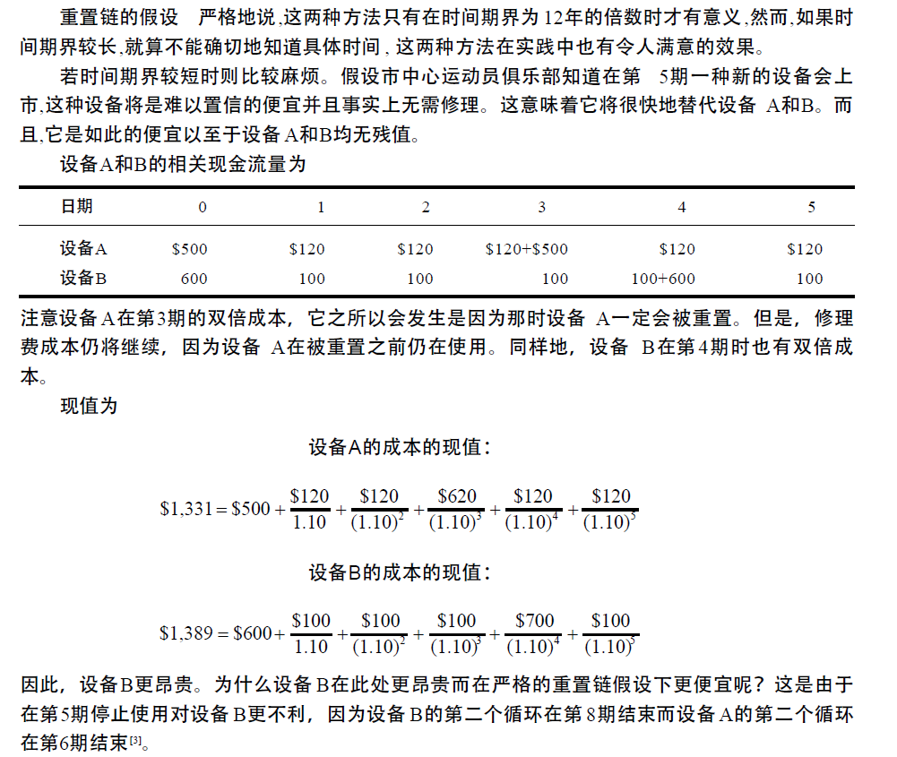

#### 设备重置的一般性决策（高级部分）

决定何时以新的机器设备替代旧的机器设备 —> 新设备的约当年均成本(EAC) v.s. 旧设备的年均成本

## 第8章 公司战略与净现值分析

### 公司战略和正净现值

贴现现金流量分析方法隐含的前提是：项目的投资报酬率必须高于资本市场的报酬率。只有在这种前提下，项目的净现值才是正值。

### 决策树

在NPV分析中，一个根本的问题是处理未来的不确定收益 —> *决策树(decision trees)法*

### 敏感性分析、场景分析和盈亏平衡分析

#### 敏感性分析和场景分析

##### 敏感性分析

*敏感性分析(sensitivity analysis)*：*what - if 分析* 和 *BOP 分析*

敏感性分析是指从众多不确定性因素中找出对投资项目经济效益指标有重要影响的敏感性因素，并分析、测算其对项目经济效益指标的影响程度和敏感性程度，进而判断项目承受风险能力的一种不确定性分析方法。

标准的敏感性分析：是假定其他变量处于正常估计值，计算某一变量的三种不同状态下可能估计出的NPV。

##### 场景分析

*场景分析(scenario analysis)*：变异的敏感性分析。考察一些可能出现的不同场景，每种场景包含了各种变量的综合影响。

#### 盈亏平衡分析

*盈亏平衡分析(break-even analysis)*：用于确定公司盈亏平衡时所需达到的销售量，是敏感性分析方法的有效补充。

> *税后价差*：$(销售单价 - 单位变动成本) \times (1 - T)$，又称*边际贡献(contribution margin)*，即每增加一单位销售对税后利润所起的贡献

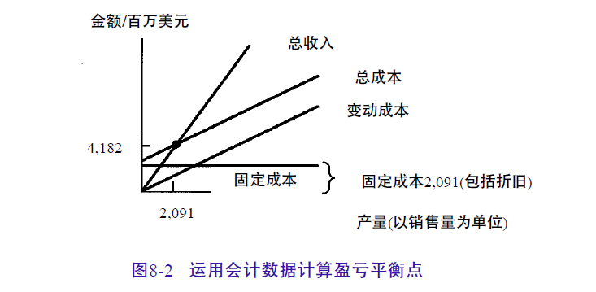

销售量只有达到以下水平时，才能补偿公司的成本：
$$
会计利润的盈亏平衡点:\\ 
\frac{(固定成本 + 折旧)\times (1 - T)}{(销售单价 - 单位变动成本)\times ( 1 - T)}
$$
现值盈亏平衡点:
$$
\frac{EAC + 固定成本 \times (1 - T_c) - 折旧 \times T_c}{(销售单价 - 单位变动成本) \times (1 - T_c)}
$$

> 会计盈亏平衡点忽略了初始投资的机会成本

### 期权理论在资本预算中的应用分析

#### 拓展期权

*拓展期权*是指当条件有利时允许公司扩大生产，当条件不利时则允许公司紧缩生产。

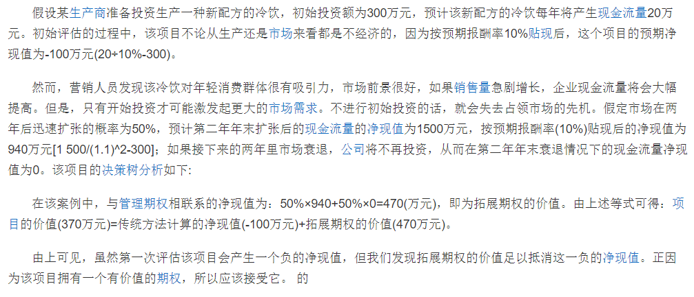

#### 放弃期权

*放弃期权*是指在实行某个项目后又放弃该项目。这可能涉及到出售该项目的资产或把这些资产用到公司的其他领域。当将某项目的资产在外部市场上出售时，该项目的市场价值就是放弃期权的价值；而当将这些资产用到公司别的领域时，其机会成本就是放弃期权的价值。

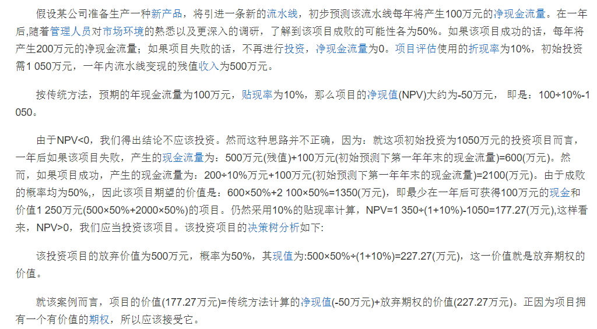

#### 贴现现金流量与期权

项目的市场价值($M$)等于不包含扩展或压缩期权在内的NPV加*管理期权*价值：
$$
M = NPV + Opt
$$

> 管理期权是指企业管理人员在外部环境和内部条件发生显著变化的情况下对项目投资初始决策作出必要的灵活性调整的一种权利。
>
> > 管理期权包括：拓展期权、放弃期权、延迟期权。 

----

