[toc]

# 第五篇 长期筹资

## 第十九章 公众股的发行

### 公开发行

公开发行：*普通现金发行(cash offer)* v.s. 附权发行
普通现金发行指出售给所有感兴趣的投资者；附权发行则出售给现有股东。

*首次公开发行(initial public offering, IPO)* / *非多次发行(unseasoned new issue)* : 公司第一次公开发行股票

> 所有的首次公开发行都是现金发行

*多次发行(seasoned new issue)*: 指先前曾发行过公司证券的公司的新股发行

> 普通股的新股多次发行可以通过现金发行或附权发行来实现

| 发行方式                     | 类型             | 定义                                                         |
| ---------------------------- | ---------------- | ------------------------------------------------------------ |
| 公开发行：传统议价，现金发行 | 现金发行包销     | 公司与投资银行之间就新发行股票或债券的承销和分配的协议进行谈判。承销商买入事先确定的一部分股票，然后按较高的价格再出售 |
|                              | 现金发行代销     | 公司要求投资银行按双方同意的价格尽可能多地出售新发行股票。但该方法没有保证究竟可以筹集多少现金 |
| 特权认购                     | 附权直接发行     | 公司直接向现有股东发行新权                                   |
|                              | 附权备用发行     | 与附权直接发行一样，这种方法包含一份与现有股东关于特权认购的协议。发行收入由承销商予以保证 |
| 非传统的现金发行             | 上架现金发行     | 有资格的公司可以让其在未来两年期间内预计所有要发行的股票都取得许可，当需要时再出售它们 |
|                              | 公司现金竞价发行 | 公司可以通过公开拍卖，而不是协商来选择如何给予承销合同       |
| 私下发行                     | 私下直接发行     | 将证券直接出售给购买者，后者至少在两年内不得再行出售         |

### 现金发行

公开发行 —> *投资银行(investment banker)*
通过发行证券来获取现金有两种基本的方法：

* *包销(firm commitment)*：投资银行以低于发行价的价格买入证券，同时承担无法卖出它们的风险。

  > 包销实际上是一种买入-卖出协议，投资银行的费用就是差价。
  >
  > 发行人得到全额收入减去差价，所有的风险转移给承销商。

* *代销(best efforts)*：承销商不需要买入证券，仅仅只是作为一个代理商，从每一只售出的股票中收取佣金。

### 权证

* *认购价格(subscription price)*：允许现有股东付款购买每股股票的价格；一个理性的股东只有当认购价格在附权发行到期日时低于股票市场价格的情况下才会认购附权发行的股票

* 购买每一股股票需要的权证数量：

  $新股数量 = \frac{准备筹集资金}{认购价格}\\购买每一股股票需要的证券数量 = \frac{旧股数量}{新股数量}$

* 附权发行对现有股票价格影响：

  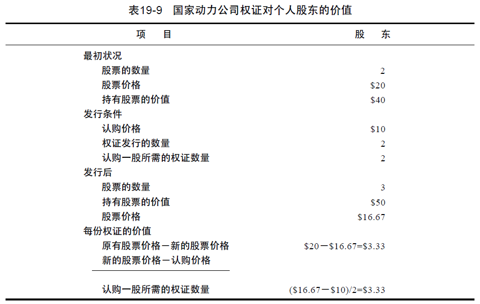
  
  > 原有股票价格与新的股票价格的差价，说明旧的股票有权认购新的股票。这一差价应当等于一份权证的价值
  >
  > 附权发行后，公司股票新的市场价格应当低于附权发行前公司股票的市场价格，认购价格越低，附权发行的价格下跌幅度就越大

### 私募资本市场

*风险资本(venture capital)*市场是*私募资本市场*的一部分

#### 融资阶段

1. 种子资金阶段：需要一小部分融资以证实一个概念或开发一种产品，这个阶段不包括市场推销。
2. 起步阶段：向过去数年内开张的公司提供融资，极有可能要支付市场推销和产品开发等支出。
3. 第一轮融资：在公司已投入起步资金后，追加投资开始销售和生产。
4. 第二轮投资：向目前正在销售产品但还未赚钱的公司提供指定用作流动资金的资金
5. 第三轮融资：向已经盈亏持平且正考虑扩张的公司提供融资。 —> *“夹层”融资(mezzanine financing)*
6. 第四轮融资：为在一年之内可能公开发行股票的公司提供资金。 —> *“过桥”融资(bridge financing)*

## 第二十章 长期负债

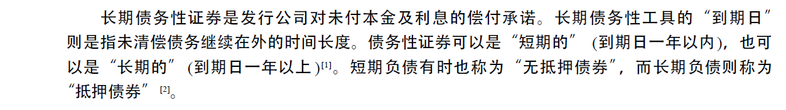

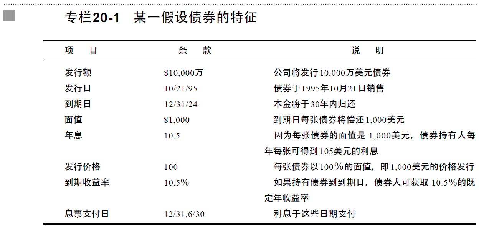
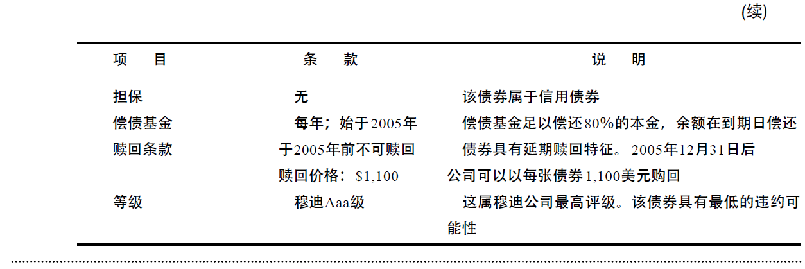

*浮动利率债券* v.s. *收益债券* v.s. *大幅折价债券*

### 公开发行债券

* 债券的基本术语

* 担保财产情况

* *保护性条款(protective covenant)*详解

  *消极条款(negative covenant)* v.s. *积极条款(positive covenant)*

  保护性条款可使股东受益，因为债权人为了确保公司在陷入财务困境时自身所投入资本的安全，会愿意接受较低的利息率

* 偿债基金计划

  “偿债基金”是出于债券清偿目的而设立的由债券信托人管理的账户。通常，公司每年会向信托人支付一笔款项，信托人则从<u>市场</u>上购回公司的债券，或者采用抽签方式随机选择债券，并且一般以<u>债券的票面价值</u>将其赎回。

  * 偿债基金对债权人提供额外保护。深陷财务困境的企业可能在偿债基金的支付方面会有困难。因此，偿债基金的支付状况就向债权人提供了一种预警系统
  * 债券基金赋予公司极具吸引力的权利。一旦债券价格下跌并低于债券面值，公司就可按较低的市场价值购入债券，用于满足偿债基金需求。假如债券价格上升并高于其面值，那么公司就可按较低的债券面值购回公司债券

* 赎回条款

  “赎回条款”允许公司在某一规定期间内以事先确定的价格购回或“赎回”全部债券

  一般而言，赎回价格会超过债券的票面价值。赎回价格同票面价值之间的价差称为*赎回升水(call premium)* —> 债券的赎回升水通常会随时间减少

  赎回条款一般在债券的有效年限初期无效，公司可能会被禁止赎回自己的债券 —> 这类赎回方式称为*延期赎回(deferred call)*，该期间，债券受*赎回保护(call-protected)*

  * *债券调换(refunding)*：以新债取代全部或部分已发行在外的债券叫做债券调换

    通常，典型的债券调换首先是以赎回价格购回全部已发行在外的债券

## 第二十一章 期权与公司理财：基本概念

### 期权

*期权(option)*是一种<u>赋予持有人在某给定日期或该日期之前的任何时间以固定价格购进或售出一种资产的权利</u>的合约

* *执行期权(exercising the option)*：通过期权合约购进或售出标的资产的行为称为执行期权
* *敲定价格或执行价格(striking or exercise price)*：持有人据以购进或售出标的资产的期权合约之固定价格称为敲定价格或执行价格
* *到期日(expiration date)*：期权到期日，之后期权失效
* *美式期权和欧式期权(American and European options)*：美式期权可以在到期日或到期日之前的任何时间执行。欧式期权只能在到期日执行。

#### 看涨期权

*看涨期权(call option)*赋予持有人在一个特定时期以某一固定价格购进一种资产的权利。

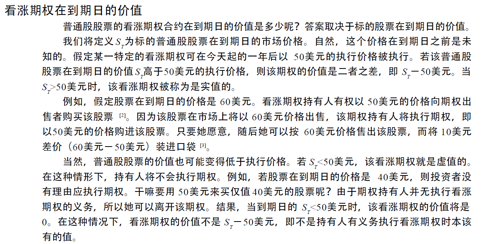

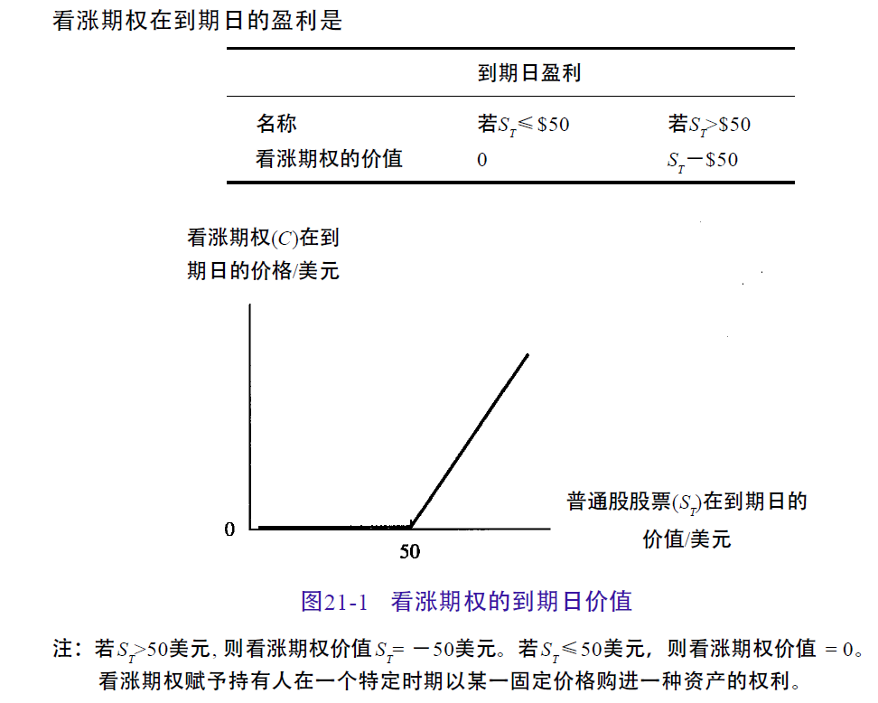

<u>看涨期权不可能有负的价值。它是一种有限责任工具，持有人可能遭受的全部损失是他购买时所付的最初金额</u>

#### 看跌期权

*看跌期权(put option)*：看跌期权赋予持有人在一个特定时期以某一固定价格售出一种资产的权利。

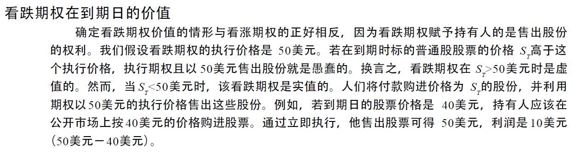

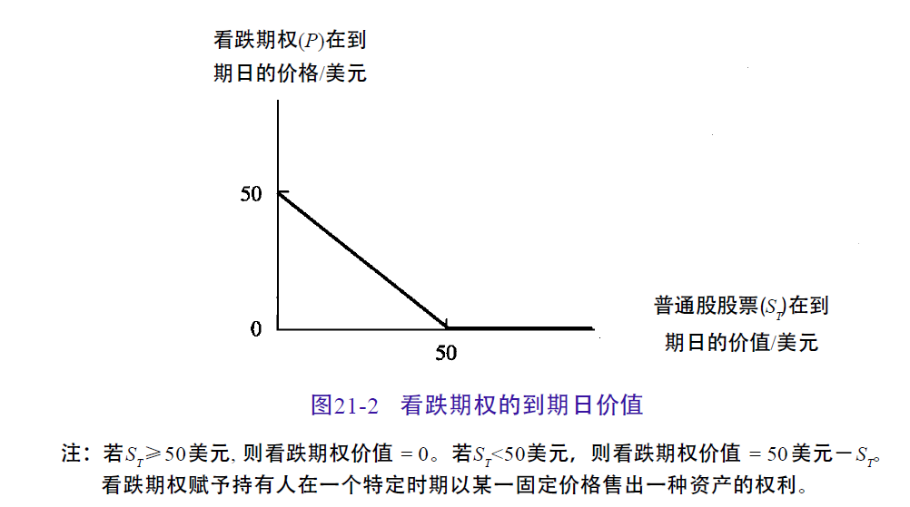

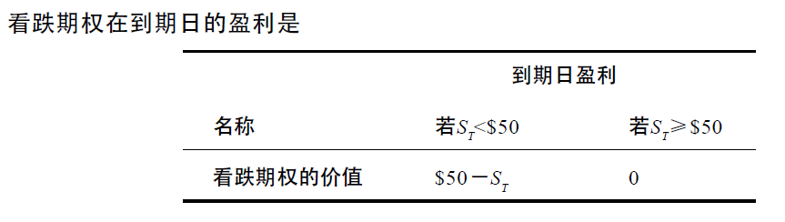

<u>每当标的资产价格高于执行价格时，看涨期权是有价值的；每当标的资产价格低于执行价格时，看跌期权是有价值的</u>

#### 售出期权

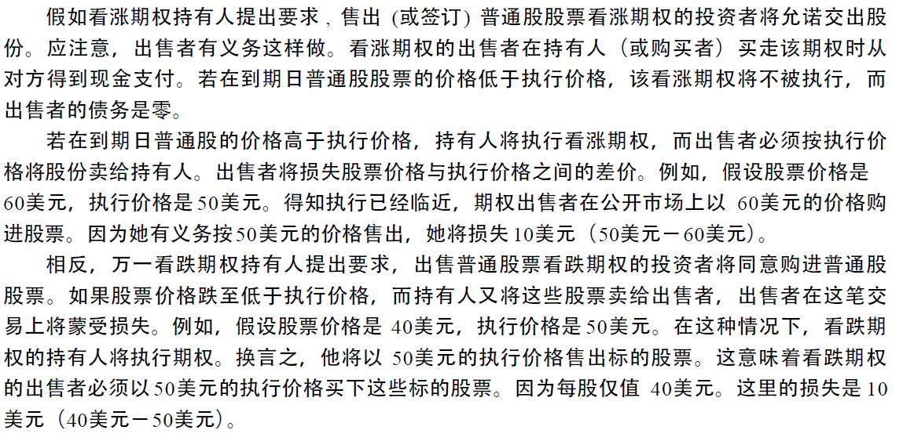

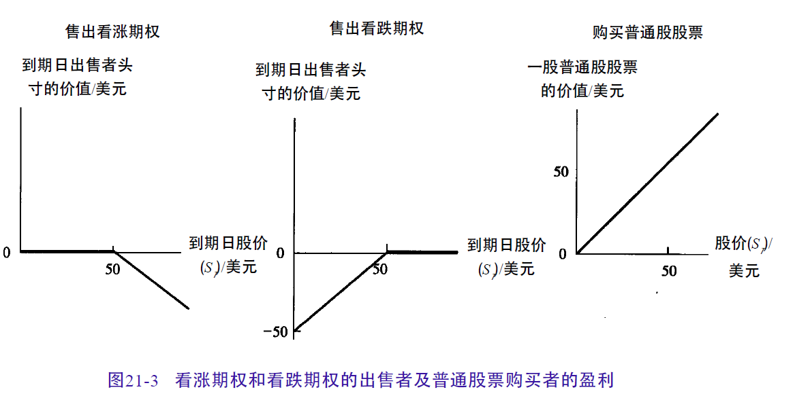

<u>购买股票同购买零执行价格的股票看涨期权是一样的</u>

#### 解读华尔街日报

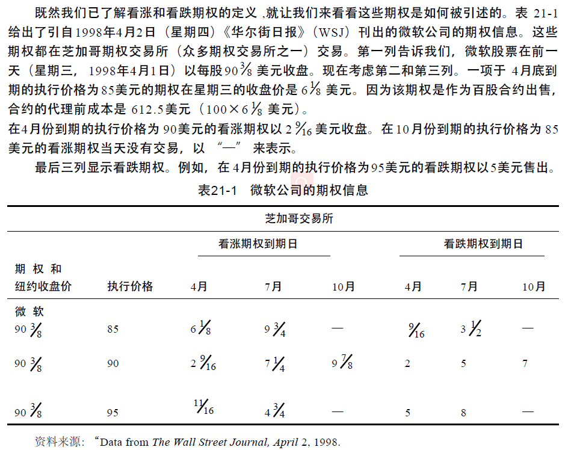

### 期权组合

<u>在期权市场上一种策略可以抵消另一种策略而带来的无风险收益</u>

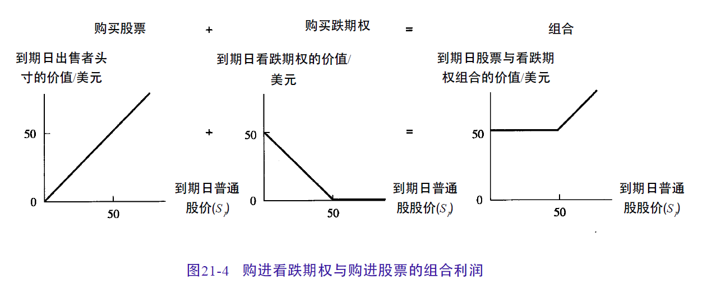

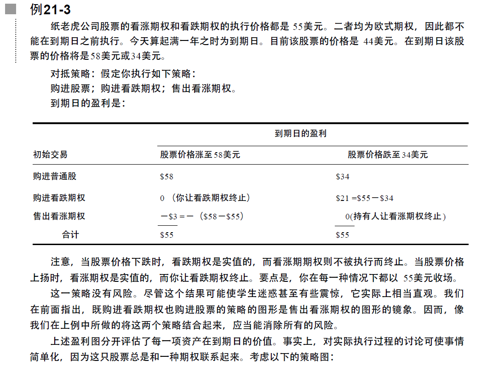

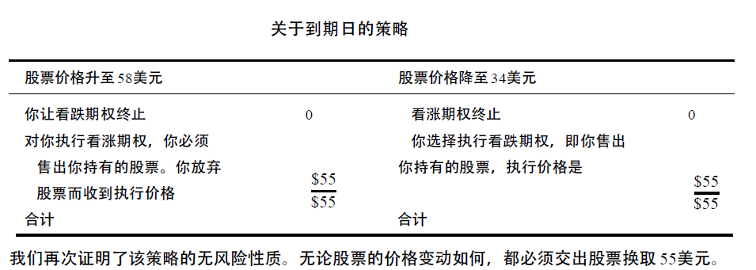

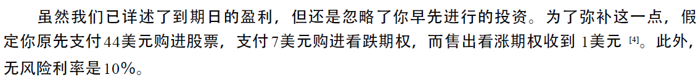

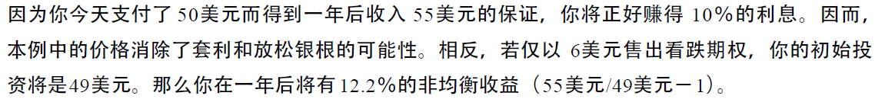

> 两种期权都是欧式期权。美式看跌期权必定按高于11美元（55美元 - 44美元）售出。
> 若美式看跌期权价格仅为7美元，人们将买下看跌期权，买下股票，并立即执行期权，从而产生4美元（-7美元 - 44美元 + 55美元）的即期套利利润

为了防止套利：**买卖权平价(put-call parity)**
$$
股票价值 + 看跌期权价值 - 看涨期权价值 = 执行价格现值
$$

> 看跌期权和看涨期权有相同的到期日和一样的执行价格

### 期权定价

#### 看涨期权的价值界定

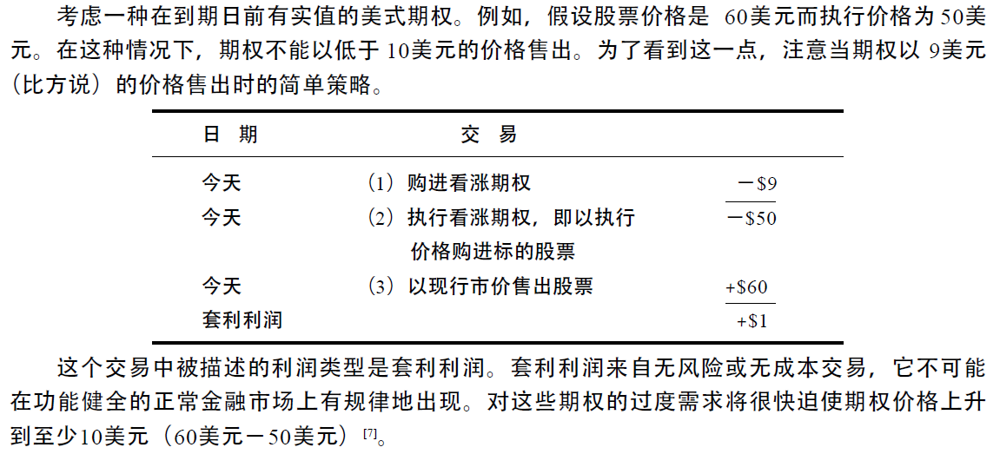

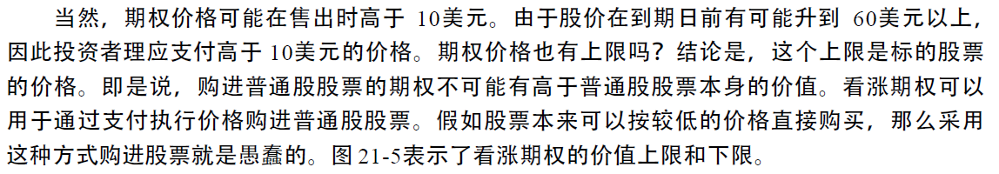

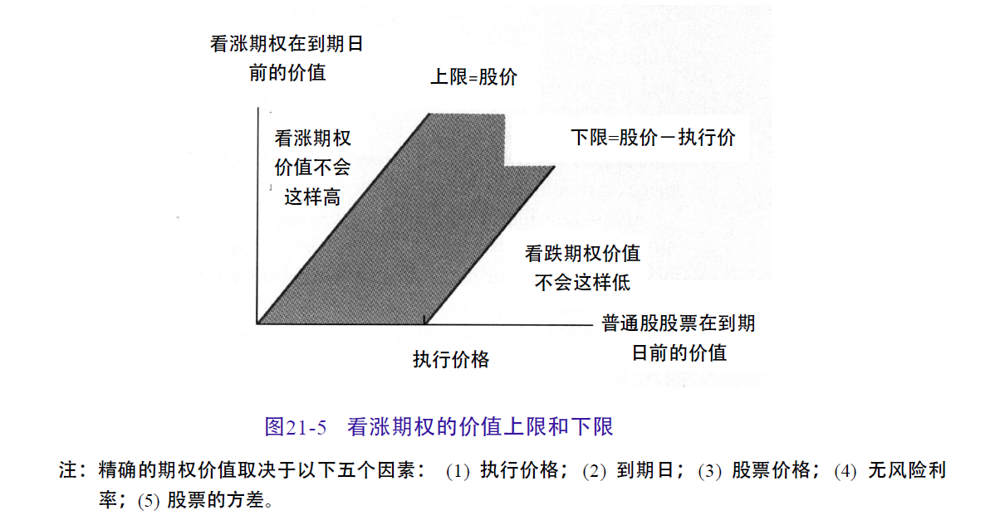

#### 确定看涨期权价值的因素

* 执行价格：当其他条件都保持不变时，执行价格愈高看涨期权的价值愈低

  > 不论执行价格多高，看涨期权的价值都不可能是负值。
  >
  > 只要在到期日之前标的资产的价格有某种可能超过执行价格，该看涨期权就有价值
  >
  > ----
  >
  > 具有高执行价格的看跌期权的市场价值高于具有低执行价格的其他等值看跌期权的价值

* 到期日：美式期权的价值必定至少与期限较短的其他同类期权的价值一样大。

  > 具有较远到期日的美式看跌期权的市场价值比到期日较近的其他等值看跌期权的市场价值高
  >
  > -----
  >
  > 对于欧式期权，这个关系不必成立

* 股票价格：在其他条件相同时，股票价格愈高，看涨期权的价格也愈高。

  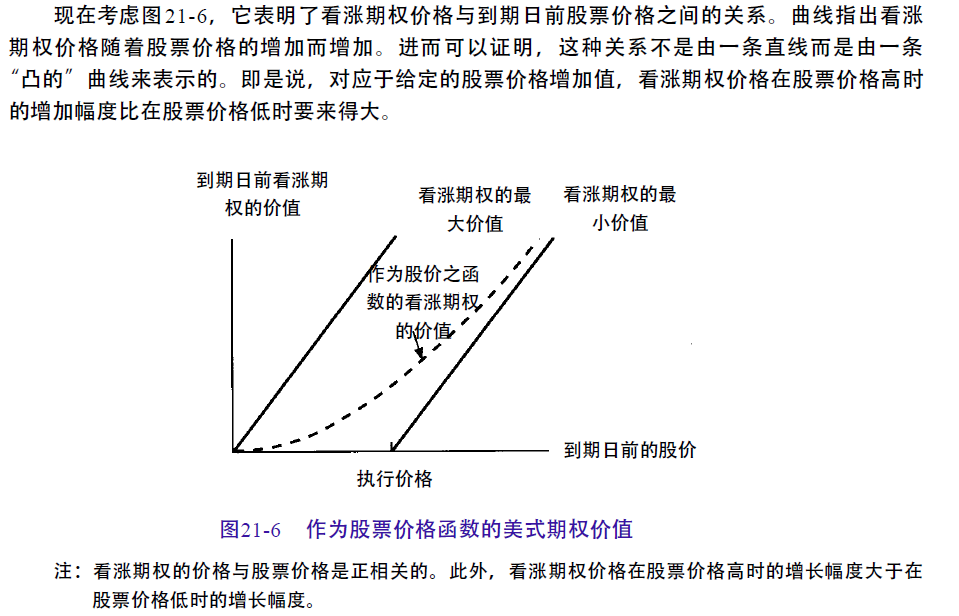

  > 看跌期权的市场价值随股价增加而减少

* **标的资产的变异性**：标的资产的变异愈大，看涨期权愈有价值

  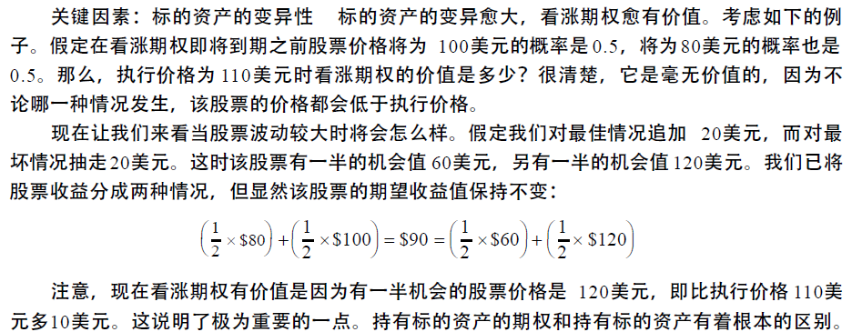
  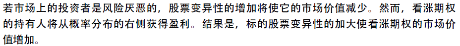

  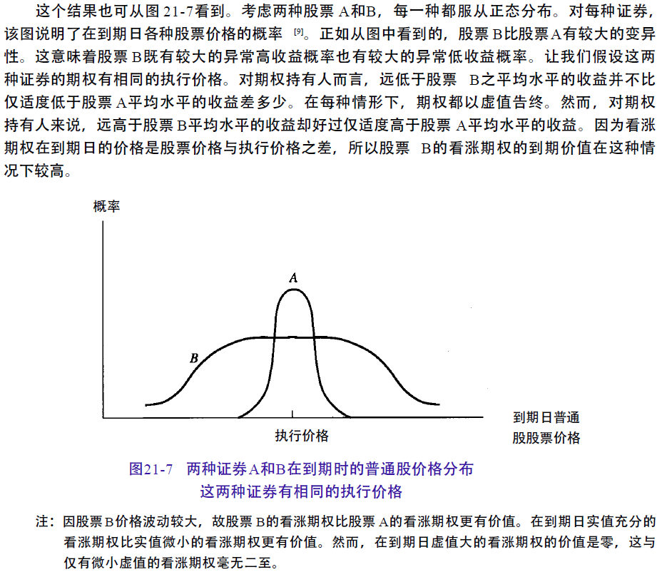

  > 标的资产的变异性使看跌期权的价值增加。

* 利率：看涨期权的价格是利率水平的函数。看涨期权的购买者仅在他们执行期权时，才支付执行价格。延迟支付在利率高时有较大的价值，而在利率低时价值较小。 —> 看涨期权的价值与利率正相关

  > 高利率反向影响看跌期权的价值。若执行价格的现值被高利率所削减，则在未来某时以固定执行价格售出股票的能力较无价值

股票价格、执行价格、利率对看跌期权的影响与对看涨期权的影响相反，标的资产的变异性、到期日对看跌期权的作用与看涨期权相同

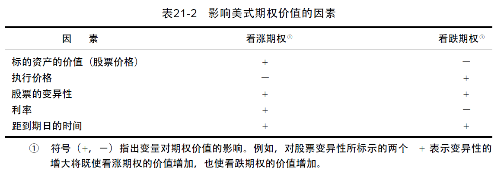

#### 期权定价公式

**Black-Scholes期权定价模型**

* 标的资产的现行价格 $S$
* 执行价格 $E$
* 距到期日的时间 $t$（单位：年）
* 标的资产的方差 $\sigma^2$（年度）
* 无风险利率 $r$（年度） 

> $N(d)$: 标准正态分布随机变量将小于或等于$d$的概率 —> $N(d)$是$d$的累积概率
>
> 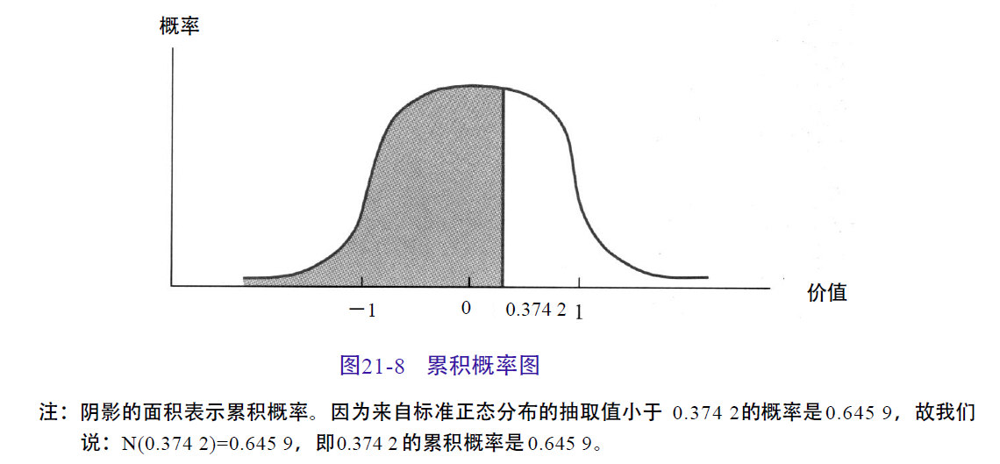

$$
C = SN(d_1) - Ee^{-rt}N(d_2)\\
d_1 = [\ln(S/E)+(r + \frac{1}{2}\sigma^2)t]/\sqrt{\sigma^2t}\\
d_2 = d_1 - \sqrt{\sigma^2t}
$$

### 作为期权的股票和债券

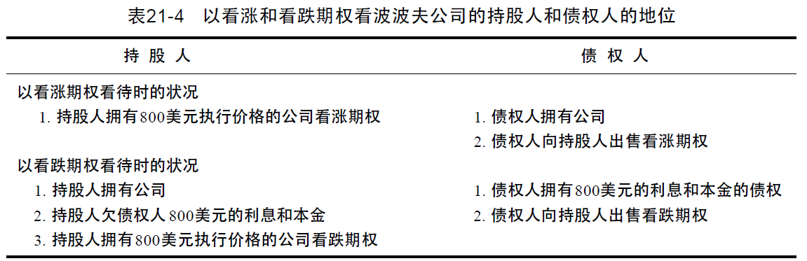

* <u>$风险债券的价值 = 无违约债券的价值 - 看跌期权的价值$</u>

* 买卖权平价：
  <u>$标的资产市场价值 + 看跌期权价值 -看涨期权价值 = 执行价格的现值$</u>

  > 买卖权平价意味着看涨期权可以被解释为看跌期权，反之亦然。

  * $以看涨期权看待的持股人状况 = 以看跌期权看待的持股人状况$

    $公司看涨期权价值 = 公司价值 + 公司看跌期权价值 - 无违约债券价值$

  * $以看涨期权看待的债权人状况 = 以看跌期权看待的债权人状况$

    $公司价值 - 公司看涨期权价值 = 无违约债券价值 - 公司看跌期权价值$
  * $公司价值 - 公司看涨期权价值 = 风险债券价值$

## 第二十二章 期权和公司理财：推广与应用

### 项目评估的二项方法或一般双态方法

#### 建立二项模型

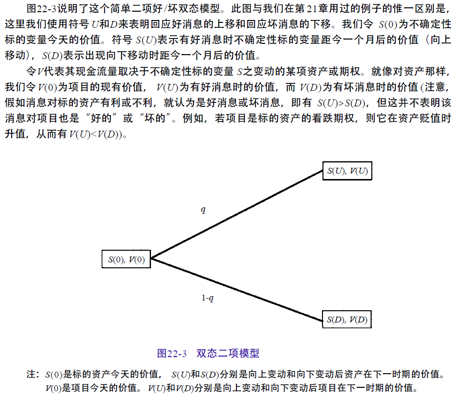

#### 中和风险的评估方法

$$
S(0) = [qS(U) + (1-q)S(D)]/(1+r)
$$

> $q$: *风险调整概率(risk-adjusted probability)*

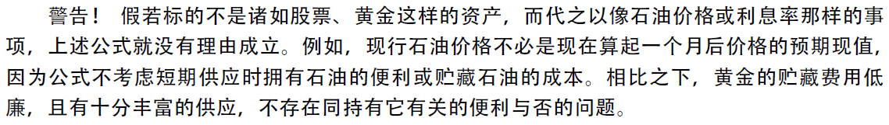

#### 建树

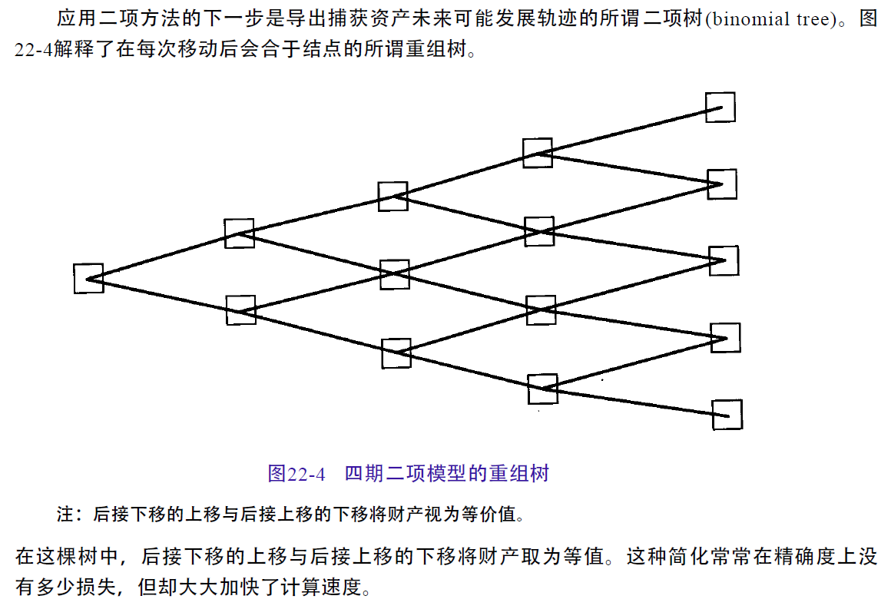

#### 为树添叶

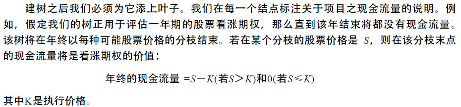

#### 沿树倒推法

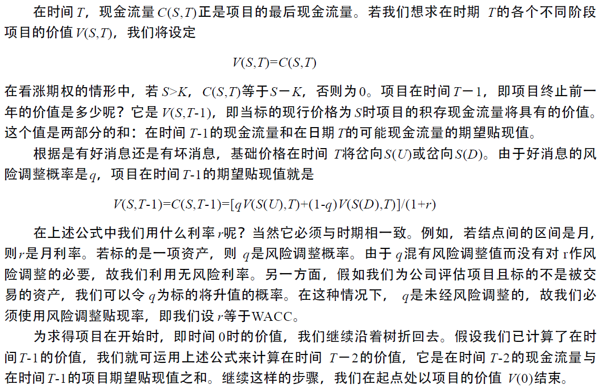

#### 模拟

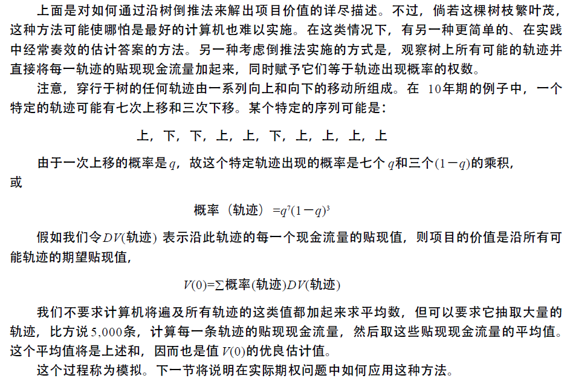

## 第二十三章 认股权证和可转换债券

*认股权证(Warrants)* v.s. *可转换债券(Convertibles)*

### 认股权证

*认股权证(warrants)*是一种允许其持有人（即投资者）有权利但无义务在指定的时期内以确定的价格直接向发行公司购买普通股的权证。

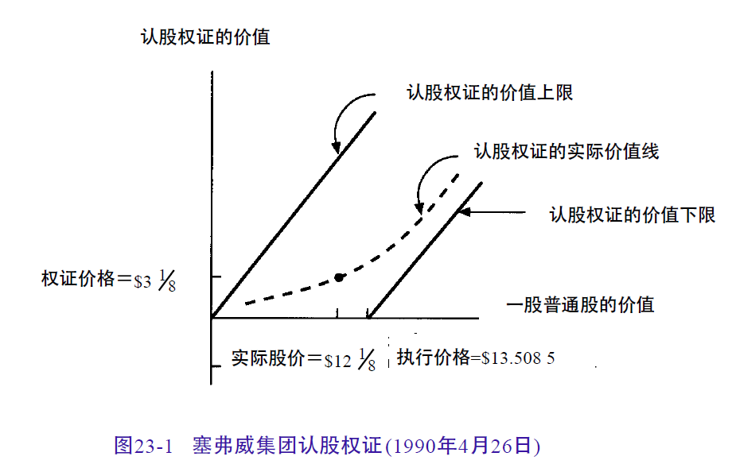

#### 认股权证定价和Black-Scholes模型（高级部分）

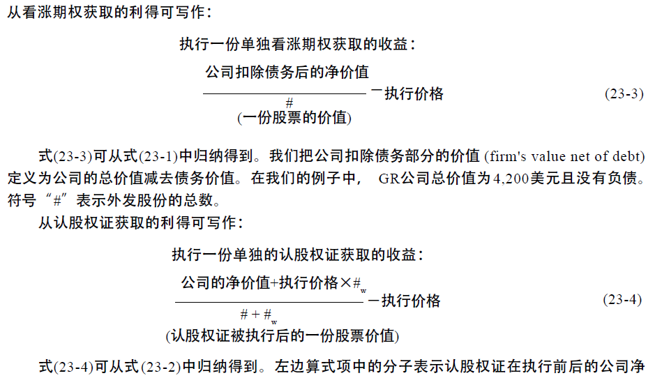
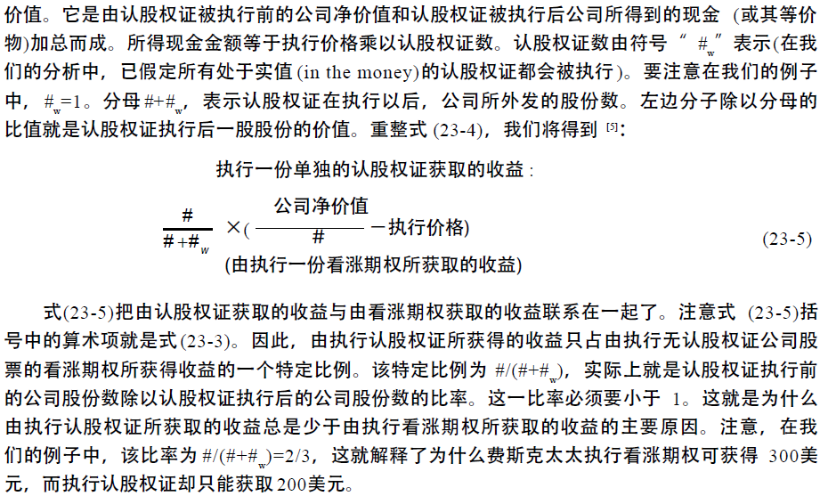
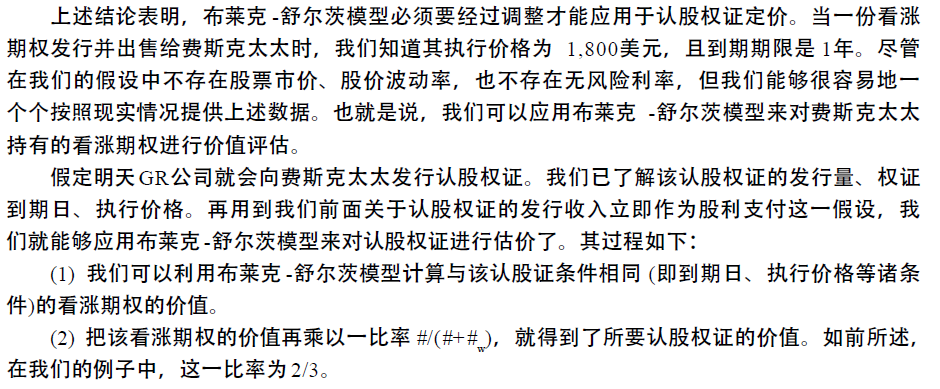

### 可转换债券

*可转换债券(convertible bond)*允许其持有人可以在债券到期日之前的任一时间（包括到期日）里将可转换债券转换为一定数目的股票

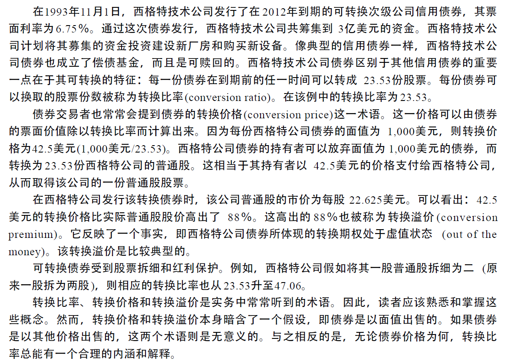

#### 可转换债券的价值评估

*纯粹债券价值* + *转换价值* + *期权价值*

##### 纯粹债券价值

*纯粹债券价值*指可转换债券在非转换成普通股而是被其投资者当作债券持有的情况下能以何价格出售。

债券持有价值取决于利率的一般水平和违约风险程度。 

可转换债券的纯粹债券价值是债券的最低限价。可转换债券价格不能总低于其纯粹债券价值。

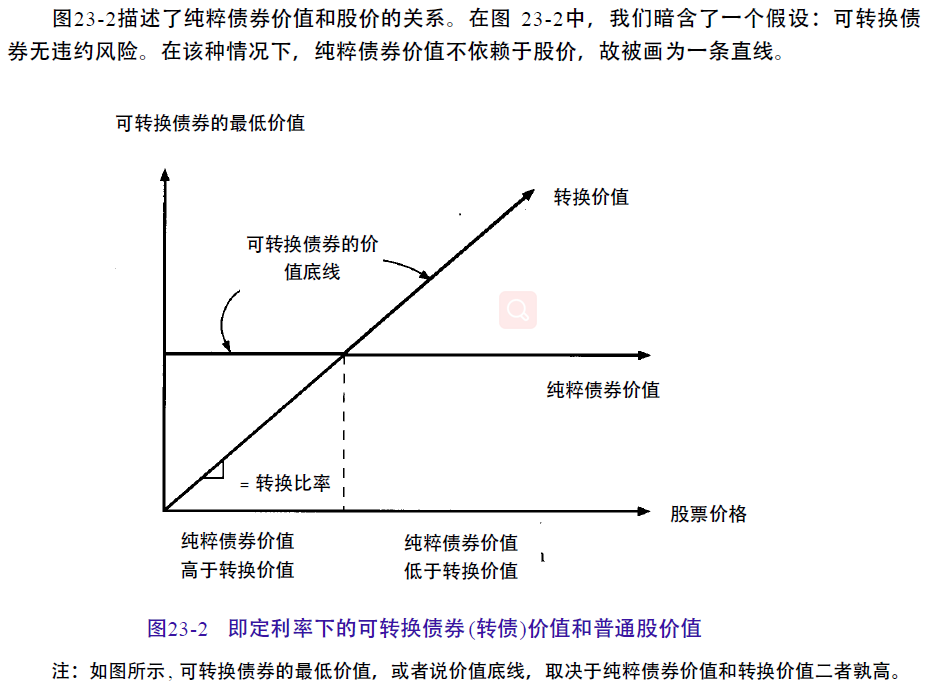

##### 转换价值

*转换价值(conversion value)*是指如果可转换债券能以当前市价立即转换为普通股

----

