[toc]

# 第四篇 资本结构和股利政策

## 第十三章 公司融资决策和有效资本市场

### 有效资本市场

*有效资本市场*，指资产的现有市场价格能够充分反映所有有关、可用信息的资本市场。
这意味着证券的现有市场价格反映了它的基本现值或内在价值，因此不存在利用有关、可用信息谋取或赚取超常或剩余利润的任何方法。
$$
AR = R - R_m
$$

> $AR$: 超常收益
> $R$: 股票当天的实际收益
> $R_m$: 当天的市场收益

过去价格的信息 v.s. 公开信息 v.s. 所有信息

#### 弱型有效市场

如果某一资本市场上的证券的价格充分地包含和反映其历史价格的信息，那么该资本市场就达到了“*弱型有效*”，或说满足了“*弱型效率(weak-form efficiency)*”：
**随机游走(random walk)** 或 **股票价格处于随机游走状态**：“随机游走”近似等同于“弱型有效”，假设过去股票价格变动与未来股票价格变动无关，*序列相关系数(serial correlation)*为零。
$$
P_t = P_{t-1} + 期望收益 + 随机误差i
$$

> 某种证券今天的价格等于“最近观测价格”，加上“证券的期望收益”，再加上这段时间发生的“随机收益值”
>
> 最近的观测价格取决于时间区间$(t-1,t)$
> 证券的期望收益是该种证券所承受风险的函数
> 随机误差是某种与证券有关的新信息引起的，无法根据历史价格来预测。
>
> 如果资本市场达到弱型有效，则仅仅使用过去价格信息的策略无法获取利润

#### 半强型有效市场和强型有效市场

如果某一资本市场上的证券价格充分地反映了所有公开可用的信息，包括如公司公布的财务报表和历史上的价格信息，那么该资本市场就达到了“*半强型有效*”

如果某一资本市场上的证券价格充分地反映了所有的信息，包括公开的和内幕的信息，那么该资本市场就达到了“*强型有效*”

## 第十四章 长期融资简介

### 普通股

*普通股(common stock)*：通常指那些在股利和破产清算方面不具任何特殊优先权的股票

*资本盈余(capital surplus)*：通常指直接缴入的权益资本中超过股票面值的部分

*留存收益(retained earning)*：净利润额用于发放*股利(dividends)*后，留用于公司经营活动的剩余部分。

*股利(dividends)*：公司对股东直接或间接投入公司的资本的回报。

*账面价值(book value)*：<u>公司普通股面值总额同其资本盈余喝累计留存收益</u>一起构成了公司的“普通股股东权益”，通常亦称作公司的账面价值

*每股账面价值*：$\frac{普通股股东权益总数}{发行在外的股票数}$

*重置价值*：指替换公司资产所需支付的当前价格。

### 企业长期负债

权益性证券 v.s. 债务性证券

* 负债不属于公司所有者权益，因此，债务人通常没有表决权，通常用借贷合约（债务契约）来保护自身利益。
* 公司对债务所支付的利息被视为一种经营费用，具有完全的抵税作用。利息费用是在计算公司应税义务之前支付给债权人，而普通股和优先股股利则是在计算公司应税义务之后分配给股东的。

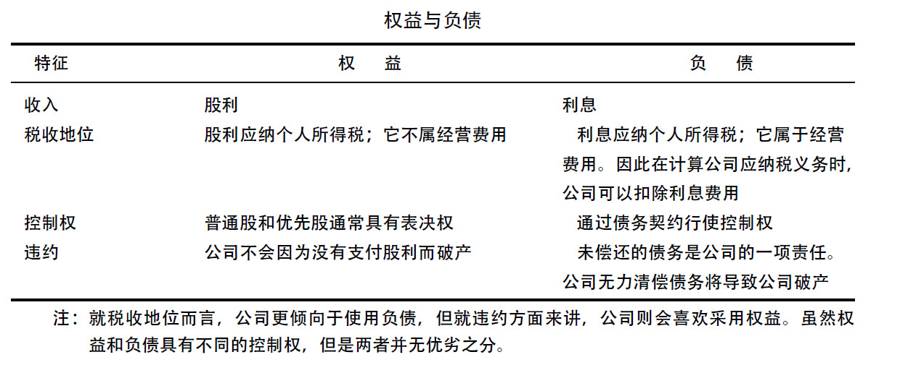

*高级债券(seniority)* v.s. *次级债券(subordinated)*

高级债券一般表明债券的偿付地位优于其他债券。
一旦公司违约，次级债券持有人必须给予其他债权人优先清偿债务的权利。这意味着次级债券持有人只有在其他债权人的债务得以偿付后才能获取补偿。
但是，次级债券的清偿地位不能次于权益

### 优先股

*优先股(preferred stock)*归属公司权益，与普通股相比，它在股利支付和公司破产清偿时的财产索取方面具有优先权。
对持续经营的企业而言，“优先权”意味着只有在优先股股东获取股利后，普通股股东才有资格分配股利

*累计股利* v.s. *非累计股利*

优先股实际上是伪装了的债券

### 融资模式

*内部融资(internal financing)* & *债务融资* & *外部权益融资*
内部融资主要源于内部自然形成的现金流，它等于净利润加上折旧减去股利。
外部融资是公司新发行的负债及权益扣除它们被赎回部分的净额

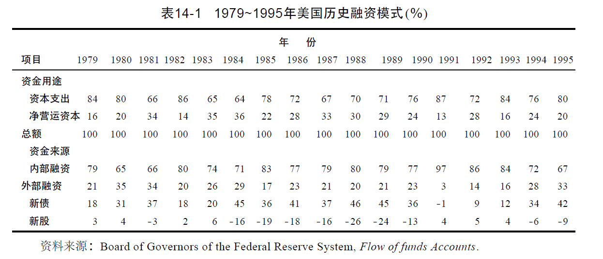

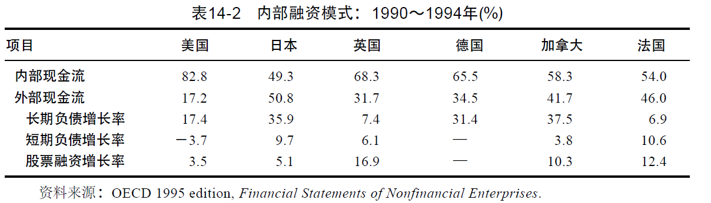

*长期融资的优序(pecking order)*：

* 内部产生的现金流是资金融资的主要来源
  * 对于净现值为正的项目，公司首选的融资来源是公司内部产生的现金流
* 一般地，公司支出总额会多于内部产生的现金流，这两者之间的差额就构成了财务赤字
* 一般而言，财务赤字可以借助举债和发行新股两种外部融资方式予以填补。但外部融资中，新发型的权益资本就总体而言并不重要，其净额通常只占融资总额的一小部分
  * 公司将外部产生的现金流作为最后采用的融资手段。在选择外部融资方式时，公司会首先考虑选用负债方式，最终才会借助普通股。

## 第十五章 资本结构：基本概念

### 资本结构问题和圆饼理论

定义：公司价值为负债和所有者权益之和
$$
V = B + S
$$

> $B$: 负债的市场价值
> $S$: 所有者权益的市场价值

*圆饼模型(pie model)*:
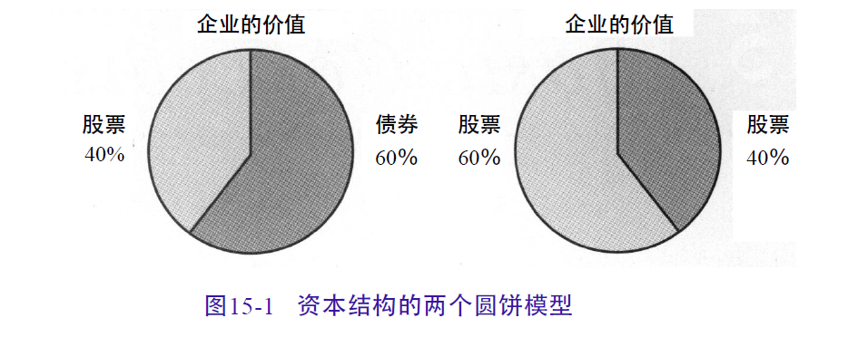

### 企业价值的最大化和股东利益的最大化

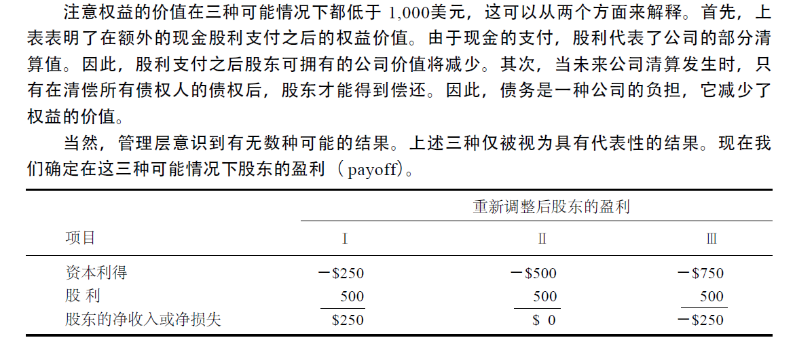
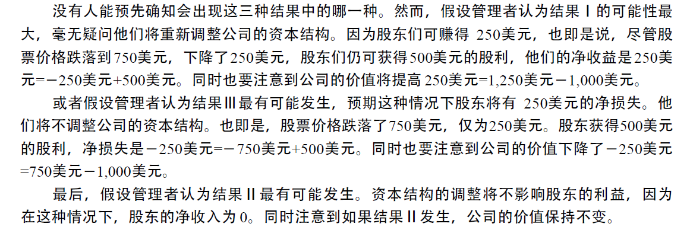

<u>当且仅当企业的价值上升时，资本结构的变化对股东有利</u>，产生最高企业价值的资本结构是使股东财富最大化的资本结构，企业价值最大化的资本结构是财务经理们应为股东选择的资本结构

### 财务杠杆和企业价值

#### 杠杆作用和股东报酬

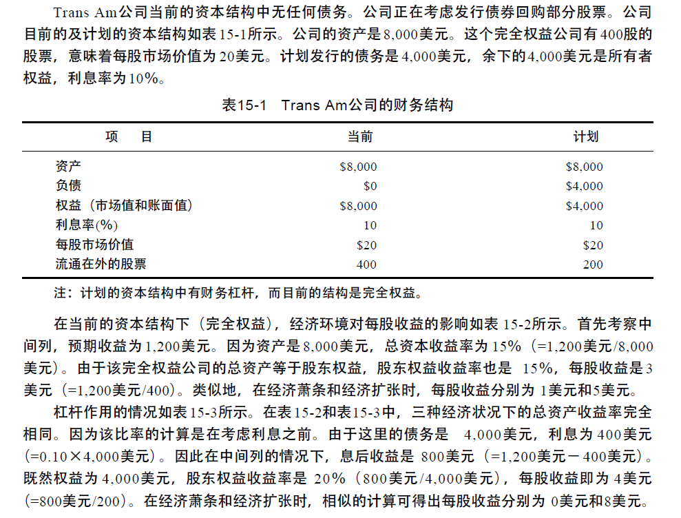

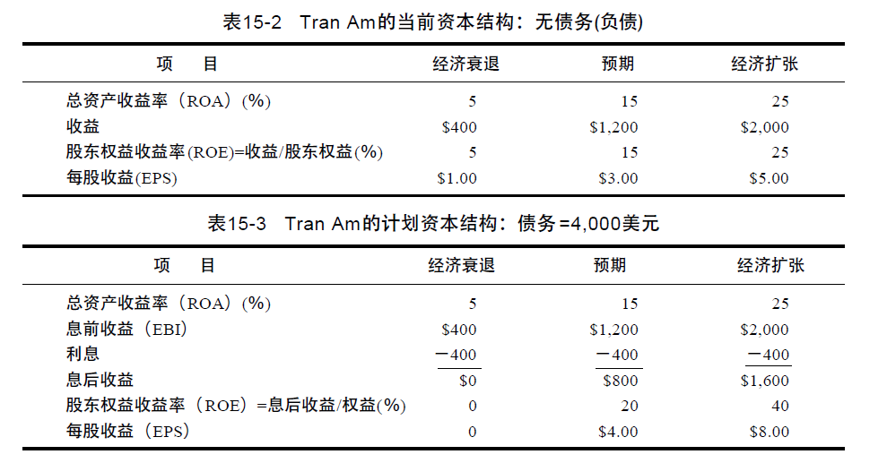

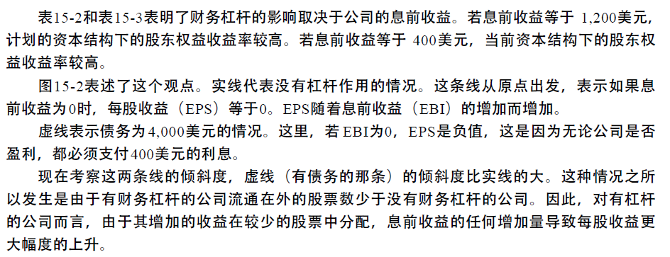

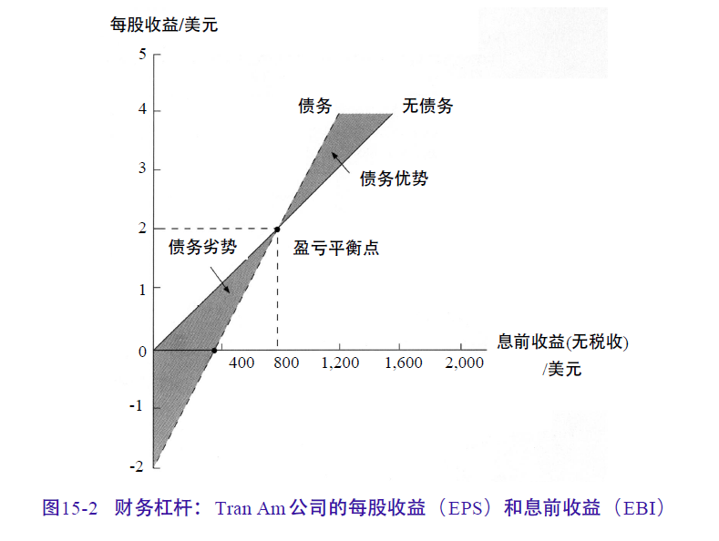

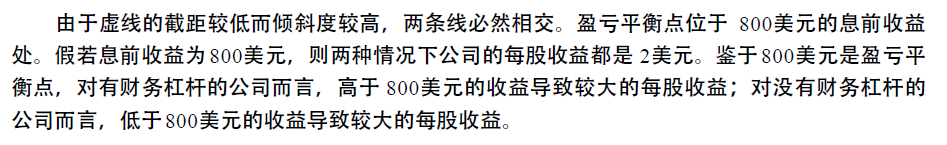

#### 债务和权益之间的选择

##### 莫迪格利安尼和米勒：MM命题

> **无税收世界**

###### MM命题Ⅰ(MM Proposition Ⅰ)

**MM命题Ⅰ(MM Proposition Ⅰ)**：企业无法通过改变其资本结构构成的比例来改变其流通在外证券的总价值，即企业的总价值总是相同的。对企业的股东而言，既没有任何较好的也没有任何较次的资本结构。
<u>**MM命题Ⅰ(无税)：杠杆企业的价值等同于无杠杆企业的价值**</u>

> 公司的资本结构调整既无助于也无损于公司股东，如果投资者无法从公司的财务杠杆中获利，那么他也不能从自制的财务杠杆中获利。
>
> 投资者可通过借款投资无杠杆企业股票，自制财务杠杆，模拟投资杠杆企业所得收益，即独立地复制公司财务杠杆的影响。均衡结果是杠杆企业价值与无杠杆企业价值相等。

###### MM命题Ⅱ(MM Proposition Ⅱ)

**股东的风险随着财务杠杆的使用而增加，期望收益率随财务杠杆上升**
$$
r_{WACC} = \frac{B}{B + S}\times r_B + \frac{S}{B + S} \times r_S
$$

> $r_B$: 利息率，也称债务成本
> $r_S$: 权益的期望收益率，也称权益成本或权益的期望收益率
> $r_{WACC}$: 企业的加权平均资本成本
> $B$: 债务的价值
> $S$: 股票的价值或权益的价值

MM命题Ⅰ的一个隐含假设是：所假定的公司的$r_{WACC}$固定不变，与资本结构无关，均为完全权益企业的权益成本

定义$r_0$为完全权益企业的资本成本$r_{WACC}$，则$r_{WACC} = r_S = r_0$
$$
r_0 = \frac{无杠杆公司的期望收益}{无杠杆的权益}
$$
考虑财务杠杆时权益的期望收益率$r_S$，令$r_{WACC} = r_0$，可调整得：
$$
r_S = r_0 + \frac{B}{S}(r_0 - r_B)
$$
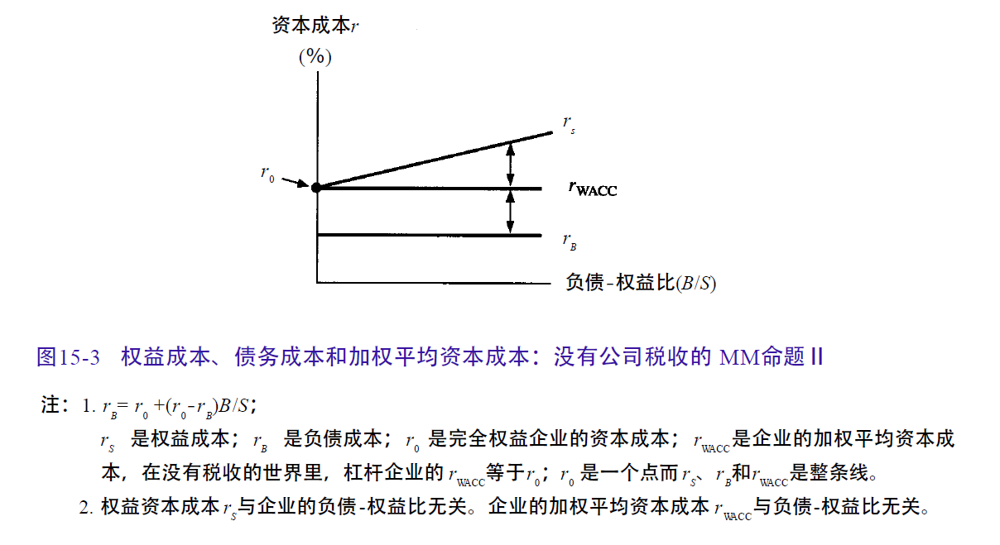

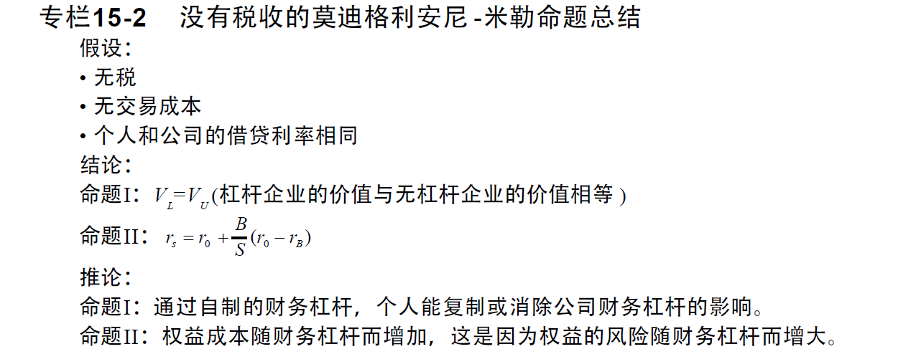

##### 税

> 在没有税收的世界中，企业价值与债务无关。当存在公司税时，企业的价值与其债务正相关。

* 完全权益企业的应税所得为$EBIT$，总税收为$EBIT \times T_C$，企业价值为：
  $$
  EBIT \times (1 - T_C)
  $$

* 杠杆企业的应税所得为$EBIT - r_BB$，总税收为$T_C \times (EBIT - r_BB)$，则公司价值为：
  $$
  EBIT - r_BB - T_C \times (EBIT - r_BB) + r_BB \\
  = EBIT\times(1-T_C) + T_C r_BB
  $$

###### 利息减税的现值

每个时期杠杆企业的现金流量较无杠杆企业的现金流量要多$T_Cr_BB$，称为*债务的税减(tax shield)*，该值为*年金值(annual amount)*

只要该企业期望有确定的税收依托，就能假定税减具有与债务利息相同的风险，则其价值可通过以$r_B$作为贴现率来计算。假设该现金流量永续，则税减的现值：
$$
\frac{T_Cr_BB}{r_B} = T_CB
$$

###### 杠杆企业的价值

无杠杆企业的价值：
$$
V_U = \frac{EBIT \times (1 - T_C)}{r_0}
$$
税减$T_Cr_BB$，以$r_B$贴现，得税减现金流量为永续时的现值：$T_CB$

杠杆企业的价值：
$$
V_L= \frac{EBIT \times (1 - T_C)}{r_0} + \frac{T_Cr_BB}{r_B} = V_U + T_CB
$$
则得**含公司税时的MM命题Ⅰ**：有杠杆企业的价值是完全权益企业的价值与$T_CB$之和

由于税减随债务额的增大而增加，企业通过用债务替代权益来提高其总现金流量和价值。 —> <u>通过提高负债-权益比，企业能降低其税收从而提高总价值</u>

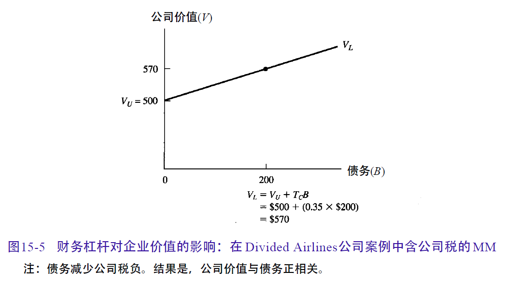

###### 期望收益率和在公司税下的财务杠杆

在存在公司税的世界中：
**MM命题Ⅱ**：权益的期望收益率
$$
r_S = r_0 + \frac{B}{S} \times (r_0 - r_B) \times ( 1  - T_C)
$$
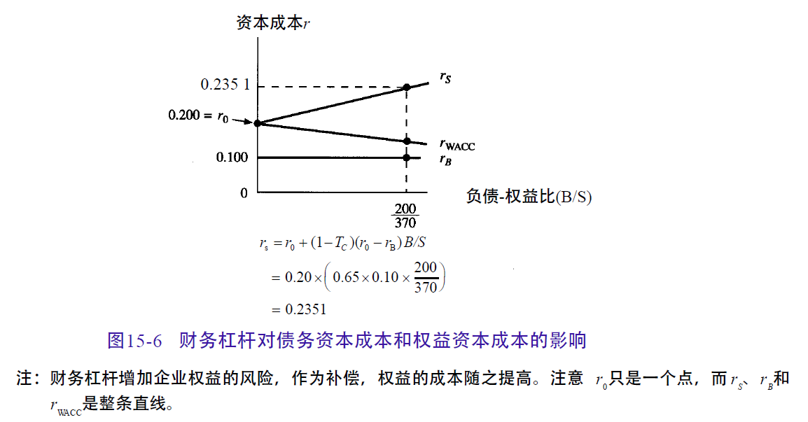

杠杆权益：
$$
S = \frac{(EBIT - r_BB)\times (1 - T_C)}{r_S}
$$

###### 加权平均资本成本$r_{WACC}$和公司税

$$
V_L = B + S\\
r_{WACC} = \frac{B}{V_L}r_B ( 1- T_C) + \frac{S}{V_L}r_S
$$

尽管债务相对权益具有税收优惠，有公司税的世界中，$r_{WACC}$随财务杠杆而降低。
依靠债务的作用，当企业降低其$r_{WACC}$时，企业的价值将提高

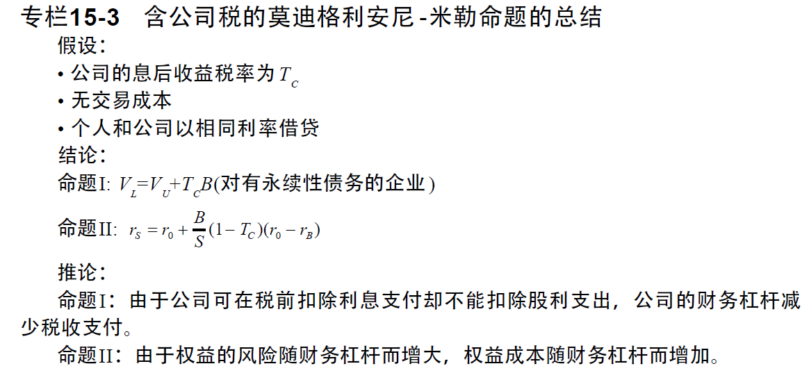

## 第十六章 资本结构：债务运用的限制

添加诸如税收和破产成本之类的现实世界问题，税收可看作政府对公司现金流量的索取权，可用$G$代表政府对公司征税权利的市场价值；破产成本是另一种对现金流量的索取权，用$L$标示其价值。
破产成本是从公司破产现金流量中支出的现金流量，对索取权$L$来说，现金流量随债务权益比上升。

圆饼理论认为所有这些权利只有一个支付源：公司的现金流量$CF$
$$
CF = S + B + G + L
$$
放款对公司价值的定义：
$$
V_T = S + B+ G + L
$$
则MM理论推论：$V = V(CF)$并取决于公司的总现金流量

股东和债权人的权利：$S + B$，*市场交易权(marketed claims)*
政府和潜在诉讼当事人的权利：$G + L$，*不可交易权(nonmarketed claims)*

> 市场交易权可在金融市场上买卖，而不可交易权却不能 

则：

$$
V_T = S + B + G + L = V_M + V_N
$$

> 我们谈到公司价值时，一般仅指市场交易权的价值$V_M$，而不是不可交易权的价值$V_N$
>
> 则总价值$V_T$不变，市场交易权的价值$V_M$大体随资本结构的变化而变化，尤其随负债-权益比的变化而变化
>
> 根据圆饼理论，$V_M$的任何增加必定意味着$V_N$的同等减少

### 增长和负债-权益比

#### 无增长型

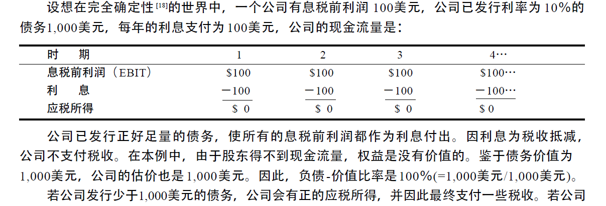

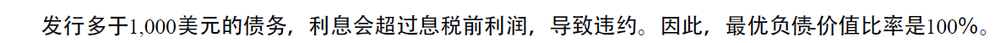

#### 增长型

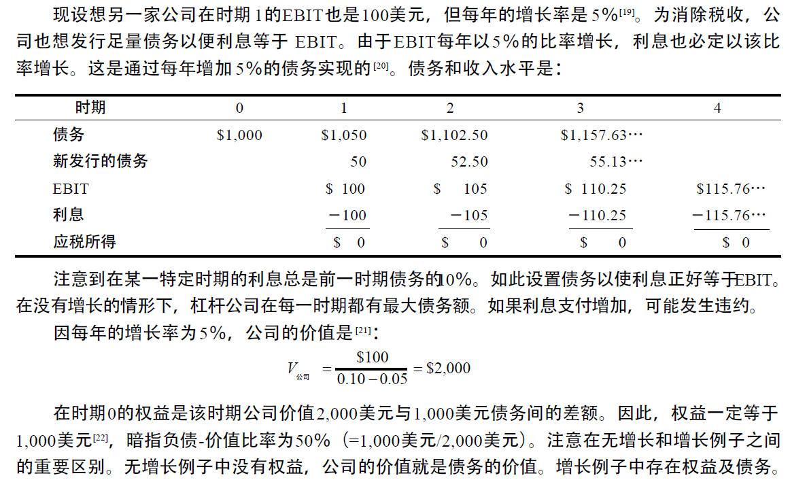

<u>高增长公司的负债比率将低于低增长公司</u>

### 个人税

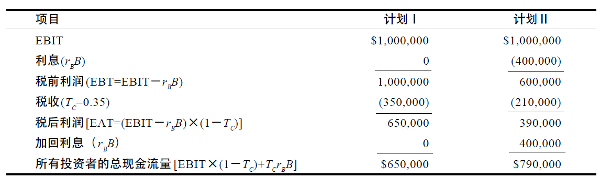
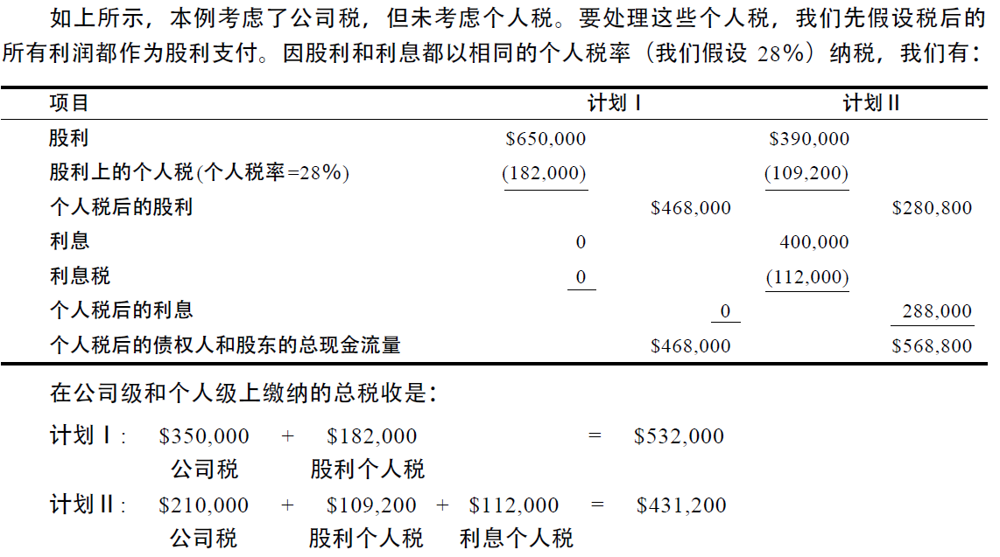

计划Ⅱ下总税收现金流量更大：

1. 当忽略个人税时，总现金流量较高
2. 所有现金流量（利息和股利）都以相同的个人税率纳税

—> 债务增加公司价值

实际上，公司可回购股份替代股利，这种策略可导致个人税低于股利支付时发生的个人税；股利可通过收益的留存而延递。
从而对股东分配的实际个人税率很可能低于个人利息税率。

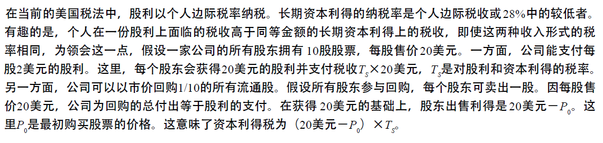

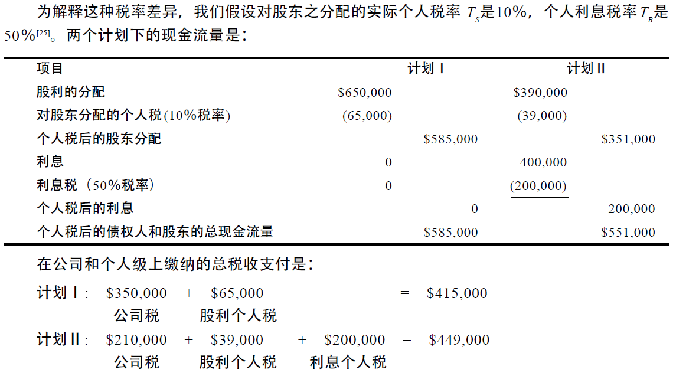

在这个方案中，计划Ⅰ下的总现金流量高于计划Ⅱ下的总现金流量

—> 在所有等级上的总税收可能随债务递增或递减，这取决于实际税率

### 米勒模型

#### 在个人和公司税下的估价

股东获得：
$$
(EBIT - r_BB)\times ( 1 - T_C) \times (1 - T_S)
$$
债权人获得：
$$
r_BB \times ( 1 - T_B)
$$
则投资者总现金流量：
$$
(EBIT - r_BB)\times ( 1 - T_C) \times (1 - T_S) +r_BB \times ( 1 - T_B)\\
\Rightarrow EBIT \times (1 - T_C) \times (1 - T_S) + r_BB \times (1- T_B)\times [1 - (1-T_C)\times(1-T_S)/(1-T_B)]
$$
总现金流量第一项为：无杠杆公司在所有税收后的现金流量，该现金流量价值一定是无杠杆公司的价值$V_U$：
$$
V_U = EBIT \times (1 - T_C) \times (1 - T_S)
$$
记购买债券$B$的个人在支付所有税后获得$r_BB\times(1-T_B)$为$B$
$$
V_L = V_U + [1 - \frac{(1- T_C)\times(1-T_S)}{1-T_B}]\times B
$$

> $T_B$: 利息税率，也即普通收入的个人税率，个人等级上的利息税率
> $T_S$: 权益分配的个人税率
> $T_C$: 公司税率

假设$T_B = T_S$，则有：
$$
V_L = V_U + T_C B
$$

无个人税的世界：
$$
V_L= \frac{EBIT \times (1 - T_C)}{r_0} + \frac{T_Cr_BB}{r_B} = V_U + T_CB
$$

> 因此，只要权益分配的纳税率与在个人等级上的利息税率相同，则个人税的引入不影响估价公式

当$T_S < T_B$，因财务杠杆而获得的收益减少。

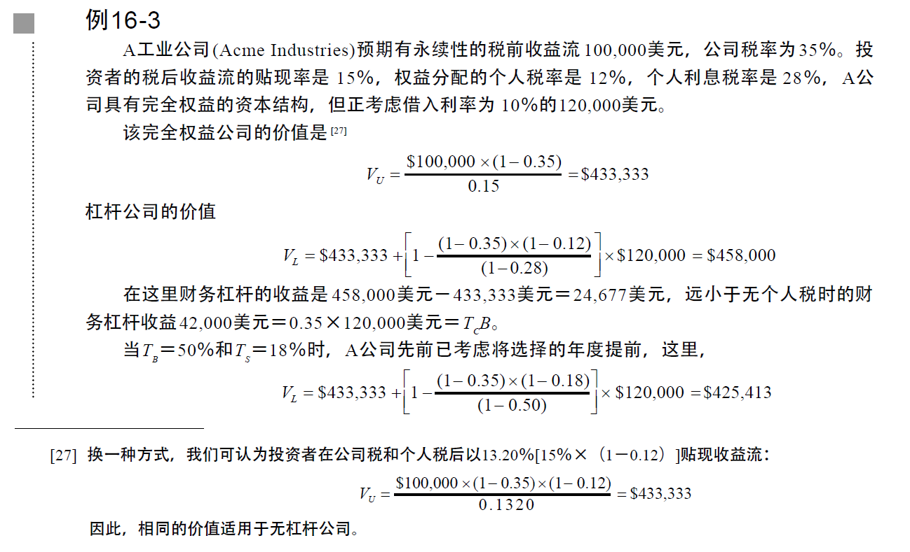
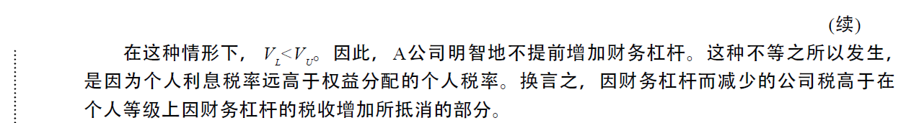

假设公司最初仅发行权益，由于债务可扣减税收，公司税后的债务成本是$(1 - T_C) \times r_B$，而权益在公司水平上不能扣减，所以权益的税后成本是$r_S$，因此公司不关心是发行债券或权益，当：
$$
(1 - T_C) \times r_B = r_S
$$
—> 公司能负担支付的债务利率。

> 债券的收益率将高于可比风险的股票的收益率。

对个人投资者而言：
$$
r_B \times (1 - T_B) = r_S \times (1 - T_S)
$$
若个人在利息上的纳税率高于在权益分配上的税率，则会对债务的收益率提出更高要求，否则将持有权益。

—> 吸引较高税收等级的投资者需要的债务收益率

因此最终，处于竞争中的公司，将发行足够的债券，以使$T_B \le T_C$的税收等级的个人持有债务，而具有较高收入等级的个人持有权益。
因为处于与公司税率相等的税收等级上的个人持有债券，结果是公司的财务杠杆不带来盈亏，从而资本结构决策对公司决策无关

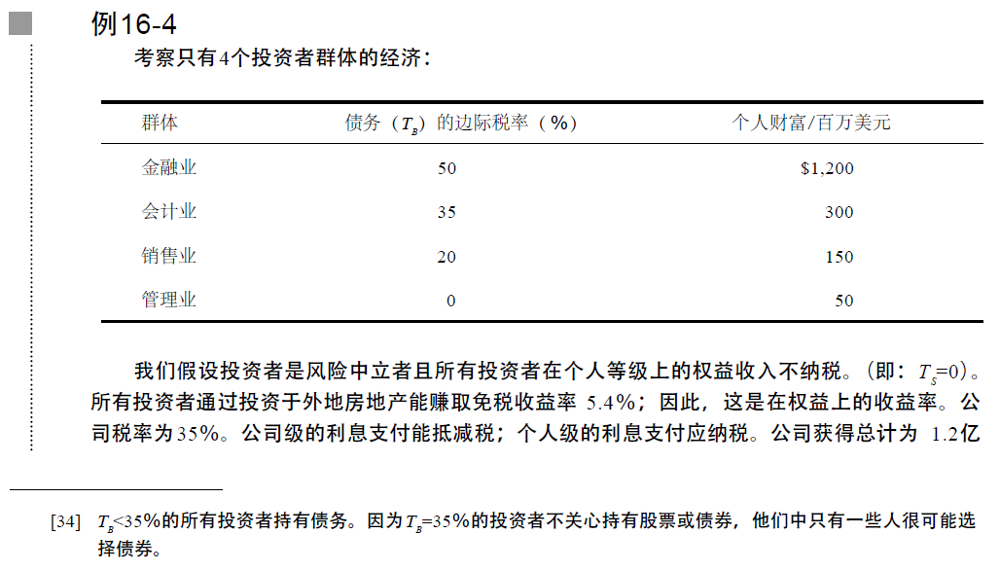
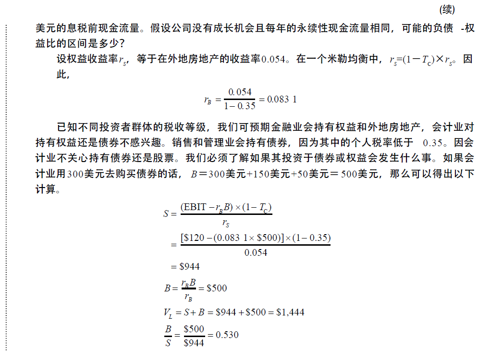
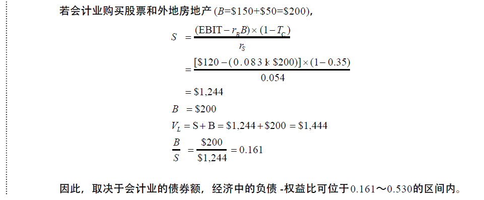

### 公司确立资本结构

在目标负债-权益比的最终决定中四个重要因素：

* 税收：

  如果公司有且将继续有应税所得，对债务的依赖将减少由公司支付的税收并且增加一些债权人所支付的税收。如果公司税率高于债权人税率，债务的运用可产生价值。

* 资产的类型：

  财务困境的代价是昂贵的，财务困境成本取决于公司所拥有的资产类型。如果公司在土地、建筑物和其他有形资产上有大量投资，其财务困境成本将小于大量投资于研究开发上的公司。
  代表性的研究开发的重售价值低于土地，因此，其价值的大部分消失于财务困境中。

* 经营收入的不确定性：

  在不确定性的经营收入的公司经理财务困难的可能性较高，即使没有负债。
  因此，这些公司主要依靠权益融资

* 优序和高融资能力：

  优序理论阐述了<u>公司更愿意选择内部权益(即留存收益)融资而非外部融资；如果资金需求超过留存收益，则发行债务优于发行权益</u>。

  * 因要支付大量费用给投资银行家，外部融资是昂贵的
  * 当经理对公司情况了解对股东多时（“不对称信息”），股东难以准确地估价外部权益。这个事实会导致股东不愿接受新权益的发行

  公司将在经营好的期间贮存现金以避免在经济不景气期间的外部融资需求；也可以在好的时期使用少量债务以便在不景气时（或出现重大机会时）能借到所需的资金。
  经济学家把现金集积和低债务水平归诸于*高融资能力(Financial Slack)*。<u>未使用的负债能力提供高融资能力和进入金融市场的准备</u>

##   第十七章 杠杆企业的估价与资本预算

同样一个项目，在一个*全权益企业(all-equity firm)*中可能是不可行的，但是在一个有杠杆企业(其他条件均不变)中则可能可行。这是因为财务杠杆通常能够降低企业的资本成本，使一些项目的NPV由负数变为正数

> 若企业将其目标负债-价值比运用于项目的整个寿命期，宜采用WACC法或FTE法；
> 若在项目整个寿命期内负债水平都已知，则宜采用APV法
>
> $APV$法通常适用于一些特殊情形，如贴息、LBO和租赁；
> WACC法和FTE法则普遍适用于更加典型的资本预算情形，在典型的资本预算情形下，APV法是相对次要的方法

### 修正现值法

*修正现值(adjusted-present-value, APV)法*：
$$
APV = NPV + NPVF\\
\Rightarrow APV = \sum_{t=1}^\infty\frac{UCF_t}{(1+r_0)^t} +负债的附带影响- 初始投资额
$$

> 即一个杠杆企业的项目价值$APV$等于一个无杠杆企业的项目价值$NPV$加上筹资方式的附带影响的净现值$NPVF$
>
> * 债务的税收收益：一笔永久债务的税收收益额是$T_CB$
>
>   > $T_C$是公司所得税税率，$B$是负债的价值
>
> * 新债券的发行成本：企业公开发行公司债券，需要投资银行的参与，企业对投资银行付出的努力和时间予以补偿，这就是发行成本，它降低了项目的价值
>
> * 财务困境成本：随着债务融资的增加，企业产生财务困境，甚至陷入破产的可能性也增加。财务困境增加企业成本，从而降低其价值
>
> * 债务融资的贴息（非市场利率融资）：借款利率存在的优惠会使得项目或企业的价值增加
>
> —> 债务的税收收益在实际中影响最大

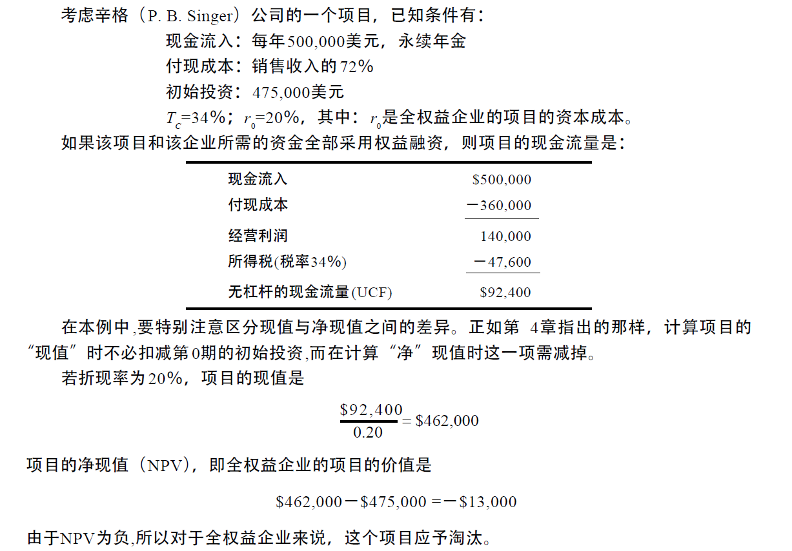
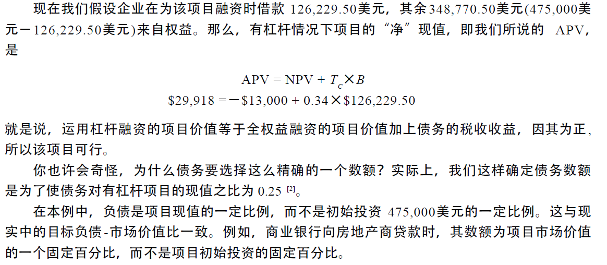

### 权益现金流量法

*权益现金流量法(flow-to-equity, FTE)*：该方法只对杠杆企业项目所产生的属于权益所有者的现金流量进行折现，折现率为权益资本成本$r_S$
对于一项永续性的现金流入：
$$
\frac{有杠杆企业项目的权益现金流量}{r_S}
$$
权益现金流量法分三个步骤：

1. 计算*有杠杆企业项目的权益现金流量(LCF)*

   
   $$
   UCF - LCF = (1 - T_C) r_BB
   $$

2. 计算$r_S$
   $$
   r_S = r_0 + \frac{B}{S} (1 - T_C)(r_0 - r_B)
   $$
   
3. 确定项目价值
   $$
   \frac{LCF}{r_S}
   $$

* 则项目的“净”现值就是有杠杆企业项目的权益现金流量(LCF)的现值减去初始投资中来自权益的部分
  $$
  NPV = \sum_{t=1}^\infty\frac{LCF_t}{(1+r_{S})^t} - (初始投资额-借入款项)
  $$

### 加权平均资本成本法

*加权平均资本成本法(weighted-average-cost-of-capital WACC)*：
$$
r_{WACC} = \frac{S}{S+B}r_S + \frac{B}{S+B}r_B(1-T_C)
$$

> $\frac{S}{S+B},\frac{B}{S+B}$: 目标比率

则项目的净现值：
$$
NPV = \sum_{t=1}^\infty\frac{UCF_t}{(1+r_{WACC})^t} - 初始投资额
$$
若项目是无限期的：
$$
NPV = \frac{UCF}{r_{WACC}} - 初始投资额
$$

### 贝塔系数($\beta$)与杠杆

有杠杆企业$\beta_L$是负债$\beta_B$和权益$\beta_S$的加权平均：
$$
V_U + T_CB = V_L = B + S\\
\begin{align}
\beta_L &=\frac{B}{V_L}\times \beta_B + \frac{S}{V_L}\times\beta_S\\
&= \frac{B}{B+S} \times \beta_B + \frac{S}{B+S}\beta_S \\
\end{align}\\
$$
有杠杆企业的$\beta_L$还可以表达成无杠杆企业$\beta_U$和节税$\beta_B$的加权平均：
$$
\begin{align}
\beta_L &= \frac{V_U}{V_L}\times \beta_U + \frac{T_CB}{V_L} \times \beta_B\\
&=\frac{V_U}{V_U+T_CB}\times \beta_U + \frac{T_CB}{V_U + T_CB} \times \beta_B
\end{align}\\
$$
则假设负债$\beta = 0$：

无税情况下普通股股票的贝塔系数$\beta_S$与企业杠杆之间的关系：
$$
\beta_{S} = \beta_{L}(1 + \frac{B}{S})
$$
纳税情况下，无杠杆企业的$\beta_U$与有杠杆企业权益的$\beta_S$之间的关系：
$$
\frac{B}{V_L} \times \beta_B + \frac{S}{V_L}\beta_S =\frac{V_U}{V_L}\times \beta_U + \frac{T_CB}{V_L} \times \beta_B \\
V_U = S + (1-T_C)\times B\\
\beta_B = 0\\
\Rightarrow \beta_{S} = (1 + \frac{(1 - T_C)B}{S})\beta_{U}
$$

> 有税条件下和无税条件下，杠杆都起了增大风险的作用；由于存在公司所得税时，杠杆会产生无风险的节税效应，从而降低整个企业的风险，因此，杠杆所起的增加$\beta$的作用在有税条件下要小些

## 第十八章 股利政策

*常规现金股利(regular cash dividends)* & *特殊现金股利* & *股票股利(stock dividend)* & *股票拆细(stock split)*

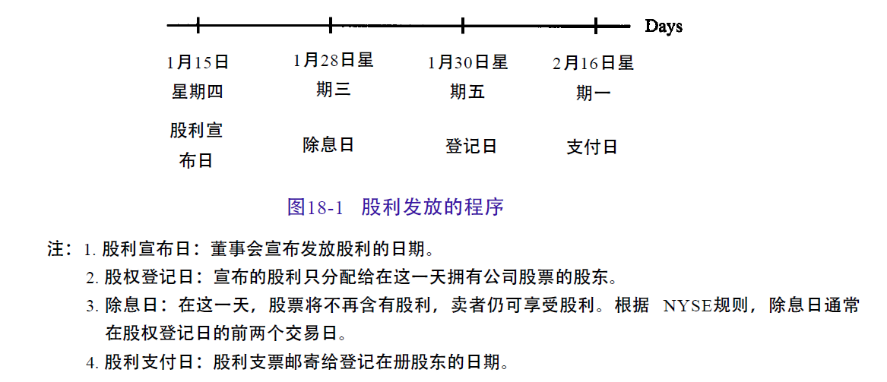
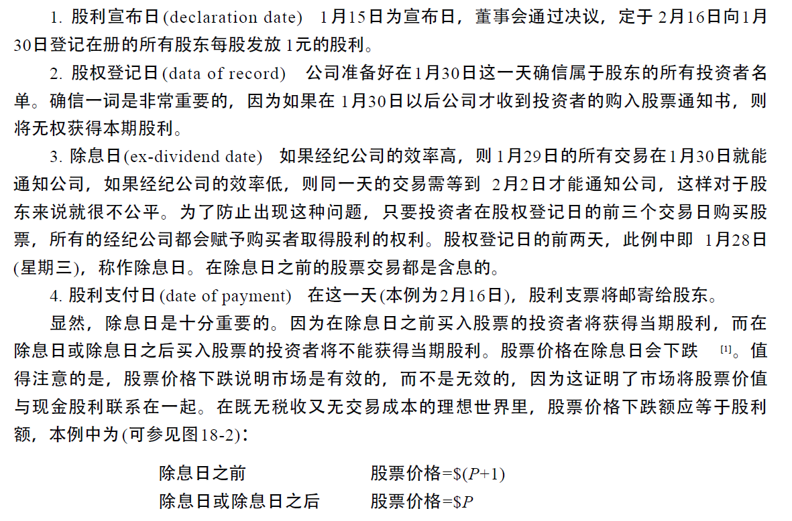
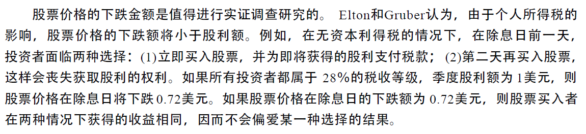

### 股利无关论

假设：

* 既无税收，又无交易费用，任何投资者都不可能通过其自身交易影响操纵市场价格。—> 完全市场
* 所有投资者对于未来投资、利益和股利具有相同的信念
* 公司的投资政策事先已经确定，不会随着股利政策的改变而改变

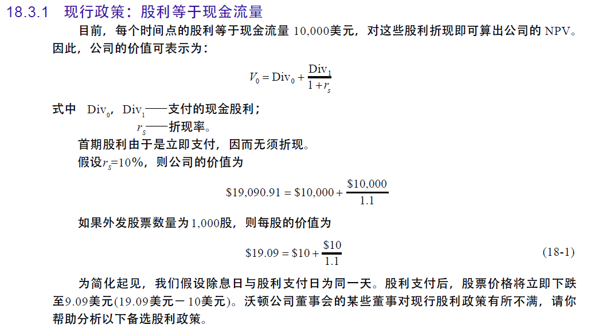

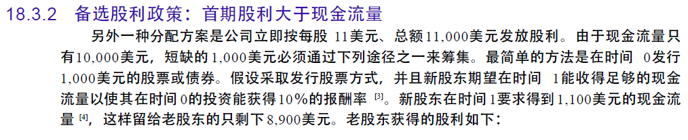

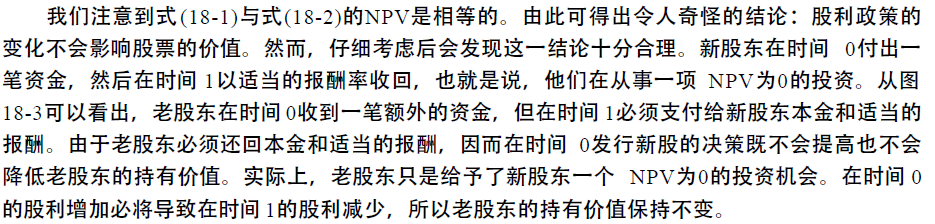

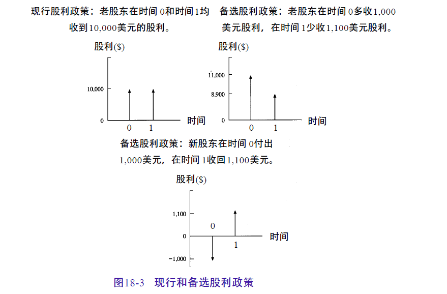

#### 自制股利

*自制股利(homemade dividends)*: 公司的股利政策被潜在的不满意股东通过自制股利而予以抵消

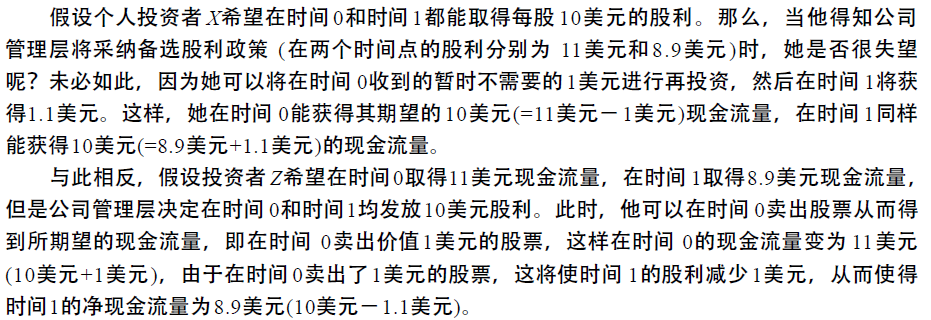

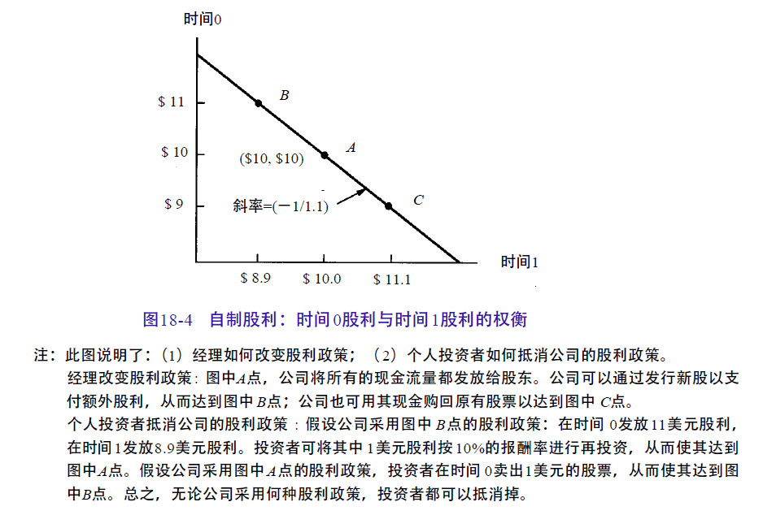

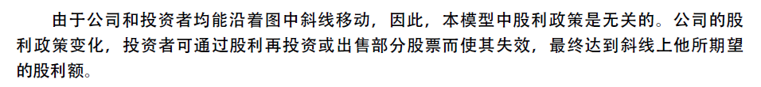

公司应该接受所有$NPV > 0$的项目，否则将会降低公司的价值 + 股利政策与公司价值无关
—> 公司任何时候都不应放弃$NPV > 0$的项目，以提高股利或用于支付首次股利

### 税收、发行成本和股利

没有充足现金支付股利的公司 v.s. 拥有充足现金支付股利的公司

* 没有充足现金支付股利的公司：

  考虑没有充足现金并且业主只有一人的公司。假设业主发行股票给自己，并提供现金给公司：

  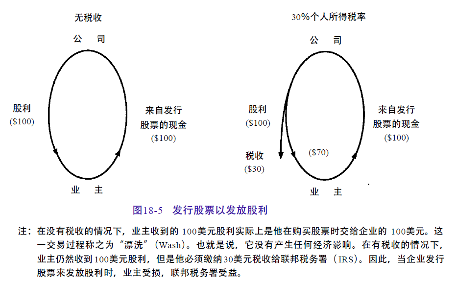

* 拥有充足现金支付股利的公司

  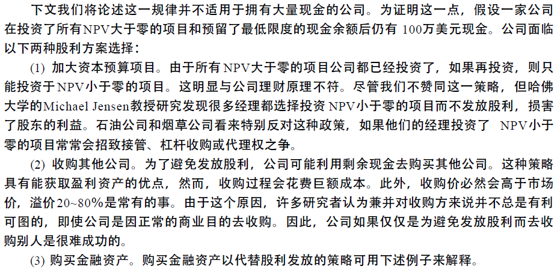
  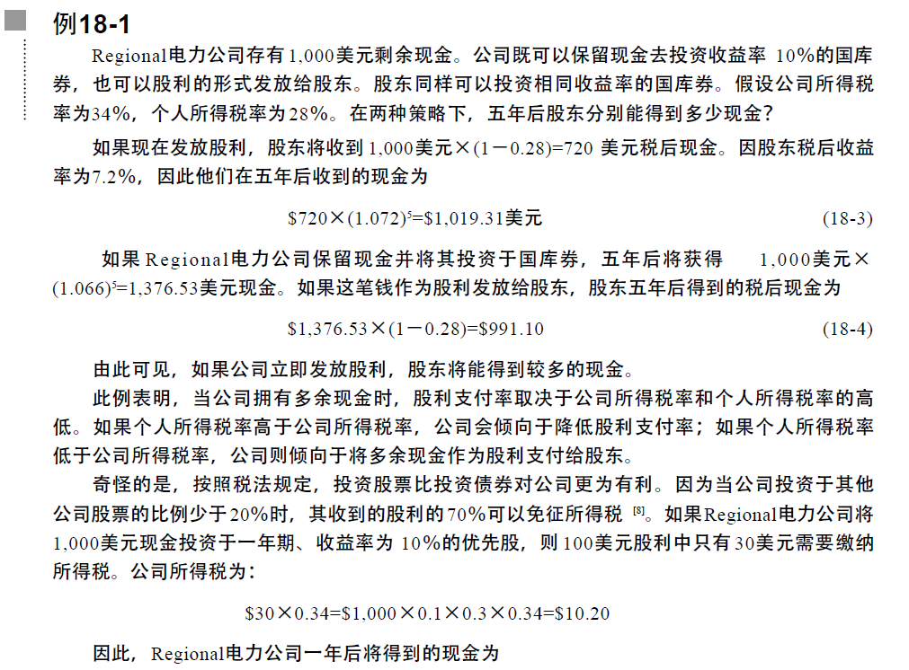
  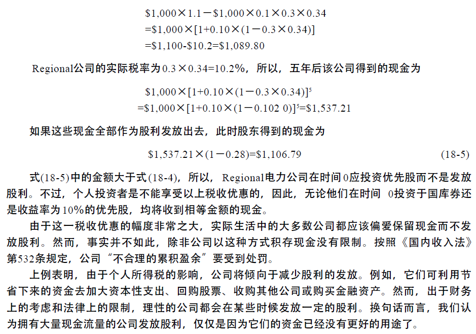

* 在存在个人所得税的情况下：

  * 公司不应通过发行股票来发放股利
  * 公司经理倾向于减少股利而寻求更为有效的资金使用渠道
  * 尽管个人所得税的存在使得发放股利不利，但这尚不足以诱导公司取消所有的股利

  只有当资金其他使用途径的成本很低时，公司经理才应当尽量避免发放股利

### 股票回购

当避税很重要时，股票回购可能是股利政策有效的替代品。

*无选择性回购(nonselective repurchase)*：通过要约收购或公开市场收购
*目标回购*：从特殊的个人股东手中回购股票

#### 股利与回购

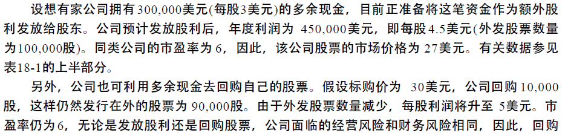
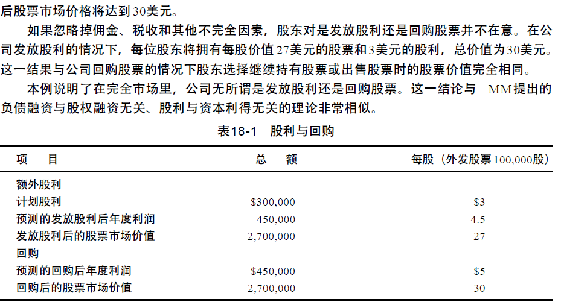

### 预期报酬、股利与个人所得税

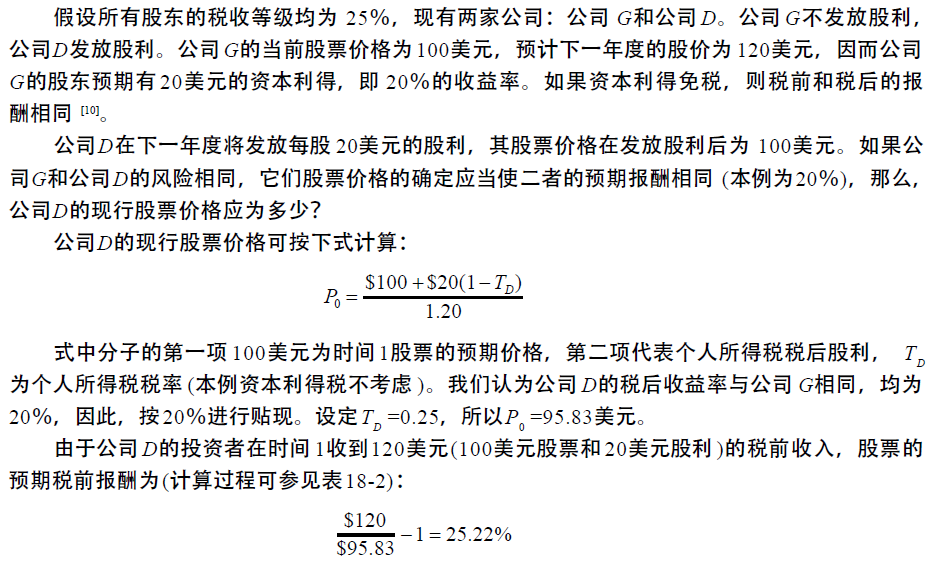
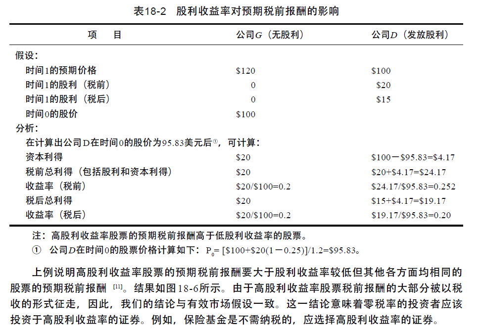

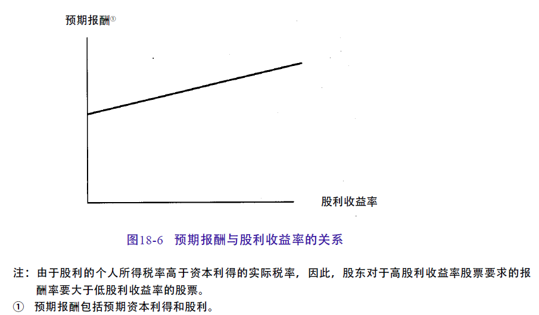

### 赞成高股利政策的现实因素

* *喜爱当前收入* v.s. *消除不确定性*

* 税收套利：通过两个步骤就可以消除因投资高收益率证券而带来的税收问题：

  1. 买入高股利收益率的股票，同时借入足够的资金以使支付的利息与收到的股利相等

     > 这一策略的好处是无须缴纳任何税收，因为股利虽然征税，但利息是税收扣除项目；
     > 坏处是由于财务杠杆的作用使得企业面临的风险很大

  2. 为消除杠杆的不利影响，投资等额的资金于已经出现税收延递账户的债务。

     > 由于税收递延账户的收入能够避税，因此以上两步如同时进行就无需纳税

* 代理成本：

  公司的产权分散时，股东和经营者之间往往会出现利益冲突。经营者会牺牲股东利益来追求自身效益最大化。
  将剩余现金流量以股利形式发放，可以减少经营者控制企业资源的能力，降低代理成本
  所有权的分散程度是衡量代理成本的基本尺度，可以预计所有权高度分散的公司发放的股利高

### 现实因素的解决

* 信息内涵效应(information-content effect)*：股票价格随着股利信号而上涨的现象

  > 公司不愿意削减股利，只有当公司确信未来盈利和现金流量等将提高到足以保证股利以后不可能再减少到以前的水平时，才会增加股利 —> 股利的增加是经理向市场传递公司前景良好的信号

* *追随者效应*：

  处于高税收等级的个人投资者更偏爱低股利或无股利。

  将低税收等级的投资者分为三类：

  * 低税收等级的个人投资者：如果喜爱当前收入或规避不确定性，他们很可能希望发放一定的股利
  * 保险基金：他们的股利收入和资本利得都无须纳税。由于无须纳税，如果偏爱当前收入，也会希望发放股利。
  * 公司：公司70%的股利收入可以免税，但是资本利得无法免税。因此，即使不期望消除不确定性，对当前收入无偏好，公司愿意投资高股利股票

  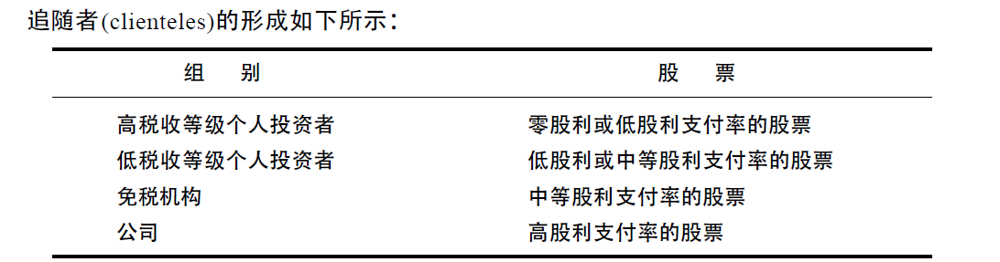

  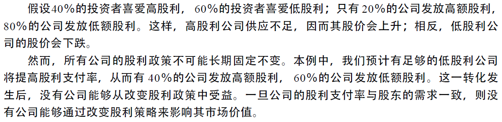

### 股利平稳化

永久性利润 v.s. 暂时性利润
随着永久性利润而不是暂时性利润的增加，股利亦增加。公司有一个长期的股利支付率目标

但是由于经理需要一定的时间来评估利润增加的真正业绩，因而股利变化通常要落后于利润变化一定时期。

—> 股利政策：股利支付水平 + 股利变化

* 股利支付水平：经理倾向于按照利润的一定比例考虑股利的发放。公司从长期股利支付率目标来考虑股利政策
* 股利变化：如果以后股利又不得不变换回来，经理们此时会尽量避免股利支付水平发生变化。因此，股利支付水平较利润水平更稳定。公司努力使其与利润变化相关的股利变化平稳化

—> 股利政策取决于两个参数：目标股利支付率$t$，现期股利对目标值的调整$s$
$$
Div_1 - Div_0 = s \cdot (tEPS_1 - Div_0)
$$

> $Div_1,Div_0$: 下一年度和本年度的股利
> $EPS_1$: 下一年度的每股收益、
>
> 稳健型公司的调整率较低，激进型公司的调整率较高
> 若$s=0, Div_1 = 0$; 若$s = 1$，实际股利变化就等于目标股利变化
>
> 股利支付率由$t$决定。如果公司面临的NPV大于零的投资项目很多，就会选择较低的支付率$t$；如果公司的现金充分但NPV大于零的投资项目有限，就会选择高的$t$

### 股票股利

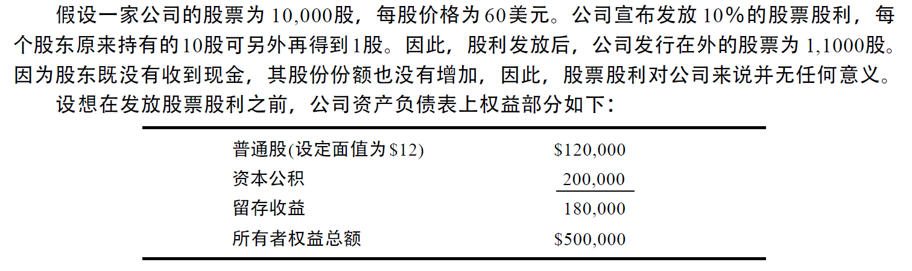
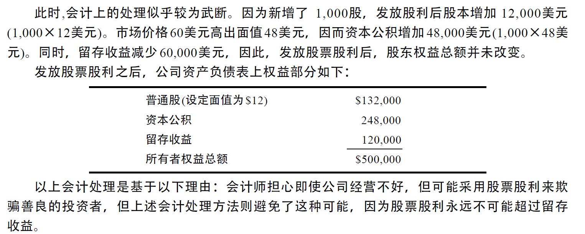

### 股票拆细

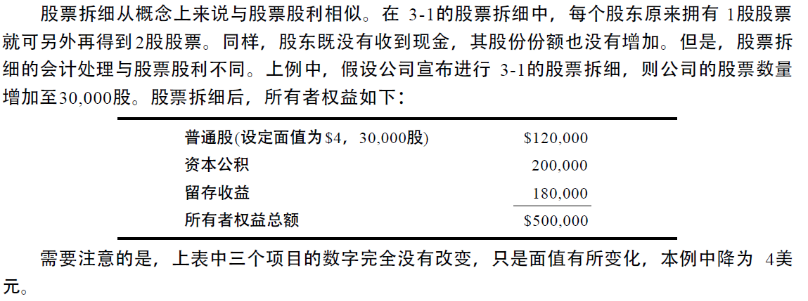

----

