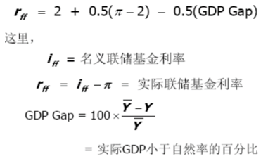
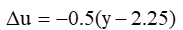

**宏经潜在名词解释整理**

导论

**外生变量**：模型以外的因素所决定的已知变量

**内生变量**：经济模型所要决定的变量

 

第二章

**国内生产总值（GDP）**：一个经济体一定时期内在其境内所生产的最终产品与服务的市场价格总额。

**国民生产总值（GNP）**: 一定时期内（一般为一季度或一年）利用一个国家所拥有的生产要素所生产的所有最终产品和服务的价值总和。

**国外要素支付净额（NFP）**:本国生产要素在世界其他国家获得的收入减去付给国外生产要素在本国获得的收入。

**支出法**：把一年内的购买各种最终产品和劳务的支出加起来，计算出该年内生产出来的产量与劳务的市场价值

**收入法**：将GDP视为所有经济主体收入的加总。

**名义GDP**：按现期价格衡量的最终产品与服务的市场价值。

**实际GDP**：用一组不变价格（基年价格）衡量的最终产品与服务的市场价值。

**GDP****平减指数**：名义GDP与实际的GDP之比。

**CPI**：典型消费者一篮子产品与服务的价格相对于某个基年同样一篮子产品与服务的价格，是一般物价水平的衡量指标。

**GDP****平减指数和CPI的区别**

GDP平减指数衡量生产出来的所有产品与服务的价格；而CPI只衡量消费者购买的一篮子产品与服务的价格。

GDP平减指数只包括国内生产的产品。因此，进口产品不影响GDP平减指数，但影响CPI。

CPI给不同产品的价格以固定的权数，而GDP平减指数给予变动的权数（每年的数量都是变化的）。

**绿色GDP**：一个国家或地区在考虑了自然资源（主要包括土地、森林、矿产、水和海洋）与环境因素（包括生态环境、自然环境、人文环境等）影响之后经济活动的最终成果，将经济活动中所付出的资源耗减成本和环境降级成本从GDP中予以扣除。

 

第三章

**绝对收入假说**：实际消费支出为实际收入的稳定函数，收入指现期绝对收入水平，消费随着收入增加而增加（MPC递减、APC递减）

**边际消费倾向递减规律**：人们的消费虽然随收入的增加而增加，但在所增加的收入中用于增加消费的部分越来越少。

**“消费函数之谜”/“凯恩斯－库兹涅茨悖论”**：短期消费函数和长期消费函数表现出来的差异。长期消费函数表达式应为C ＝ bYd ，即在长期内自发性消费为零。

**相对收入假说**：消费并不取决于现期绝对收入水平，而是取决于相对收入水平。（空间与时间）

**示范效应**：消费者消费时会在空间上进行相互比较，试图在消费水平上超过别人或至少不低于同一阶层的其他人，收入增长率较高（相对收入增加），则降低平均消费倾向。

**攀比效应**：消费者消费时会在空间上进行相互比较，试图在消费水平上超过别人或至少不低于同一阶层的其他人，收入增长率较低（相对收入下降），则提高平均消费倾向。

**棘轮效应**：消费支出在时间上是不可逆的。人们在时间上将其消费与自己的过去消费进行对比，消费支出只能上升，而难以在现期收入下降时也随之下降的现象。（收入较过去增加，APC不变；减少，APC提高）

**终生收入假说**：消费者是理性的，能以合理的方式使用自己的收入，进行消费。理性的消费者将根据效用最大化的原则使用一生的收入，安排一生的消费与储蓄，使一生中的收入等于消费，强调财产也会影响消费。

基本假设：

寿命与工作年限能够确定

不考虑财产的利息

不考虑价格变动因素

**持久收入假说**：将收入分为持久收入为预期持续到未来的收入（保持三年以上）与暂时收入，

消费取决于永久性收入。

**净存货机制**：在价格机制基本不起作用时，把总产出推向与总需求相等的水平的一种数量机制。（D>S-非意愿存货下降-企业增加产出）

**乘数**：总产出的增加量与自发性支出增加量之间的比率。

 

第四章

**投资**：资本的形成，即社会实际资本的增加，如厂房、设备、存货等。

**货币的时间价值**：当前所持有的一定量货币比未来获得的等量货币具有更高的价值。

**资本的边际效率（MEC）**：使资本品使用期内预期收益的现值等于投资成本的贴现率。

**资本边际效率递减规律**：厂商增加投资时预期利润率递减。（I↑-资本品供给价格↑/产品价格↓-预期利润率↓）-使资本家对未来缺乏信心，引发投资需求不足。

**合意资本存量**：处于边际位置上的投资项目的利润率等于市场利息率决定的资本存量，是全社会利润最大化的资本存量。

**引致投资**：投资支出随着产出水平的增加而增加，引致投资曲线向右上方倾斜。

**资本产出比**：生产1元GDP所需的资本量。

**加速数**：每增加1元产出需要增加的投资数。

**加速原理**：预期总产出增加，对投资需求有加速数影响。

**资本边际产量（MPK）**：通过多使用一单位资本所能获得的产量。

**托宾的Q比率**：公司市场价值对其资产重置成本的比率。反映的是一个企业两种不同价值估计的比值。

 

第五章

**货币**：是交换的媒介，是由中央银行发行的，政府以法律形式保证其在市场上流通的一般等价物。

**货币需求**：家庭、企业、政府愿意以货币形式持有的财产。

**投机性货币需求**：由于未来利率的不确定，人们为避免资产损失或增加资本收益，及时调整资产结构，因而形成的对货币的需求

**凯恩斯陷阱区/流动性陷阱**：利率极低，证券价格上升到足够高时，人们估计，如此高的证券价格只会下降，不会再上升，于是人们就会不肯再买证券，而宁肯保留货币在手中。这时，增加货币供给，人们也不会再去买证券。

**古典区**：当利息率很高时，有价证券的价格降到非常低，投机者预计有价证券的价格在将来会回升，于是倾向于购买有价证券，投机货币需求为零。

 

第六章

**M0**：通货，即流通中的现金（铸币和纸币）

**M1**：M0+支票账户存款（活期存款）

**M2**：M1+小额定期存款等（大多数国家沿用）

**M3**：M2+大额定期存款+其他流动性较差的金融资产

**“中国货币之谜”**：货币供应量的增加没有引起通胀。

**基础货币/高能货币**：中央银行资产负债表中的负债额是公众持有的现金与商业银行的准备金之和，这是货币供给的基础，用符号H表示。

**准备金**：银行收到但没有贷出去的存款。

**准备金率**：准备金与存款的比率。

**法定准备金率**：由法律规定的商业银行准备金率的最低限。

**超额准备金**：超过法定准备金以上的那部分准备金。

**再贴现率**：商业银行在票据未到期以前将票据卖给中央银行，得到中央银行的贷款，中央银行在对商业银行办理贴现贷款中所收取的利息率。

**影子银行**：银行监管体系之外，可能引发系统性风险和监管套利等问题的信用中介体系

**公开市场业务**：政府通过中央银行在金融市场上买进和卖出政府债券从而控制货币供给量的一种手段。（萧条-央行买进债券-投放货币-货币供给量↑）

**正回购**：中国人民银行向一级交易商卖出有价证券，并约定在未来特定日期买回有价证券的交易行为。（逆-买-卖）

**再贴现政策**：通过改变对商业银行的贷款利率影响商业银行向中央银行的借款，调节货币供给量。（过热-提高再贴现率-减少向央行借款-货币供给量↓）

 

**第七章**

**凯恩斯定律**：社会总需求的变动，只会影响产量或国民收入的变动，使总供给与总需求均衡，而不会引起相应的价格变动，

**IS****曲线**：使总需求等于总产出的商品市场均衡的各种利率和产出水平的组合。

**LM****曲线**：使货币供给等于货币需求的货币市场均衡的各种利率和均衡产出水平的组合。

**LM****曲线的“凯恩斯区域”或“萧条区域”**：当利率降低到人们认为它不可能再低的水平时，货币投机需求对利率变动的敏感程度无穷大，货币投机需求曲线成为一条水平线。

**LM****曲线的“古典区域”**：当利率提高到人们认为它不可能再高的水平时，货币投机需求对利率变动完全缺乏敏感性，货币需求曲线成为一条垂直线。

 

第八章

**收入政策**：政府为降低一般价格水平上升的速度而采取的强制性或非强制性的限制工资和价格的政策

**财政政策**：政府审慎地利用其权力，根据对客观经济形势的分析，有意识地变动政府支出和收入来调节需求、从而实现充分就业、物价稳定、经济增长和国际收支平衡的宏观经济目标政策。（扩张：为减轻萧条，扩大社会就业-增G减T-AD↑；紧缩：减轻过热-增T减G-AD↓-减轻通胀压力）

**自动稳定器**：由于财政政策某些内在的特点，其自身也会自动产生一种弱化经济波动或者有益于经济稳定的作用。（税率累进制；转移支付与社保；农产品价格支持）

**相机抉择法**：政府根据一定时期的经济社会状况，机动决定选择不同类型的反经济周期的财政政策工具

**挤出效应**：由于利息率的提高导致投资水平下降以及总需求水平进一步下降，扩张性财政政策的产出效应受到限制。

**货币政策**：国家通过中央银行调节货币供给量，从而影响利率的变动来间接影响总需求的行为。（扩张-增加货币供给-利率降低-带动总需求增长）

**泰勒规则**：联储基金利率目标的设定基于如下指标：通货膨胀率；实际和充分就业GDP之间的缺口

 

 

第九章

**庇古效应**：实际货币余额（M/P）是家庭财富的一部分，随着物价水平P的下降，实际货币余额（M/P）增加，消费者会感到富有，并更多地进行支出（消费）。

**工资黏性**：工资率不能随劳动供求的变动而及时而迅速的变动。

**AS-AD****古典情形**：在古典情形中，总需求的扩大，只能导致价格水平上升，产出量或国民收入不会变化

**货币中性**：古典情形中，货币量的变化只会导致价格、工资等名义变量的变化，而实际变量（产量、就业）不会发生变化

**AS-AD****凯恩斯情形**：如果总需求增加，会使闲置的资源逐渐得到充分利用，产出量扩大，但价格水平不会变动。

 

**物价总水平变化对总需求的影响**

利率效应/凯恩斯效应：价格总水平上升，将导致利率上升，进而导致投资和总需求水平下降。

实际余额效应/庇古效应：物价总水平上升，以货币表示的资产购买力下降，并导致总需求变化。

汇率效应/蒙代尔效应：物价总水平上升会使进口增加，出口减少；国内生产成本上升，从而导致国内投资水平下降。

税收效应：价格总水平上升会导致人们名义收入增加，从而使税负增加，可支配收入下降，进而消费和投资水平下降。

 

**价格水平的变化影响总供给的机制**

价格水平的变化影响实际工资；

实际工资的变化影响劳动市场的供求；

劳动的供求又决定了实际的就业量；

实际就业量的变化影响总产量。

 

**简单凯恩斯模型、IS-LM模型和AS-AD模型区别**

简单凯恩斯模型说明的是产品市场上的均衡收入的决定，它未考虑货币市场，而且假定投资不变，是一个抽象化的简单模型。

IS–LM 模型说明的是产品市场、货币市场共同均衡时的均衡收入和均衡利率的决定，但它假定价格水平不变，或者说未考虑价格水平。

AD-AS 模型说明的是均衡收入和价格水平的决定，它取消了价格水平不变这一假定，寻求价格水平与均衡收入之间的联系机制。

 

第十章

**失业者**：年龄在规定范围段（如美国规定16~65周岁），有工作能力并且正在寻找工作却没有工作的人。

**就业者**：包括在调查时作为有报酬的雇员工作、在自有企业中工作或在家庭成员的企业中从事无报酬工作的工人。它还包括由于诸如假期等原因而临时缺勤的工人。

**劳动力**：失业者与就业者之和。

**丧失信心的工人**：一个想工作但放弃寻找工人的人，不计入劳动力。

**失业率**：失业人数与全部劳动力人数之比

**劳动力参与率**：劳动力与成年人口之比

**摩擦性失业**：由于劳动市场或生产过程中难以避免的正常摩擦所产生的短期、局部性失业。

**结构性失业**：由于经济结构、技术水平的发展、变化及劳动供求区域结构之间的不对称等原因而导致的失业

**周期性失业**：由于总需求不足使得生产萎缩，进而导致对劳动力的需求下降而产出的失业

**自愿性失业**：虽然有就业机会，但由于嫌工资太低、工种不合兴趣等原因而不愿就业，宁愿失业的情况

**非自愿性失业**：由于经济社会没有提供足够的劳动需求，导致许多人在现行工资率水平愿意工作却找不到工作

**隐性失业**：形式上有工作，但实际上就业者提供的边际产值低于企业的边际劳动力成本，甚至提供的边际产值为零或为负数。

**自然失业率**：自然失业人口与总劳动力的比率，是经济运行于充分就业水平时的失业率

**充分就业**：消除了非自愿性失业或周期性失业以后的社会就业状况。

**职业搜寻**：劳动力市场的信息不完全，劳动力需要在市场上搜寻他所需要的信息

**彼得原理**：在一个等级制度中，每个职工趋向于上升到他所不能胜任的地位；每一个职工最终都将达到彼得高地，在该处他的提升商数(PQ)为零。

**效率工资模型**：企业或雇主主动地将本企业员工的工资定在高于均衡工资的水平。

**效率工资**：高于市场工资率，使企业员工勤奋工作的工资

**奥肯定律**：描述GDP变化和失业率变化之间存在的一种关系。当增长率高于2.25%的趋势增长率时，失业率会下降。并且，实际GDP增长率在一年内持续高于趋势增长率每一个百分点，失业率会下降0.5%。即

**通货膨胀**：经济社会一般价格水平的持续的上涨。

**核心CPI**：受需求拉动而发生的消费价格上涨的幅度，将受气候和季节因素影响较大的产品价格剔除之后的居民消费物价指数。

**温和型通胀/低通胀**：每年总体价格水平上升的幅度在10%以内（奔腾：10%-100%；超级/恶性：100%+）的通胀。

**通胀的再分配效应**：通胀会造成收入的再分配，还会改变债权人与债务人之间的收入、利益配置。

**费雪效应**：通胀率上升1个百分点，要求名义利率也上升1个百分点。（费雪方程：名义利率=实际利率+通胀率）

**鞋底成本**：通胀导致人们减少货币持有量时所浪费的资源。 

**菜单成本**：企业为适应相对物价的变化，需要不停的变更产品报价的成本。

**需求拉动的通货膨胀：**总需求超过总供给所引起的一般价格水平的持续显著的上涨。（AS不变-AD右移）

**成本推动的通货膨胀**：物价水平上升是由生产成本提高而推动的。（AD不变-AS左移）

**混合型通胀**：需求拉动型通胀-P↑-W/P↓-W↑-生产成本↑-成本推动型通胀-Y↓-进一步刺激总需求……

**结构型通胀**:各部门之间的劳动生产率不同，但要求工资涨幅相同，会导致社会的工资增长率超过劳动生产率而引起通胀

**货币数量论**:经济中存在的货币供应量决定了货币价值，因而货币量增长是通货膨胀主要原因（M>L）

**菲利普斯曲线**：表示失业与货币工资变动率（早期）/通货膨胀（短期，弗里德曼）之间交替关系的曲线。通货膨胀率高时，失业率低。

**牺牲比率**：为了使通货膨胀率降低一个百分点所必须牺牲的年实际国民收入的百分比

**标准型通胀目标制**：对通货膨胀目标做出了清晰的承诺并执行透明的制度框架以确保央行对该目标负责

**混合型通胀目标制**：公信力高但是并未就某一通货膨胀目标做出明确承诺

**初始型通胀目标制：**公布了一个通货膨胀目标, 但是因公信力低, 所以没有对目标做出明确的承诺

**输入型通胀：**由于国外商品或生产要素价格的上涨，引起国内物价的持续上涨现象

**总产出决定的短边规则**：总产出决定于生产能力（资源约束型经济，如古典区）和需求（需求约束型经济，如凯恩斯陷阱区）二者中的小者。

**通货紧缩**：产能过剩或需求不足导致物价、工资、利率、粮食、能源等各类价格持续下跌。

 

第十一章

**“70规则”**：某个变量年增长率为X%，则该变量在70/X年内翻一番。

**环境库兹涅茨曲线**：环境污染与经济增长的长期关系呈倒U形。

**自然资源**：自然界提供的作为生产过程投入品的资源，如耕地，河流，森林，矿产资源等等。分为可再生资源与不可再生资源两类。

**“荷兰病”**：自然资源的丰富反而拖累经济发展的一种经济现象。

**物质资本存量**：用来生产商品和劳务的技术设备及其附属物的存量，又简称资本。

**人力资本**：劳动者通过教育，培训和实际经历获得的知识和技能，它们附着在劳动者个人这一特殊载体上并表现为他们素质差异。

 