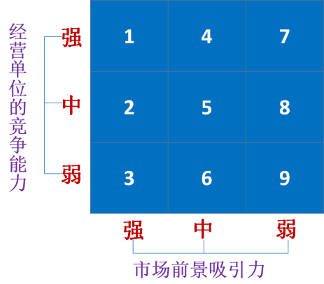
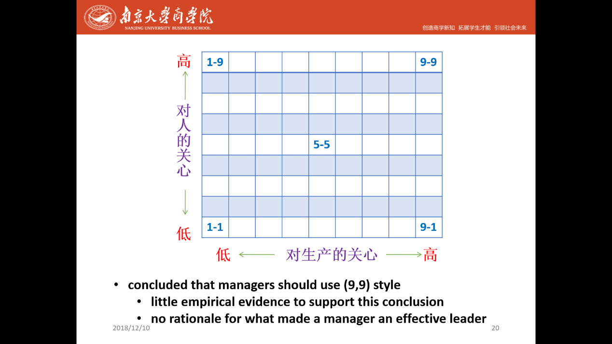

1. **泰罗的科学管理理论**

（1）主要观点：①科学管理的根本目的是谋求最高工作效率

②达到最高工作效率的重要手段，是用科学的管理方法代替旧的经验管理

③实施科学管理的核心问题，是要求管理人员和工人双方在精神上和思想上来一个彻底变革

（2）管理制度（科学管理原理）：

①对工人提出科学的操作方法，以便合理利用工时，提高工效

②在工资制度上实行差别计件制。按照作业标准和时间定额，规定不同的工资率

③对工人进行科学的选择、培训和提高

④制定科学的工艺规程，并用文件形式固定下来以利推广

⑤使管理和劳动分离，把管理工作成为计划职能，工人的劳动成为执行职能

（3）评价：①将科学引进管理领域，用一套具体的科学管理方法代替个人经验主义和管理的旧方法，是历史性的创新

②使生产效率大大提高，适应了资本主义经济的发展需要

③管理职能和执行职能分离，使管理理论的创立和发展有了实践基础

④成了资本家最大限度压榨工人的手段，把人当作机器，忽视人的情感、态度等感性因素

**2.法约尔关于经营管理的概念及管理原则**

（1）企业经营六大职能：

技术职能：设计制造

经营职能：进行采购、销售和交换

财务职能：确定资金来源及使用计划

安全智能：保证员工劳动安全及设备使用安全

会计职能：编制财产目录，进行成本统计

管理职能：包括计划、组织、指挥、协调、控制五项

（2）管理的五要素：

①计划：预测未来事态，长短期计划

②组织：确定执行任务和管理职能的机构，由管理机构进一步确定完成任务必须的机器、物资、人员

③指挥：对下属的活动进行指导，使企业活动互相协调配合

④协调：协调各部门、各员工的活动，使其走向共同目标

⑤控制：确保实际工作与规定的计划、标准相符

（3）十四条管理原则：

\1. 分工：通过专业化提高效率、降低成本

\2. 权力和责任：管理者必须有职有权，职权相当

\3. 纪律：员工必须遵守组织纪律和规章制度

\4. 统一指挥：每位员工应该只应接受一个上级的命令，不能多头领导

\5. 统一方向：组织应该只有一个行动计划，作为统一全体管理者和员工的行动方向

\6. 个人要服从整体：任何员工的利益都不能凌驾于组织整体利益之上

\7. 报酬：必须公平合理，及时支付

\8. 集权：集权程度应视下级的具体情况而定

\9. 等级链：从最高层至最底层要形成有序的权力线

\10. 秩序：人与物都应在正确的时间处于正确的位置

\11. 公平：管理者必须公平、友善地对待下属

\12. 稳定性：人员任期和替补应有清晰的规则

\13. 主动性：鼓励员工执行计划时充分发挥主动性和创新精神

\14. 团队精神：促进团队精神，创造组织内部的和谐与团结氛围

**3.霍桑实验及人际关系学说**

（1）目的：找出工作条件对生产效率的影响，以寻求提高劳动生产率的途径。

（2）结论：生产效率不仅受物理的、生理的因素影响，而且受社会环境、社会心理的影响。

（3）表现方面

①**企业的职工是“社会人”**。物质条件的改变，不是劳动生产率提高或降低的决定性原因。 人不是孤立存在的，而是属于某一工作集体并受这一集体影响的。 

②**满足工人的社会欲望，提高工人的士气是提高生产效率的关键。**士气的高低取决于安全感、归属感等社会、心理方面的欲望的满足程度以及企业中人与人之间的关系。

③**企业中实际存在着一种“非正式组织”。**非正式组织以感情为主要标准，要求成员遵守人群关系中形成的非正式的不成文的行为准则，不仅存在于工人之中也存在于管理人员和技术人员之中。

④**企业应采用新型的领导方法**。主要是组织好集体工作，采取措施提高士气，促进协作，使企业每个人都能参与领导真诚持久的工作。

**4.管理科学学派的主要观点**

（1）以经济效果的好坏作为评价标准

（2）使衡量各项活动效果的标准定量化

（3）依靠计算机进行各项管理

（4）强调使用先进的科学理论和管理方法

**5.斯密的劳动分工研究**

（1）亚当·斯密的分工交易理论：①市场的广狭限制着交换能力

②交换能力的大小有限制分工的程度

③分工的程度决定一国的劳动生产力

④一国的劳动生产力又是国民财富多寡的主要决定因素

（2）分工的益处

①劳动分工可以使工人重复完成单项操作，从而提高劳动熟练程度，提高劳动效率。

②劳动分工可以减少由于变换工作而损失的时间。

③劳动分工可以使劳动简化，使劳动者的注意力集中在一种特定的对象上，有利于创造新工具和改进设备。

**6.明茨伯格管理者角色论**

（1）人际关系角色：代表人：行使一些具有礼仪性质的职责

领导者：和员工一起工作并通过员工的努力来确保组织目标的实现

联络者：和组织内部的个人或工作小组一起工作,建立和外部利益相关者的良好关系

（2）信息角色：监督者：持续关注组织内外环境的变化以获取对组织有用的信息

传播者：把他们作为信息监督者所获取的大量信息分配出去

发言人：把信息传递给单位或组织以外的个人

（3）决策角色：企业家：对发现的机会进行投资以利用

干扰应对者：处理冲突或解决问题

资源分配者：决定组织资源用于哪些项目

谈判者：与员工、供应商、客户和其他工作小组进行必要谈判工作

**7.企业伦理与社会责任**

（1）相关的道德观

①功利主义道德观：能给行为影响所及的大多数人带来最大利益的行为才是善的

②推己及人道德观：合作、和谐、双赢

③社会契约道德观：按照企业所在地区政府和员工都能接受的社会契约所进行的管理行为就是和善的

④公平公正道德观：不应歧视、同工同酬

⑤权利至上道德观：尊重和保护个人基本权利

（2）合乎道德的管理的特征：

①不仅把遵守道德规范视作组织获取利益的一种手段，而且更把其视作组织的一项责任

②从社会整体角度看问题

③善于处理组织与利益相关者的关系，也善于处理管理者与一般员工及一般员工内部的关系

④把人看作目的，组织的行为是为了人

⑤超越法律的要求，能让组织取得卓越的成就

⑥具有自律的特征

⑦以组织的价值观为行为导向

（3）影响管理道德的因素：

①道德发展阶段（三层次六阶段）

a.前惯例层次（决策的依据是本人利益）

·遵守规则以避免受到物质惩罚

·只在符合你的直接利益时才遵守规则

b.惯例层次（受他人期望的影响）

·做你周围的人所期望的事

·通过履行你允诺的义务来维持平常秩序

c.原则层次（受个人用来辨别是非的伦理准则的影响）

·尊重他人的权利，置多数人的意见于不顾，支持不相干的价值观和权利

·遵守自己选择的伦理准则，即使这些准则违背了法律

②个人特性：管理者的个人价值观（包括道德观）；自信心；自控力

③组织结构

a.比较完善的内外制衡、监督机制

b.明确的规章制度，清晰说明各级管理职务的实施细则和应遵守的道德准则

c.上级管理行为的示范作用

d.绩效评估考核体系会起到指挥棒的作用

④组织文化：诚信、包容

⑤问题强度：该问题如果采取不道德的处理行为可能产生后果的严重程度

**8.决策类型**

（1）长期决策与短期决策：

长期（战略）决策：有关组织今后发展方向的长远性、全局性的重大决策

短期（战术）决策：为实现长期战略目标而采取的短期策略手段

（2）战略决策、战术决策、业务决策

战略决策：对组织最重要，具有长期性和方向性

战术决策：又称管理决策，是在组织内贯彻的决策

业务决策：执行性决策，日常工作中进行，牵涉范围较窄

（3）个人决策与集体决策：

集体决策：指多个人一起做出的决策

（优点：更大范围汇总信息；可拟定更多备选方案；能更好沟通；能作出更好的决策 

缺点：花费较多时间；产生群体思维；责任不明）

个人决策：指单个人作出的决策

（4）初始决策与追踪决策：

初始决策：零起点决策，在有关活动尚未进行从而环境未受影响下进行

追踪决策：在组织情况发生变化的情况下进行

（5）程序化决策与非程序化决策（Herbert A. Simon）：

程序化决策：对例行问题的对策

非程序化决策：对例外问题进行决策

（6）确定性决策、风险型决策与不确定型决策：

确定性决策：在稳定（可控）条件下进行的决策

风险型决策：自然状态不止一种，但有多少种，以及每种发生的概率可确定

不确定型决策：在不稳定条件下进行的决策

**9.决策的理论**

（1）完全理性：古典决策理论（理性、最优解）

内容：①决策者必须全面掌握有关决策环境的信息情报

②决策者要充分了解有关备选方案的情况

③决策者应建立一个合理的自上而下的执行命令的组织体系

④决策者进行决策的目的始终都是在于使本组织获得最大的经济利益

评价：①基于“经济人”假设提出的

②主张应该从经济的角度来看待决策问题

③忽视了非经济因素在决策中的作用

（2）有限理性：行为决策理论（有限理性、满意原则）

内容：①人是有限理性的

②决策者容易受知觉偏差的影响，对未来的状况作出判断时，常常运用直觉

③决策者很难充分了解和掌握全部信息情报，很难全部了解各种备选方案的情况。

④决策者往往厌恶风险

⑤决策者往往只求满意结果，而不是最佳方案

⑥影响决策的不仅有经济因素，还有决策者的心理与行为特征，如态度、情感、经验和动机等

（3）回溯决策理论/隐含最爱理论（直觉）：

①把思考重点放在决策之后，解释决策者如何努力使自己的决策合理化

②说明了直觉在决策中的作用

**10.决策的影响因素**

（1）环境：①环境的特点影响组织的活动选择

②对环境的习惯反应模式也影响组织的活动选择

（2）过去决策：

①过去的决策是目前决策的起点

②过去的决策对目前决策的影响程度取决于过去决策与现任决策者的关系情况

（3）决策者对风险的态度：

①喜好风险的人通常会选取风险程度较高但收益也较高的行动方案

②厌恶风险的人通常会选取较安全同时收益水平也较低的行动方案

（4）伦理：决策者是否重视伦理以及采用何种伦理标准会影响其对待事物或行为的态度，进而影响决策

（5）组织文化：会影响到组织成员对待变化的态度，进而影响到一个组织对方案的选择与实施

（6）时间：①时间敏感型决策：指那些必须迅速作出的决策，对速度的要求甚于一切

②知识敏感型决策：指那些对时间要求不高，而对质量要求较高的决策

**11.决策的方法**

（1）集体决策方法：头脑风暴法、名义小组技术、德尔菲专家法（具体见T12）

（2）有关活动方向的决策方法：经营单位组合分析法（波士顿矩阵）、政策指导矩阵（具体见T13）

（3）有关活动方案的决策方法：

①确定型决策方法：未来情况只有一种并为管理者所知时则采用

常用——线性规划和量本利分析法等

②风险型决策方法：在比较和选择管理方案时，如果未来情况不止一种，管理者不知道到底哪种情况会发生，但知道每种情况发生的概率，则采用。

常用——决策树法

③不确定型决策方案：在比较和选择管理方案时，如果管理者不知道未来情况有多少种，或虽知道有多少种，但不知道每种情况发生的概率，则采用。

常用——大中取大法、小中取大法和最小最大后悔法等

**12.集体决策方法**

（1）头脑风暴法

a.四项原则：①不对别人的建议作任何评价

②建议越多越好

③想法越新颖，奇特越好

④可以进行必要的完善和补充

目的：创造一种畅所欲言，自由思考的范围，激发创造性思维 

b.名义小组技术

`  `特点：小组成员互不通气，也不集中讨论、协商

`  `内容：①召集一些有知识的人，告知其问题，要求他们独立思考并写下各自的建议和方案

`        `②各自陈述意见，小组成员对全部备选方案进行投票

`        `③根据投票结果确定方案，管理者也有权拒绝

c.德尔菲专家法:用于听取专家对某一问题或机会的意见

关键：①选择好专家，这主要取决于决策所涉及的问题或机会的性质

②决定适当的专家人数，一般10～50人较好

③拟定好意见征询表，因为它的质量直接关系到决策的有效性

**13.有关活动方向的决策方法**

（1）经营单位组合分析法（波士顿矩阵）

①基本思想：大部分企业都有两个以上的经营单位，每个经营单位都有相互区别的产品市场片，企业应该为每个经营单位确定其活动方向

②主张：应综合考虑企业或该经营单位在市场上的相对竞争地位和业务增长情况

a.相对竞争地位往往体现在企业的市场占有率上

b.业务增长率有利于市场占有率的扩大，决定着投资机会的大小

③四种类型：

a.金牛型：市场占有率较高，而业务增长率较低产生的大量现金可以满足企业经营的需要

b.明星型：市场占有率和业务增长率都较高不失时机地投入必要的资金，扩大生产规模

c.幼童型：经营单位业务增长率较高，目前市场占有率较低有前途：投入必要的资金，使其向“明星”型转变无前途：忍痛割爱，及时放弃该领域

d.瘦狗型：经营单位市场份额和业务增长率都较低采取收缩甚至放弃的战略

④经营单位组合分析法的步骤：

a.把企业分成不同的经营单位

b.计算各个经营单位的市场占有率和业务增长率

c.根据其在企业中占有资产的比例来衡量各个经营单位的相对规模

d.绘制企业的经营单位组合图

e.根据每个经营单位在图中的位置，确定应选择的活动方向

（2）政策指导矩阵：从市场前景和相对竞争能力两个角度来分析企业。

①市场前景取决于赢利能力、市场增长率、市场质量和法规限制等    因素，分为吸引力强、中等、弱三种；

②相对竞争能力取决于经营单位在市场上的地位、生产能力、产品 研究和开发等因素，分为强、中、弱三种。

a.区域1和4：竞争能力较强，市场前景也较好，优先发展这些经   营单位

b.区域2：虽然市场前景较好，但企业利用不够，分配更多的资源以提高其竞争能力

c.区域3：市场前景虽好，但竞争能力弱，根据不同的情况来区别对待

d.区域5：一般在市场上有2～4个强有力的竞争对手，分配给这些经营单位足够的资源

e.区域6和8：市场吸引力不强且竞争能力较弱，或虽有一定的竞争能力但市场吸引力较弱，缓慢放弃这些经营单位

f.区域7：竞争能力较强但市场前景不容乐观，经营单位本身不应得到发展，但可利用它们的较强竞争能力为其他快速发展的经营单位提供资金支持

g.区域9：市场前景暗淡且竞争能力较弱，尽快放弃

**14.目标管理法**

（1）基本思想：

①企业的任务必须转化为目标，企业管理人员必须通过这些目标对下级进行领导并以此来保证企业总目标的实现。

②目标管理是一种程序，是一个组织中的上下各级管理人员会同到一起来制定共同的目标，确定彼此的成果责任，并以此项责任来作为指导业务和衡量各自贡献的准则。

③每个企业管理人员或工人的分目标就是企业总目标对他的要求，同时也是这个企业管理人员或工人对企业总目标的贡献。

④管理人员和工人是靠目标来管理，以所要达到的目标为依据，进行自我指挥、自我控制，而不是由他的上级来指挥和控制。

⑤企业管理人员对下级进行考核和奖惩也是依据这些分目标

（2）目标的性质：层次性、网络性、多样性、可考核性、可实现性、富有挑战性和伴随信息反馈性

（3）如何利用目标管理组织计划的实施（目标管理的过程）

①制定目标②明确组织的作用③执行目标④成果评价⑤实行奖惩⑥制定新目标并开始新的目标管理循环。

**15.管理幅度的影响因素，管理幅度与管理层次的关系**

（1）管理幅度的影响因素：

①主管和下属的工作能力：如果主管和下属的工作能力都较强，管理的幅度就可适当宽些

②工作的内容和性质

a.主管所处的管理层次：处在管理系统中的不同层次，决策与用人的比重各不相同。

b.下属工作的相似性

c.计划的完善程度

d.非管理事务的多少：通常，管理的层次越高，主管的非管理性事物越多，管理幅度较小

③工作条件：助手的配备情况；信息手段的配备情况；工作地点的相近性

④工作环境：环境越不稳定，各层主管人员的管理幅度越受到限制。

（2）管理幅度与管理层次的关系：管理层次由管理幅度决定。管理层次与管理幅度成反比

**16.扁平化与金字塔式结构，优劣势**

（1）扁平化结构：在组织规模已定的条件下，管理幅度较大、管理层次较少的一种组织结构形态

`     `优点：①信息的传递速度快，可以使高层尽快发现问题并纠偏 

②信息传递过程中失真的可能性较小

③有利于下属主动性和首创精神的发挥

缺点：①主管无法对每位下属进行充分有效的监督

`      `②影响信息的及时利用

（2）锥形结构：管理幅度较小，管理层次较多

`     `优点：①可以是每位主管仔细研究每位下属的有限信息

`           `②主管可以对每位下属进行详尽的指导

`     `缺点：①经过层次太多，影响信息从基层传至高层的速度，且有可能造成失真

`           `②影响各层主管积极性的发挥

`           `③使计划的控制工作变得复杂

**17.集权与分权**

（1）制度权的实质:决策的权力，即决定干什么的权力，决定如何干的权力，制度权力与组织中的管理职位有关，与占据职位的人无关

（2）集权与分权是相对的

（3）组织中的集权倾向（几乎普遍存在）

①产生原因：组织的历史、领导的个性、政策的统一与行政的效率

②集权的好处：a.保证组织总体政策的统一性

b.保证决策执行的效率

③过分集权的弊端：降低决策的质量、降低组织的适应能力，降低组织成员的工作热情

（4）分权及其实现途径

①分权标志：a.决策的频度：组织中较低管理层次制定决策的频度或数目越大，分权程度越高

b.决策的幅度：组织中较低层次决策的范围越广，涉及的职能越多，分权程度越高

c.决策的重要性：组织中较低层次的决策影响程度较大，分权程度越高

d.对决策的控制程度：高层次对低层次决策的控制程度越低，分权程度越高

②分权的影响因素：a.促进因素：组织规模、活动分散性、培训管理人员的需要

b.不利因素：政策的统一性、缺乏受过良好训练的管理的人员

③分权的途径：组织设计中的权力分配（制度分权）和主管人员在工作中的授权

**18.组织结构形式**

（1）直线制结构（简单结构）：组织没有职能机构，从最高管理层到最基层，实行直线垂直领导。低复杂性、低正规化、高度集权（职权集中在一个人手中）

①优点：a.权力集中，指挥统一；b.垂直联系，责任明确；c.机构简单，沟通迅速；d.机动灵活，管理成本低。

②缺点：a.对最高领导要求高;b.组织规模扩大时，高层管理者管理幅度过宽，易出现决策失误;

c.权力过分集中，风险较大

③适用范围：适用于小型组织；发展初期；简单动态的环境

（2）职能制结构：在组织内设置若干职能部门，并都有权在各自业务范围内向下级下达命令。也就是各基层组织都接受各职能部门的领导

①优点：a.能发挥职能机构的专业管理作用，对下级工作的指导更细

b.减轻了直线主管的负担

c.管理者实行职能分工，使对管理者的选用和培养变得容易

②缺点：a.妨碍了组织必要的集中领导和统一指挥，形成多头领导，可能造成管理混乱

b.不利于明确划分直线人员与职能部门的职责权限，容易造成争夺权力、推卸责任

③适用范围：现代企业一般都不采用职能制

（3）直线—职能制结构：在组织内部，既设置纵向的直线指挥系统，又设置横向的职能管理系统，以直线指挥系统为主体建立的两维的管理组织

①优点：a.把直线结构和职能结构的优点结合起来，既保证了组织的统一指挥，又加强了专业化管理。即：指挥权集中，决策迅速，容易贯彻到底

b.分工细密，职责清楚

c.各部门仅对自己应做的工作负责，既可减轻直线管理人员的负担，又可充分发挥专家的特长

d.组织稳定性较高，在外部环境变化不大的情况下，易发挥组织的集团效率

②缺点：a.直线部门与职能部门间目标不易统一，增加了协调的难度

b.难以培养“多面手”式的管理通才

c.由于分工细、规则多，因而反应慢，适应性差

（4）事业部制（分部型结构、“斯龙模型”）：在直线职能制框架基础上，设置独立核算，自主经营的事业部，在总公司领导下，统一政策，分散经营。是一种分权化体制。

①划分事业部的标志：主要按产品、顾客或地域划分事业部。

三个基本要素：独立的市场、独立的利益、独立的自主权

②主要特点：a.按企业的产出将业务活动组合起来，成立专业化的生产经营部门

b.事业部在纵向关系上，按照“集中政策，分散经营”的原则，处理企业高层领导与事业部之间的关系

c.在横向关系方面，各事业部均为利润中心，实行独立核算

d.企业高层和事业部内部，仍然按照职能制结构进行组织设计

③优点：a.强调结果，事业部经理对一种产品或服务负完全的责任

b.高层管理者可摆脱日常行政事务，专注于战略决策

c.能充分发挥事业部的积极性和灵活性，更好地适应市场

d.有利于培养管理通才

④缺点：a.机构重复，管理成本高；

b.事业部之间相互支持和协调困难，限制了组织资源的共享，容易出现各自为政的部门主义倾向，从而导致组织总体利益受损

⑤使用范围：主要适用于品种多样化、各有独立市场的大型组织

（5）矩阵型结构：是由按职能划分的纵向指挥系统与按项目组成的横向系统结合而成的组织 

①优点：a.发挥了职能部门化和产品部门化两方面的优势

b.促进了专业资源在各项目中的共享

c.加强了部门间的信息交流与合作；

d.增强了职能人员直接参与项目管理积极性。

②缺点：放弃了统一指挥，造成了一定程度的混乱，容易产生权力斗争

③适用范围：环境具有较高不确定性，组织目标需要同时反映技术和产品双重要求

（6）新型组织结构类型

①无边界组织：缩短命令链，对控制跨度不加限制，取消各种职能部门，代之以授权的团队

特点：a.通过取消组织垂直界限而使组织的结构趋向扁平化，使等级秩序作用降到最低限度

b.为消除组织的水平界限，以多功能团队取代职能部门，围绕公司的工作流程来组织活动

c.充分发挥无边界组织的职能，还要打破组织与客户之间的专业界限及心理障碍

②虚拟组织：决策集中化的程度很高，但部门化程度很低，或根本不存在，主要优势是灵活性，但分公司主管人员对公司的主要职能活动缺乏强有力的控制。

③网络组织：要求一个灵活的可能使能力、自我管理团队和其他资源围绕一个共同的知识基础的球状结构,可根据公司的利益对外部和内部做出快速的反应

④横向组织结构：使组织摆脱上层管理者负担过重的问题，并打破传统的部门界限。围绕工作流

程而不是职能来建立结构。

⑤混合型组织：在今天复杂多变的商务环境中，大型组织通常使用混合型结构将各种组织形式的特

点综合起来，以适应特定的战略需要。

**19.影响组织设计的权变因素**

（1）**外部环境**（两个层次：任务环境、一般环境）

①10个方面：产业、原材料、人力资源、财务资源、市场、技术、经济环境、政府、社会文化和国际部门。

②主要特点：不确定性（取决于环境的复杂性和环境的变动性）

③环境的特点及其变化对企业组织的影响主要表现在以下三个方面：

a.对职务和部门设计的影响

b.对各部门关系的影响

c.对组织结构总体结构的影响（稳定：机械式管理系统；多变：柔性的管理系统）

（2）**经营战略**：实现组织目标的各种行动方案，方针和方向选择的总称，组织结构必须服从组织所选择的战略的要求。

①战略选择在两个层次上影响组织结构：

a.不同的战略要求不同的业务活动，从而影响管理职务的设计

b.战略重点的改变，会引起组织的工作重点，从而各个部门与职务在组织中重要程度的改变，因此要求各管理职务以及部门之间的关系做相应的调整

②战略的类型不同，企业活动的重点不同，组织结构的选择有异。采取单一经营战略的公司，更倾向于采用集权的组织结构，采用多元化战略的企业，相对集权的层级组织也会随之发展为分权的结果。

③战略的分类：

1. 从企业经营领域的宽窄来分

单一经营战略：集权结构

多种经营战略：分权结构

b.企业对竞争的方式和态度分：

保守型战略：刚性结构（严格分工；高度集权；规范化规章和程序；以成本和效率为中心的严格的计划体制；生产专家和成本控制专家在管理中占重要地位；信息沟通以纵向为主）

风险型战略：柔性结构（规范化程度低；分权的控制；计划粗泛而灵活；高层管理以市场营销专家和产品研发专家为主；信息沟通以横向为主）

分析型战略：兼具刚性和柔性（既强调纵向的智能控制，也重视横向的项目协调；对生产部门和市场营销部门实行详细而严格的计划管理，而对生产的研究开发部门则实行较为粗放的计划管理；高层管理层由老产品的生产管理、技术管理等职能部门的领导及新产品的事业部领导联合组成；信息在传统部门间，主要为纵向沟通，在新兴部门间及其与传统部门间，主要为横向沟通；权力的配置是集权与分权的适当结合）

（3）**技术及其变化**

①生产技术：不同生产技术特点的企业要求不同的组织设计

`  `单件小批生产：柔性结构

`  `大批大量生产：刚性结构

`  `连续生产：柔性结构

②信息技术：a.使组织结构呈现扁平化趋势

b.集权化和分权化可能带来双重影响

c.加强或改善了企业内部各部门间以及各部门成员间的协调

d.要求给下属较大的工作自主权

e.提高专业人员比例

**（4）企业发展阶段**

①创业阶段：决策组织结构相当不正规，组织内部的信息沟通主要建立在非正式的基础上。

②职能发展阶段：组织结构建立在职能专业化的基础上，各职能间的协调需要增加，信息沟通变得更重要，也更困难

③分权阶段：组织采用分权的方法来应对职能结构引起的种种问题，组织结构以产品或地区事业部为基础来建立。组织资源转用于开发新产品的相关活动减少

④参谋激增阶段：影响组织中的命令统一

⑤再集权阶段：公司高层主管再度高度集中决策权力，同时信息处理的计算机化，也使再集权成

为可能

**（5）规模：**随着企业的发展，企业活动的规模日渐扩大，内容日趋复杂，对企业组织管理提出了更高的要求

①规范化：大型组织具有较高的规范化程度，小型组织可以通过管理者的个人观察进行控制

②分权化：组织规模越大，就越需分权化

③复杂性：大型组织显示出复杂性的显著特征

④专职管理人员数量：大型组织的另一个特点是管理人员，办事人员和专业人员的数量激增

**（6）文化：**企业文化是指组织内各成员所共同分享及认同的价值观、规范与信念，用以维系，以及凝聚众人企业文化，需要组织结构，互相配合，方能发挥其效用。

**20.领导概念**

（1）领导者和管理者的区别

①领导，就是指挥、带领、引导和鼓励部下为实现目标而努力的过程，也包括领导者个人所具有的影响力。包括三个要素：领导者必须有部下或追随者；领导者拥有影响追随者的能力和力量；领导的目的是通过影响部下来达到企业的目标

②“管理”建立在合法的，有报酬的和强制性的权力基础上的；“领导”更多的是建立在个人影响权和专长权以及模范作用的基础上

③一个人可能既是管理者也是领导者；但一个人也可能是领导者而不是管理者，例如非正式组织中最具影响力的人；一个人也可能是管理者而不是领导者。使非正式组织中有影响力的人参加正式组织的管理，会大大有益于管理的成效；对于那些不具备领导才能的人，应该从管理团队中剔除或减少

（2）领导的特质理论

①思想素质：有强烈的事业心，责任感，创业精神。

②业务素质知识：a.懂得市场经济的基本原理

b.懂得管理的基本原理，方法，和各项专业管理的基本知识

c.懂得生产技术和有关的自然科学，技术科学的基本知识，熟知行业发展方向

d.懂得政治思想工作，心理学和人才学

e.应熟练应用计算机，信息管理系统和网络

业务技能：a.较强的分析、判断和概念能力。

b.决策能力

c.组织指挥和控制的能力

d.沟通，协调企业内外各种关系的能力

e.不断探索和创新的能力。

f.知人善任的能力

（3）身体素质：强健的身体、充沛的精力

**21.勒温的三种领导风格**

（1）专权型领导——领导者决定一切

指领导者个人决定一切，布置下属执行。这种领导者要求下属绝对服从，并认为决策是自己一个人的事情。

（2）民主型领导——共同讨论后决策

指领导者发动下属讨论，共同商量，集思广益，然后决策，要求上下融洽，合作一致地工作。

（3）放任型领导——给下属充分的自由

指领导者撒手不管，下属愿意怎么做就怎么做，完全自由。他的职责仅仅是为下属提供信息并与企业外部进行联系，以此有利于下属工作

领导方式的这三种基本类型各具特色，也各适合用于不同的环境。领导者要根据所处的管理层次、所负担的工作性质以及下属的特点，在不同时空处理不同问题时，针对不同下属选择合适的领导方式。

**22.管理方格理论**

该理论可用一张方格图来表示，在这张图上，横轴表示领导者对生产的关心，纵轴表示领导者对人的关心。每一条轴划分为九小格，第一格代表关心程度最低，第九格表示关心程度最高，每一小方格代表一种领导方式。

五种典型的领导方式：

①9.1型方式（任务型）

只注重任务的完成，不重视人的因素。这种领导是一种专权式的领导，职工失去进去精神，不愿用创造性的方法解决问题，不能施展所有本领。

②1.9型方式（乡村俱乐部型）

特别关心职工。这种管理的结果可能很脆弱，一旦和谐的人际关系受到影响，生产成绩会随之下降。

③5.5型方式（中庸之道型）

既不过于重视人的因素，也不过于重视任务因素，努力保持和谐和妥协，以免顾此失彼。遇到问题总想用息事宁人的方法了事。由于牢守传统习惯，从长远看，会使企业落伍。

④1.1型方式（贫乏型）

对职工的关心和对生产任务的关心都很差，会使企业失败。

⑤9.9型方式（团队型）

对生产和人的关心都达到最高点。职工在工作上希望相互协作，共同努力去实现企业目标；领导者诚心诚意地关心职工，努力使职工在完成组织目标的同时满足个人需要。职工都能运用智慧和创造力进行工作，关系和谐，出色地完成任务。

通过以上分析，得出以下结论：作为领导者，既要发扬民主，又要善于集中；既要关心企业任务的完成，又要关心职工的正当利益。只有这样，才能使领导工作卓有成效。

**23.权变领导理论**

（1）权变理论认为不存在一种普适的领导方式，领导工作强烈地受到领导者所处的客观环境的影响，即领导和领导者是某种既定环境的产物

（2）领导方式S是领导者特征L、追随者特征F和环境E的函数：S=f(L,F,E)

①领导者特征：领导者的个人品质、价值观和工作经历

②追随者特征：追随者的个人品质、工作能力、价值观等

③环境：工作特性、组织特性、社会状况、文化影响、心理因素等

（3）在环境较好和环境较差的组织中，采用低LPC领导方式，即趋向于工作任务型的领导方式；在环境中等的组织中，采用高LPC领导方式，即趋向于人际关系的领导方式

**24.马斯洛需求层次论**

（1）两个基本论点：

①人是有需要的动物，其需要取决于它已经得到了什么，还缺少什么，只有尚未满足的需要能够影响行为。已经得到满足的需要不再能起激励作用

②人的需要都有轻重层次，某一层次需要得到满足后，另一层需要才会出现

（2）内容：**马斯洛将需要划分为五级**

①生理的需要：人为了能够继续生存，必须满足基本的生活要求，如衣食住行等

②安全的需要：对现在的安全的需要（就业安全、生产中的劳动安全、社会生活中的人身安全等）对未来安全的需要，就是希望未来生活能有保障

③社交的需要：人们希望在社会生活中受到别人的注意、接纳、关心、友爱和同情，在感情上有所归属，属于某一个群体

④尊重的需要：自尊和受人尊重

⑤自我实现的需要：这是更高层次的需要。这种需要是希望在工作上有所成就，在事业上有所建树，实现自己的理想或抱负，包括胜任感、成就感两个方面

**人类的需要具有多样性、层次性、潜在性和可变性等特征**

1. 需要的多样性：一个人在不同的时期可能有多种不同的需要
1. 需要的层次性：需要的层次由其迫切性来决定
1. 需要的潜在性：需要的潜在性是决定需要是否迫切的原因之一
1. 需要的可变性：需要的迫切性、需要的层次结构是可以改变的。原因：原来迫切的需要，通过某种活动已在一定程度上得到满足，需要的迫切性消除；环境的影响，人们改变了自己对各种需要迫切性的认识

**25.双因素理论**

赫兹伯格把企业中有关的因素分为两种：

（1）满意因素（激励因素）：使人得到满足和激励的因素，与工作本身或工作内容有关，包括成就、赞赏、工作本身的意义及挑战性、责任感、晋升、发展等

（2）不满意因素（保健因素）：容易产生意见和消极行为的因素，包括公司的政策与管理、监督、工资、同事关系和工作条件等

这两种因素是影响员工绩效的主要因素。

**26.期望理论（维克多·弗鲁姆）**

只有当人们预期到某一行为能给个人带来有吸引力的结果时，个人才会采取这一特定行为。人们对待工作的态度取决于对下述三种联系的判断：努力—绩效的联系；绩效—奖赏的联系；奖赏—个人目标的联系。

期望理论的基础是自我利益，他认为每一员工都在寻求获得最大的自我满足，期望理论的核心是双向期望，管理者期望员工的行为，员工期望管理者的奖赏；期望理论的假设是管理者知道什么对员工最有吸引力。

**27.公平理论（亚当斯，1960s）**

这种激励理论主要讨论报酬的公平性对人们工作积极性的影响。横向比较（自己与别人）和纵向比较（现在与过去）

尽管公平理论的基本观点是普遍存在的，但实际运用中很难把握。个人总是倾向于过高估计自己的投入量而过低估计自己所得到的报酬，对别人则相反。因此管理者在运用该理论时应当更多地注意实际工作绩效与报酬之间的合理性

**28.沟通的不同类型及特点**

（1）按照功能划分：工具式沟通和感情式沟通

①工具式沟通：目的的影响和改变接受者的行为，最终达到组织的目标。

②感情式沟通：获得对方精神上的同情和谅解，最终改善相互间的关系。

（2）按照方法划分：口头沟通、书面沟通、非语言沟通、体态语言沟通、语调沟通及电子邮件沟通

（3）按照组织系统：正式沟通和非正式沟通

渠道：正式组织系统和非正式组织系统或个人

（4）按照方向：上行沟通、下行沟通、平等沟通和网络沟通

（5）按照反馈：单向沟通和双向沟通

①单向沟通：没有反馈，适合问题简单但时间紧；下属易于接受方案；下属没有了解足够信息；上级缺乏处理负反馈的能力

②双向沟通：有反馈，适合时间充裕但问题棘手；下属对解决方案的接受程度至关重要；下属能提供有价值的信息；上下级习惯双向沟通并能处理好负反馈

**29.沟通过程**

内容：

①发送者向接受者传递信息或者需要接受者提供信息

②发送者将这些译成接受者能够理解的一系列符号。为了能够有效的沟通，这些符号必须能符合适当的媒体

③将上述符号传递给接受者。且由于选择的符号类型不同，传递的方式也不同。可以是书面的，口头的，身体动作的，网上交流平台等

④接受者接受这些符号。且接受者根据这些符号的传递方式，选择相对应的接受方式

⑤接受者将这些符号译为具有特定含义的信息

⑥接受者接受理解信息的内容

⑦发送者通过反馈来了解他想传递的信息是否被对方准确无误的接受

**30.非正式沟通**

（1）特点：交流速度比较快；信息比较准确；效率高；可以满足职工的需要；有一定的片面性

（2）正确对待非正式沟通：

①管理人员必须认识到它是一种重要的沟通方式，否认和消灭都是不可取的

②可以充分利用非正式沟通为自己服务

`     `③非正式沟通中的错误信息必须“以其人之道，还至其人之身”，通过非正式渠道进行更正

**31.沟通中的主要障碍**

（1）个人因素

①选择性接受：指人们有选择地接受与他们期望不一致的信息——必须对有关各方进行协调

②沟通技巧的差异：个人的沟通技巧存在不同程度的差异

（2）人际因素：主要包括沟通双方的相互信任、信息来源的可靠程度和发送者与接收者之间的相似程度

①信息传递是发送者和接受者双方的事情，双方要相互信任

②信息来源的可靠性由下列四个因素决定：诚实、能力、热情、客观

③沟通的准确性与沟通双方间的相似性有着直接的关系

（3）结构因素：地位差别、信息传递链、团体规模和空间约束四个方面

①一个人在组织中的地位很大程度上取决于他的职位，地位高的人往往处于沟通的中心地位

②一般说来，信息通过的等级越多，它达到目的地的时间也越长，信息失真率则越大

③当工作团体规模较大时，人与人之间的沟通也相应地变得较为困难

④一般说来，两个人间的距离越短，他们交往的频率也越高

（4）技术因素：主要包括语言、非语言暗示、媒介的有效性和信息过量

**32.如何克服障碍、提升沟通效果**

（1）明了沟通的重要性，正确对待沟通

（2）学会“听”

（3）创造一个相互信任，有利于沟通的小环境

（4）缩短信息传递链，拓宽沟通渠道，保证信息的畅通无阻和完整性

（5）通过职工代表大会促进沟通

（6）工作组：当企业发生重大问题，引起上下关注时，管理人员可以投权组成临时的专题工作组。该工作组由部分管理人员和一部分职工自愿参加，利用一定的工作时间

（7）加强平行沟通，促进横向交流

（8）利用互联网进行沟通

**33.管理控制过程**

（1）确立标准：①确定控制对象，分析影响企业经营结果的各种因素（环境、资源投入、组织活动）

②选择控制重点，在影响经营成果的众多因素中选择若干环节作为重点控制对象

③制定标准方法，常用的有统计性标准，根据评估建立标准，工程标准等

（2）衡量成效：①通过衡量成绩，检验标准的客观性和有效性

②确定适宜的频度

③建立信息反馈系统

（3）纠正偏差：①找出偏差产生的主要原因

②确定纠偏措施的实施对象

③选择恰当的纠偏措施（双重优化，考虑原先计划的影响，消除对纠偏措施的疑虑）

**34.有效控制的要求：适时、适度、客观、弹性**

（1）适时控制：企业经营活动中产生的偏差要及时纠正，以避免偏差的扩大，或防止偏差对企业不利影响的扩散。纠正偏差的最理想方法是在偏差未产生以前，可以通过建立企业经营状况的预警系统来预测偏差的产生。

（2）适度控制：适度控制是指控制的范围、程度和频度要恰到好处，防止控制过多或控制不足，处理好全面控制与重点控制的关系，使花费一定费用的控制得到足够的控制收益。

（3）客观控制：控制工作应该针对企业的实际状况，采取必要的纠偏措施，或促进企业活动沿着原先的轨道继续前进。客观地控制源于对企业经营活动状况及其变化的客观了解和评价。

（4）弹性控制：有效的控制系统应在遇到突发的、无力抗拒的变化情况下仍能发挥作用，维持企业的运营。弹性控制通常与控制的标准有关。一般地说，弹性控制要求企业制定弹性的计划和弹性的衡量标准。

**35.创新职能的基本内容**

（1）目标创新：企业在各个时期的具体经营目标需要适时根据市场环境和消费需求的特点及变化加以调整

（2）技术创新：企业创新的主要内容

①要素创新：材料创新、设备创新

②要素组合方法的创新：生产工艺创新，生产过程的时空组织创新

③产品创新：品种创新、产品结构的创新，是企业技术创新的核心内容

（3）制度创新：需要从社会经济角度来分析企业各成员间的正式关系的调整和变革，包括产权制度的创新、经营制度的创新和管理制度的创新。企业制度创新的方向是不断调整和优化企业所有者、经营者、劳动者三者之间的关系，使各方面的权力和利益得到充分体现，使组织的各种成员的作用得到充分发挥

（4）组织机构和结构的创新：企业系统的正常运行，既要求具有符合企业及其环境特点的运行制度， 要求具有与之相应的运行载体，即合理的组织形式

机构：主要涉及管理劳动的横向分工的问题

结构：主要涉及管理劳动的纵向分工问题

**36.创新的源泉**

（1）意外的成功或失败：企业应当正视其存在并对其进行认真的分析

（2）企业内外的不协调：企业必须仔细观察不协调的存在，分析不协调的原因

（3）过程改进的需要：这样的创新可能迅速被组织所接受，并很快成为一种通行的标准

（4）行业和市场的结构变化：关键要迅速地组织创新的行动

（5）人口的结构变化：决定劳动力市场的供给和消费市场的变化，影响生产成本或为技术创新提供契机

（6）观念的改变：影响着不同产品的市场销路，为企业提供着不同的创新机会

（7）新知识的产生：最受企业重视和欢迎木业最为变化莫测和难以驾驭

